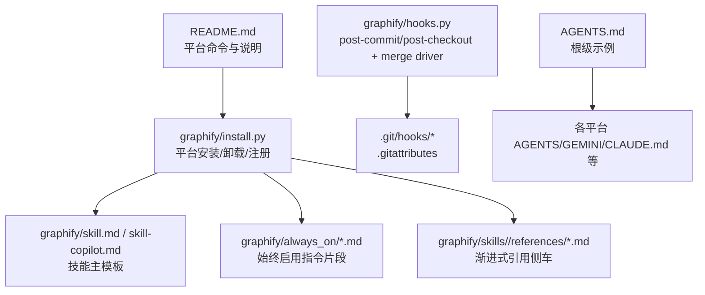
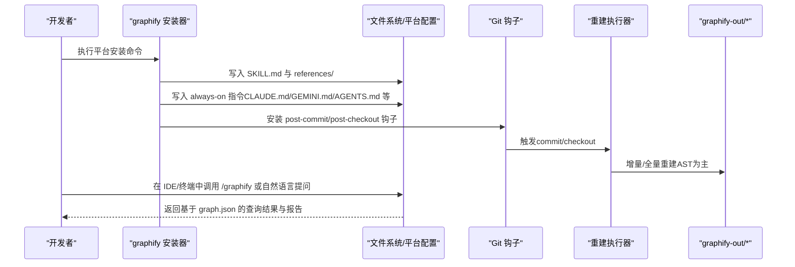
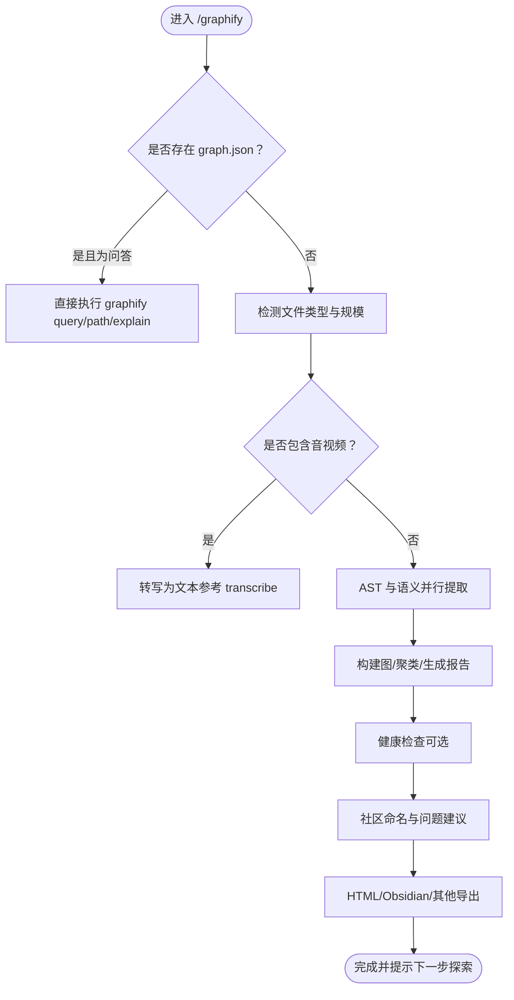
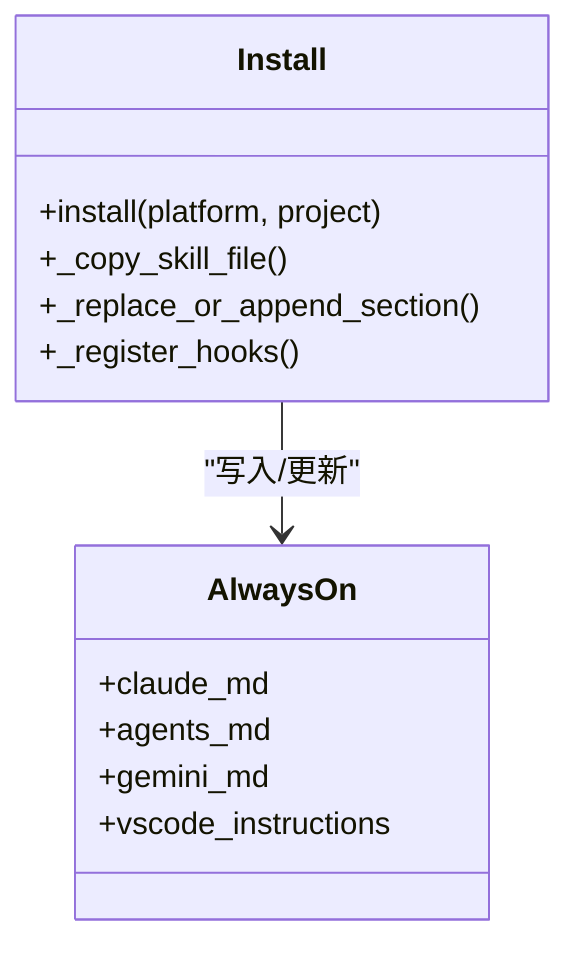
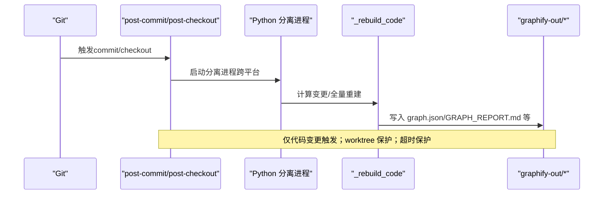
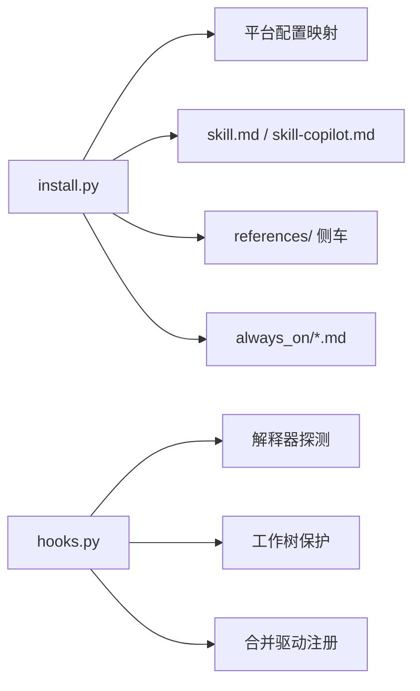

# AI助手平台集成

<cite>
**本文引用的文件**   
- [README.md](file://README.md)
- [AGENTS.md](file://AGENTS.md)
- [graphify/skill.md](file://graphify/skill.md)
- [graphify/skill-copilot.md](file://graphify/skill-copilot.md)
- [graphify/always_on/claude-md.md](file://graphify/always_on/claude-md.md)
- [graphify/always_on/agents-md.md](file://graphify/always_on/agents-md.md)
- [graphify/hooks.py](file://graphify/hooks.py)
- [graphify/install.py](file://graphify/install.py)
- [graphify/skills/claude/references/hooks.md](file://graphify/skills/claude/references/hooks.md)
</cite>

## 目录
1. [简介](#简介)
2. [项目结构](#项目结构)
3. [核心组件](#核心组件)
4. [架构总览](#架构总览)
5. [详细组件分析](#详细组件分析)
6. [依赖关系分析](#依赖关系分析)
7. [性能与扩展性](#性能与扩展性)
8. [故障排除指南](#故障排除指南)
9. [结论](#结论)
10. [附录：平台安装与配置速查](#附录平台安装与配置速查)

## 简介
本文件面向希望将 Graphify 与 20+ AI 编程助手平台集成的团队与个人，提供从“技能文件结构”“始终启用指令”“Git 钩子与合并驱动”到“平台特定最佳实践与排障”的完整方案。Graphify 通过本地 AST 解析与可选语义提取，构建可查询的知识图谱，并以“先图后文”的方式提升问答、路径追踪与影响面分析的效率。

## 项目结构
围绕“平台集成”，仓库中与安装、技能、始终启用指令和 Git 钩子相关的核心位置如下：
- 平台安装与卸载逻辑：graphify/install.py
- 技能主模板（供多平台复用）：graphify/skill.md；GitHub Copilot 专用模板：graphify/skill-copilot.md
- 始终启用指令片段（按平台注入）：graphify/always_on/*.md
- Git 钩子与合并驱动：graphify/hooks.py
- 平台参考文档（如 hooks 参考）：graphify/skills/*/references/*.md
- 根级示例 AGENTS.md：AGENTS.md
- 用户快速上手与平台命令表：README.md

图示来源
- [README.md](file://README.md)
- [graphify/install.py](file://graphify/install.py)
- [graphify/skill.md](file://graphify/skill.md)
- [graphify/skill-copilot.md](file://graphify/skill-copilot.md)
- [graphify/always_on/claude-md.md](file://graphify/always_on/claude-md.md)
- [graphify/always_on/agents-md.md](file://graphify/always_on/agents-md.md)
- [graphify/hooks.py](file://graphify/hooks.py)
- [AGENTS.md](file://AGENTS.md)

章节来源
- [README.md](file://README.md)
- [graphify/install.py](file://graphify/install.py)
- [graphify/skill.md](file://graphify/skill.md)
- [graphify/skill-copilot.md](file://graphify/skill-copilot.md)
- [graphify/always_on/claude-md.md](file://graphify/always_on/claude-md.md)
- [graphify/always_on/agents-md.md](file://graphify/always_on/agents-md.md)
- [graphify/hooks.py](file://graphify/hooks.py)
- [AGENTS.md](file://AGENTS.md)

## 核心组件
- 技能文件（SKILL.md）
  - 作用：定义 /graphify 工作流、参数、输出产物与交互规则，是各平台识别并加载的核心能力描述。
  - 结构要点：元数据头、用法段、步骤化流程（检测→AST/语义并行→构建/聚类→报告/可视化）、子命令（update/query/path/explain/add/watch）与诚实性规则。
  - 渐进式拆分：部分平台支持 references/ 侧车目录，按需加载更细粒度的参考文档（如 hooks、query、transcribe、github-and-merge 等）。
- 始终启用指令（Always-on）
  - 目标：在每次会话或工具调用前自动提示“优先使用 graphify query/path/explain”，减少盲目读取源码的成本。
  - 机制：通过 install 流程向 CLAUDE.md、GEMINI.md、AGENTS.md、VS Code copilot-instructions.md、Cursor rules 等平台配置文件写入固定段落。
- Git 钩子与合并驱动
  - post-commit：仅对代码变更进行增量重建（AST），不触发 LLM，避免阻塞提交。
  - post-checkout：分支切换时全量重建（代码），保持 graph.json 与当前分支一致。
  - 合并驱动：为 graph.json 注册 union 合并策略，避免多人并行提交产生冲突标记。

章节来源
- [graphify/skill.md](file://graphify/skill.md)
- [graphify/skill-copilot.md](file://graphify/skill-copilot.md)
- [graphify/always_on/claude-md.md](file://graphify/always_on/claude-md.md)
- [graphify/always_on/agents-md.md](file://graphify/always_on/agents-md.md)
- [graphify/hooks.py](file://graphify/hooks.py)

## 架构总览
下图展示“安装—技能—始终启用—钩子—运行”的整体链路。

图示来源
- [graphify/install.py](file://graphify/install.py)
- [graphify/hooks.py](file://graphify/hooks.py)
- [graphify/skill.md](file://graphify/skill.md)
- [graphify/always_on/agents-md.md](file://graphify/always_on/agents-md.md)

## 详细组件分析

### 技能文件结构与机制（SKILL.md 与 references/）
- 顶层结构
  - 元数据：名称、描述、触发方式（/graphify）。
  - 用法段：列出所有常用参数与子命令，作为“帮助文本”。
  - 步骤化流程：Step 0~9，涵盖 GitHub URL 克隆、环境自检、检测、AST/语义并行、构建/聚类、健康检查、社区命名、可视化/导出、清单与成本统计。
  - 子命令：--update/--cluster-only、query/path/explain、add/watch 等。
  - 诚实性规则：禁止捏造边、必须显示 token 用量、大图的可视化警告等。
- 渐进式引用（references/）
  - 目的：将长文档拆分为主题侧车（hooks、query、transcribe、github-and-merge、exports 等），按需加载，降低上下文压力。
  - 平台适配：install 会根据平台配置决定是否复制 references/ 侧车，并在 SKILL.md 中以相对路径链接。
- 关键参考
  - hooks 参考：用于指导安装 commit hook 与原生 CLAUDE.md 集成。
  - query/transcribe/github-and-merge/exports 等：分别对应查询、音视频转写、跨库合并与导出功能。

图示来源
- [graphify/skill.md](file://graphify/skill.md)
- [graphify/skills/claude/references/hooks.md](file://graphify/skills/claude/references/hooks.md)

章节来源
- [graphify/skill.md](file://graphify/skill.md)
- [graphify/skill-copilot.md](file://graphify/skill-copilot.md)
- [graphify/skills/claude/references/hooks.md](file://graphify/skills/claude/references/hooks.md)

### 始终启用指令（Always-on）
- 目标：让助手在回答代码相关问题时优先走“图查询”路径，而非逐文件 grep。
- 典型写入位置
  - Claude Code：CLAUDE.md（含 PreToolUse 钩子）
  - Gemini CLI：GEMINI.md（BeforeTool 钩子）
  - Codex/OpenCode/Cursor/Kilo/Aider 等：各自 AGENTS.md 或规则文件
- 内容要点
  - 存在 graph.json 时，优先使用 graphify query/path/explain
  - 若存在 wiki/index.md，优先导航 wiki
  - 修改代码后执行 update 保持图最新
- 安装器行为
  - 以幂等方式插入或替换指定标记段落，避免覆盖用户自定义内容
  - 同时更新版本戳，避免“版本不一致”告警

图示来源
- [graphify/install.py](file://graphify/install.py)
- [graphify/always_on/claude-md.md](file://graphify/always_on/claude-md.md)
- [graphify/always_on/agents-md.md](file://graphify/always_on/agents-md.md)

章节来源
- [graphify/install.py](file://graphify/install.py)
- [graphify/always_on/claude-md.md](file://graphify/always_on/claude-md.md)
- [graphify/always_on/agents-md.md](file://graphify/always_on/agents-md.md)

### Git 钩子与合并驱动
- 安装/卸载/状态
  - 安装：写入 post-commit 与 post-checkout 钩子，注册 .gitattributes 与 git config 中的 merge=graphify 驱动
  - 卸载：移除已安装的钩子片段与合并驱动条目
  - 状态：检查钩子与合并驱动是否已注册
- 行为细节
  - post-commit：仅当有代码变更时触发，跳过仅 graphify-out/ 变更的文件，避免循环重建
  - post-checkout：仅在分支切换时触发，且要求已有 graphify-out/
  - 跨平台后台执行：通过 Python 启动独立进程，避免 Windows MSYS shell 缺少 nohup 的问题
  - 工作树保护：在 linked worktree 下跳过重建，避免并发与误写
  - 超时控制：支持 GRAPHIFY_REBUILD_TIMEOUT 环境变量
- 合并驱动
  - 针对 graph.json 的 union 合并，避免多人并行提交产生冲突标记
  - 自动写入 .gitattributes 并注册 git config

图示来源
- [graphify/hooks.py](file://graphify/hooks.py)

章节来源
- [graphify/hooks.py](file://graphify/hooks.py)

### 平台安装与配置（概览）
- 通用入口
  - 安装：graphify install [--project] [--platform P]
  - 始终启用：graphify <platform> install（例如 claude/gemini/codex/opencode/kilo/copilot/aider/claw/droid/trae/kiro/pi/devin/antigravity 等）
  - 卸载：graphify uninstall 或 per-platform uninstall
- 平台差异要点
  - 钩子型（Claude Code、Gemini CLI）：通过 PreToolUse/BeforeTool 钩子在搜索/读文件前引导至图查询
  - 指令文件型（Codex、OpenCode、Cursor、Kilo、Aider 等）：写入 AGENTS.md 或平台规则文件
  - 特殊项：Cursor 写入 .cursor/rules/graphify.mdc 并 alwaysApply；Kilo 额外写入 native command 与插件；Trae 不支持 PreToolUse，依赖 AGENTS.md
- 项目级 vs 全局
  - --project 将技能与指令写入当前仓库（便于团队协作与版本化）
  - 未加 --project 则写入用户级配置目录

章节来源
- [README.md](file://README.md)
- [graphify/install.py](file://graphify/install.py)

## 依赖关系分析
- 安装器依赖
  - 平台配置表：决定每个平台的 SKILL.md 源、目标路径、是否附带 references/ 侧车、是否需要写入 always-on 指令
  - 版本戳：.graphify_version 防止“版本不一致”告警
  - 幂等更新：_replace_or_append_section 保证重复安装安全
- 钩子依赖
  - Python 解释器探测：优先使用安装时固定的解释器路径，其次回退 PATH 上的 graphify 或系统 python
  - 工作树保护：比较 git-dir 与 git-common-dir，避免在 linked worktree 上重建
  - 合并驱动：通过 git config 与 .gitattributes 注册

图示来源
- [graphify/install.py](file://graphify/install.py)
- [graphify/hooks.py](file://graphify/hooks.py)

章节来源
- [graphify/install.py](file://graphify/install.py)
- [graphify/hooks.py](file://graphify/hooks.py)

## 性能与扩展性
- 并行与缓存
  - AST 与语义提取并行执行，显著缩短大图构建时间
  - 语义提取具备缓存命中机制，增量更新更快
- 资源限制
  - 钩子内支持超时与资源限制，避免长时间阻塞提交
- 可扩展点
  - 新增平台：在平台配置表中添加 entry，指定 skill_file、skill_dst、skill_refs 与 always-on 目标
  - 新增 references 主题：在对应 bundle 的 references/ 下新增文档，并在 SKILL.md 中引用

[本节为通用指导，无需具体文件来源]

## 故障排除指南
- 常见安装问题
  - 找不到 graphify 命令：根据 uv/pipx/pip 的安装方式更新 PATH 或使用 python -m graphify
  - 版本不一致告警：重新安装或升级后再次执行 install
- 钩子相关
  - 提交后未重建：检查是否仅变更了 graphify-out/；确认钩子已安装；查看 ~/.cache/graphify-rebuild.log
  - Windows 无后台任务：已由 Python 分离进程替代 nohup，确保 Python 可被探测到
- 合并冲突
  - graph.json 出现冲突标记：运行 hook install 以注册合并驱动
- 语义提取失败
  - 未设置 API Key：按 README 提示设置对应后端 Key；纯代码语料无需 Key
- 大模型 JSON 截断
  - 调整输出上限或分块大小，必要时切换到兼容 OpenAI 的网关

章节来源
- [README.md](file://README.md)
- [graphify/hooks.py](file://graphify/hooks.py)

## 结论
通过将“技能文件 + 始终启用指令 + Git 钩子/合并驱动”组合，Graphify 能在 20+ 平台上实现一致的“先图后文”体验：提交即重建、切换分支即同步、问答即图查询。配合 references/ 的渐进式加载与幂等安装，既保证了易用性，也兼顾了可维护性与可扩展性。

[本节为总结，无需具体文件来源]

## 附录：平台安装与配置速查
- 安装技能
  - 全局：graphify install [--platform <平台>]
  - 项目级：graphify install --project [--platform <平台>]
- 启用“始终使用图”
  - 各平台：graphify <平台> install（如 claude/gemini/codex/opencode/kilo/copilot/aider/claw/droid/trae/kiro/pi/devin/antigravity 等）
- 管理 Git 钩子
  - 安装：graphify hook install
  - 卸载：graphify hook uninstall
  - 状态：graphify hook status
- 卸载
  - 全部：graphify uninstall [--purge]
  - 单平台：graphify <平台> uninstall

章节来源
- [README.md](file://README.md)
- [graphify/install.py](file://graphify/install.py)
- [graphify/hooks.py](file://graphify/hooks.py)