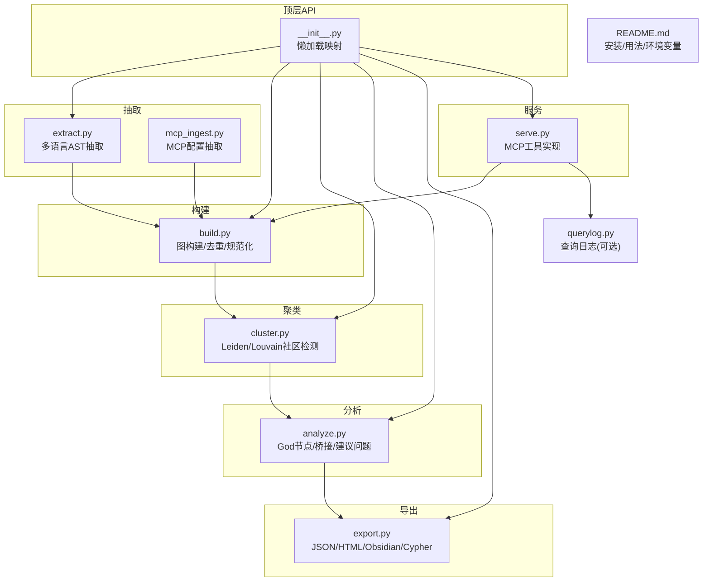
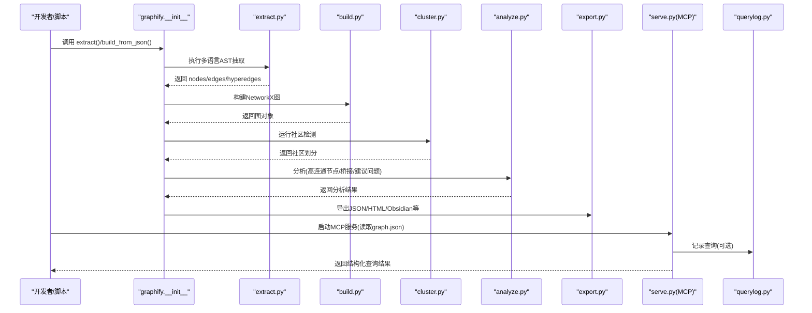
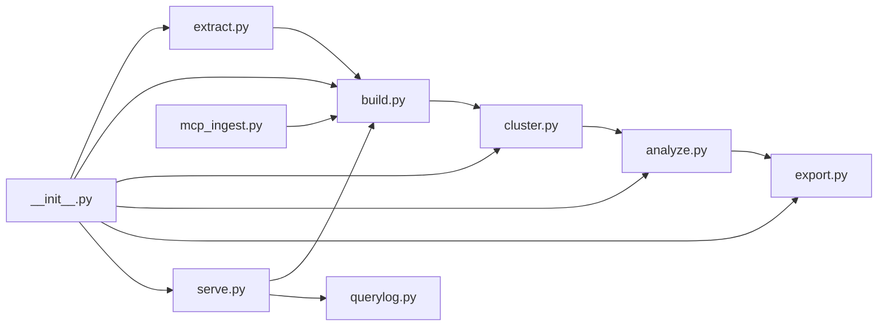
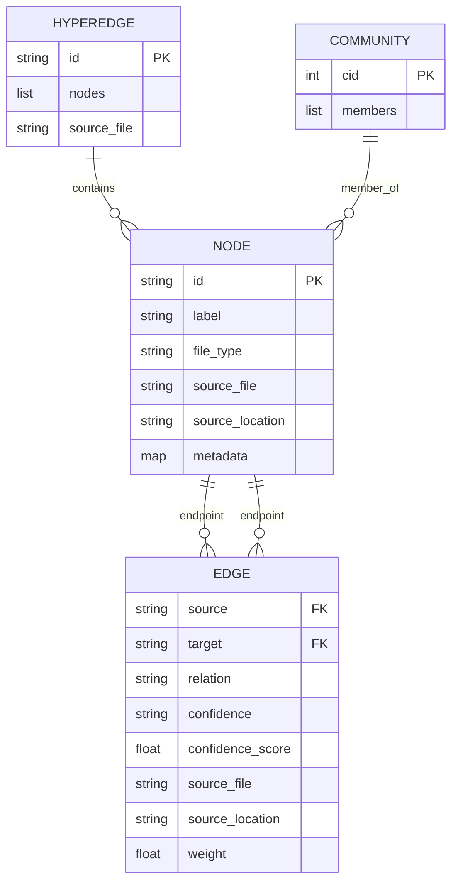

# API参考

<cite>
**本文引用的文件**   
- [graphify/__init__.py](file://graphify/__init__.py)
- [graphify/extract.py](file://graphify/extract.py)
- [graphify/build.py](file://graphify/build.py)
- [graphify/cluster.py](file://graphify/cluster.py)
- [graphify/analyze.py](file://graphify/analyze.py)
- [graphify/export.py](file://graphify/export.py)
- [graphify/serve.py](file://graphify/serve.py)
- [graphify/mcp_ingest.py](file://graphify/mcp_ingest.py)
- [graphify/querylog.py](file://graphify/querylog.py)
- [README.md](file://README.md)
</cite>

## 目录
1. [简介](#简介)
2. [项目结构](#项目结构)
3. [核心组件](#核心组件)
4. [架构总览](#架构总览)
5. [详细组件分析](#详细组件分析)
6. [依赖关系分析](#依赖关系分析)
7. [性能与可扩展性](#性能与可扩展性)
8. [故障排查指南](#故障排查指南)
9. [结论](#结论)
10. [附录：数据模型与错误码](#附录数据模型与错误码)

## 简介
本API参考面向Graphify的Python库与MCP服务，覆盖以下能力：
- Python库主入口与延迟加载的公共函数（如 extract、build_from_json、cluster、analyze、export、reflect、ingest 等）
- MCP协议标准化接口（query_graph、get_node、get_neighbors、shortest_path 等）
- 节点、边、超边、社区等数据结构规范
- 错误码与异常处理机制
- 使用示例与版本兼容性说明

## 项目结构
Graphify采用“提取→构建→聚类→分析→导出”的分层流水线。顶层包通过懒加载暴露稳定API；内部模块按职责拆分，便于扩展与维护。

图表来源
- [graphify/__init__.py:1-31](file://graphify/__init__.py#L1-L31)
- [graphify/extract.py:1-120](file://graphify/extract.py#L1-L120)
- [graphify/build.py:383-762](file://graphify/build.py#L383-L762)
- [graphify/cluster.py:134-236](file://graphify/cluster.py#L134-L236)
- [graphify/analyze.py:100-121](file://graphify/analyze.py#L100-L121)
- [graphify/export.py:183-271](file://graphify/export.py#L183-L271)
- [graphify/serve.py:21-63](file://graphify/serve.py#L21-L63)
- [graphify/querylog.py:1-81](file://graphify/querylog.py#L1-L81)
- [README.md:434-453](file://README.md#L434-L453)

章节来源
- [graphify/__init__.py:1-31](file://graphify/__init__.py#L1-L31)
- [README.md:434-453](file://README.md#L434-L453)

## 核心组件
本节概述Python库对外暴露的主要API及其职责。

- 抽取与收集
  - extract(): 对源码进行确定性结构抽取，输出节点+边字典集合
  - collect_files(): 扫描并筛选待抽取的文件集合
- 构建
  - build_from_json(extraction, directed=False, root=None): 从抽取结果构建NetworkX图
  - build(extractions, directed=False, dedup=True, ...): 合并多个抽取结果后构建图
- 聚类
  - cluster(G, resolution=1.0, exclude_hubs_percentile=None): Leiden/Louvain社区检测
  - score_all(G, communities): 计算各社区凝聚度分数
  - cohesion_score(G, community_nodes): 单社区凝聚度
- 分析
  - god_nodes(G, top_n=10): 返回最连接的核心实体
  - surprising_connections(G, communities, top_n=5): 跨社区/跨文件的“意外”连接
  - suggest_questions(G, communities, community_labels, top_n=7): 生成可回答的问题
- 导出
  - to_json(G, communities, output_path, force=False, ...): 导出为graph.json
  - to_html(...)/to_svg(...)/to_canvas(...)/to_wiki(...): 多种可视化/文档化导出
- 反射与工作记忆
  - reflect(): 聚合工作记忆到LESSONS.md或overlay
  - save_query_result(...): 保存问答结果用于反思
- 其他
  - to_json/to_html/to_svg/to_canvas/to_wiki 由 export/wiki 提供
  - 所有API通过 __init__.py 懒加载暴露

章节来源
- [graphify/__init__.py:4-30](file://graphify/__init__.py#L4-L30)
- [graphify/extract.py:1-120](file://graphify/extract.py#L1-L120)
- [graphify/build.py:765-800](file://graphify/build.py#L765-L800)
- [graphify/cluster.py:134-236](file://graphify/cluster.py#L134-L236)
- [graphify/analyze.py:100-121](file://graphify/analyze.py#L100-L121)
- [graphify/export.py:183-271](file://graphify/export.py#L183-L271)

## 架构总览
下图展示从源码到知识图谱的关键流程，以及MCP服务的接入点。

图表来源
- [graphify/__init__.py:4-30](file://graphify/__init__.py#L4-L30)
- [graphify/extract.py:1-120](file://graphify/extract.py#L1-L120)
- [graphify/build.py:383-762](file://graphify/build.py#L383-L762)
- [graphify/cluster.py:134-236](file://graphify/cluster.py#L134-L236)
- [graphify/analyze.py:100-121](file://graphify/analyze.py#L100-L121)
- [graphify/export.py:183-271](file://graphify/export.py#L183-L271)
- [graphify/serve.py:21-63](file://graphify/serve.py#L21-L63)
- [graphify/querylog.py:1-81](file://graphify/querylog.py#L1-L81)

## 详细组件分析

### Python库API详解

#### extract()
- 功能：基于tree-sitter AST对代码进行确定性抽取，输出nodes/edges/hyperedges
- 输入：路径/文件列表、语言解析器配置、过滤规则等
- 输出：包含nodes、edges、hyperedges的字典
- 注意：支持大量语言与配置文件类型；对递归深度、异常进行保护

章节来源
- [graphify/extract.py:1-120](file://graphify/extract.py#L1-L120)

#### build_from_json() / build()
- 功能：将抽取结果组装为NetworkX图；支持有向/无向；自动去重与ID规范化
- 关键特性：
  - 兼容旧版links字段
  - 语义ID重映射与幽灵节点合并
  - 跨语言幻影边防护
  - 超边成员键规范化(nodes/members/node_ids)
- 参数：directed、dedup、root等

章节来源
- [graphify/build.py:383-762](file://graphify/build.py#L383-L762)
- [graphify/build.py:765-800](file://graphify/build.py#L765-L800)

#### cluster() / score_all() / cohesion_score()
- 功能：社区检测与质量评估
- 算法：优先Leiden(graspologic)，回退Louvain(networkx)
- 参数：resolution控制粒度；exclude_hubs_percentile排除超级枢纽
- 输出：{community_id: [node_ids]} 及凝聚度评分

章节来源
- [graphify/cluster.py:134-236](file://graphify/cluster.py#L134-L236)
- [graphify/cluster.py:257-269](file://graphify/cluster.py#L257-L269)

#### analyze() 系列
- god_nodes(top_n): 返回最连接的实体（排除文件级hub与噪声标签）
- surprising_connections(communities, top_n): 跨社区/跨文件的高价值连接
- suggest_questions(communities, labels, top_n): 自动生成探索性问题

章节来源
- [graphify/analyze.py:100-121](file://graphify/analyze.py#L100-L121)
- [graphify/analyze.py:124-153](file://graphify/analyze.py#L124-L153)
- [graphify/analyze.py:419-544](file://graphify/analyze.py#L419-L544)

#### export() 系列
- to_json(G, communities, path, force=False, ...): 安全写入graph.json（含大小/收缩检查）
- to_html/to_svg/to_canvas/to_wiki: 多种可视化/文档化输出

章节来源
- [graphify/export.py:183-271](file://graphify/export.py#L183-L271)

#### serve.py (MCP服务)
- 功能：加载graph.json并提供MCP工具（query_graph、get_node、get_neighbors、shortest_path等）
- 传输：stdio默认，可选HTTP
- 安全：校验graph.json大小上限、拒绝损坏文件、清理敏感信息

章节来源
- [graphify/serve.py:21-63](file://graphify/serve.py#L21-L63)
- [README.md:434-453](file://README.md#L434-L453)

#### querylog.py (可选)
- 功能：以JSONL追加方式记录每次查询（需显式开启）
- 环境变量：GRAPHIFY_QUERY_LOG_ENABLE、GRAPHIFY_QUERY_LOG、GRAPHIFY_QUERY_LOG_RESPONSES

章节来源
- [graphify/querylog.py:1-81](file://graphify/querylog.py#L1-L81)

### MCP协议标准化接口

- 服务启动
  - stdio模式：python -m graphify.serve graphify-out/graph.json
  - HTTP模式：python -m graphify.serve graphify-out/graph.json --transport http --port 8080 [--api-key]
- 可用工具（名称与用途）
  - query_graph(question, mode="bfs", depth=3, token_budget=2000, context_filters=None)
  - get_node(label_or_id)
  - get_neighbors(node_id, relation_filter=None)
  - shortest_path(start_label, end_label)
  - list_prs / get_pr_impact / triage_prs（若集成PR相关能力）
- 调用格式
  - 通过IDE/MCP客户端以标准MCP方法名调用，参数为JSON对象
  - 返回文本摘要或结构化子图（NODE/EDGE行），受token预算限制
- 中文分词与停用词
  - 内置中文分词（jieba可选）、多语言停用词过滤、IDF加权与三igram候选集加速

章节来源
- [README.md:434-453](file://README.md#L434-L453)
- [graphify/serve.py:164-183](file://graphify/serve.py#L164-L183)
- [graphify/serve.py:192-214](file://graphify/serve.py#L192-L214)
- [graphify/serve.py:271-320](file://graphify/serve.py#L271-L320)
- [graphify/serve.py:746-771](file://graphify/serve.py#L746-L771)

### 数据格式规范

- 节点（Node）关键字段
  - id: 唯一标识（全仓库相对路径派生，避免幽灵节点）
  - label: 可读名称
  - file_type: code/document/paper/image/rationale/concept
  - source_file: 源文件相对路径
  - source_location: 定位信息（如 L123）
  - metadata: 附加元数据（如 mcp_kind）
- 边（Edge）关键字段
  - source/target: 端点id
  - relation: 关系类型（imports/calls/inherits/references/...）
  - confidence: EXTRACTED/INFERRED/AMBIGUOUS
  - confidence_score: 数值权重（导出时补全）
  - source_file/source_location: 来源位置
  - weight: 权重
  - _src/_tgt: 方向恢复标记（内部使用）
- 超边（Hyperedge）关键字段
  - id: 超边唯一标识
  - nodes: 成员节点列表（别名members/node_ids会被规范化为nodes）
  - source_file: 来源文件
- 社区（Community）
  - {cid: [node_ids]}，附带凝聚度分数与命名（可由LLM或最高度节点命名）

章节来源
- [graphify/build.py:383-762](file://graphify/build.py#L383-L762)
- [graphify/export.py:183-271](file://graphify/export.py#L183-L271)
- [graphify/mcp_ingest.py:319-373](file://graphify/mcp_ingest.py#L319-L373)

### 错误码与异常处理

- 抽取阶段
  - 递归超限：返回error="recursion_limit_exceeded"
  - 其他异常：返回error="{ExceptionType}: {message}"
- 构建阶段
  - 非哈希id节点/边：跳过并打印警告
  - 旧schema兼容：links→edges、source→source_file、file_type同义词映射
  - 幽灵节点合并：非AST节点与AST同名节点合并
  - 跨语言幻影边：不同语言家族间calls/imports/references被丢弃
- 服务阶段
  - graph.json损坏：提示重建
  - 文件大小超限：拒绝加载
- 导出阶段
  - 新图节点数小于现有graph.json：拒绝覆盖（除非force=True）
- 查询日志
  - 失败静默：不抛异常，仅忽略

章节来源
- [graphify/extract.py:156-168](file://graphify/extract.py#L156-L168)
- [graphify/build.py:490-762](file://graphify/build.py#L490-L762)
- [graphify/serve.py:21-63](file://graphify/serve.py#L21-L63)
- [graphify/export.py:183-271](file://graphify/export.py#L183-L271)
- [graphify/querylog.py:53-81](file://graphify/querylog.py#L53-L81)

### 使用示例（路径引用）
以下为常见场景的调用路径与要点（不直接粘贴代码，给出具体文件与行号以便查阅）：
- 从零构建知识图谱
  - 抽取：[graphify/extract.py:1-120](file://graphify/extract.py#L1-L120)
  - 构建：[graphify/build.py:383-762](file://graphify/build.py#L383-L762)
  - 聚类：[graphify/cluster.py:134-236](file://graphify/cluster.py#L134-L236)
  - 分析：[graphify/analyze.py:100-121](file://graphify/analyze.py#L100-L121)
  - 导出：[graphify/export.py:183-271](file://graphify/export.py#L183-L271)
- 通过MCP服务查询
  - 启动服务：[README.md:434-453](file://README.md#L434-L453)
  - 工具实现与搜索打分：[graphify/serve.py:164-183](file://graphify/serve.py#L164-L183), [graphify/serve.py:192-214](file://graphify/serve.py#L192-L214), [graphify/serve.py:746-771](file://graphify/serve.py#L746-L771)
- 记录与分析
  - 查询日志：[graphify/querylog.py:1-81](file://graphify/querylog.py#L1-L81)
  - 建议问题：[graphify/analyze.py:419-544](file://graphify/analyze.py#L419-L544)

## 依赖关系分析

图表来源
- [graphify/__init__.py:4-30](file://graphify/__init__.py#L4-L30)
- [graphify/extract.py:1-120](file://graphify/extract.py#L1-L120)
- [graphify/build.py:383-762](file://graphify/build.py#L383-L762)
- [graphify/cluster.py:134-236](file://graphify/cluster.py#L134-L236)
- [graphify/analyze.py:100-121](file://graphify/analyze.py#L100-L121)
- [graphify/export.py:183-271](file://graphify/export.py#L183-L271)
- [graphify/serve.py:21-63](file://graphify/serve.py#L21-L63)
- [graphify/mcp_ingest.py:86-166](file://graphify/mcp_ingest.py#L86-L166)
- [graphify/querylog.py:1-81](file://graphify/querylog.py#L1-L81)

章节来源
- [graphify/__init__.py:4-30](file://graphify/__init__.py#L4-L30)

## 性能与可扩展性
- 抽取并行与递归保护：提升吞吐，防止深递归崩溃
- 构建优化：
  - 三igram索引与IDF加速查询
  - 幽灵节点合并与ID规范化减少冗余
  - 跨语言幻影边过滤降低噪声
- 聚类：
  - Leiden优先，大社区二次分割，低凝聚度再分割
  - 支持排除超级枢纽，避免污染社区边界
- 导出：
  - 安全覆盖策略与备份机制
  - 大规模图裁剪与预算控制

章节来源
- [graphify/extract.py:151-168](file://graphify/extract.py#L151-L168)
- [graphify/build.py:596-762](file://graphify/build.py#L596-L762)
- [graphify/cluster.py:134-236](file://graphify/cluster.py#L134-L236)
- [graphify/export.py:183-271](file://graphify/export.py#L183-L271)

## 故障排查指南
- 命令不可用/PATH问题：见README中的安装与PATH说明
- graph.json冲突标记：启用git merge driver自动合并
- 节点数量减少导致覆盖拒绝：使用--force或完整重建
- Ollama上下文窗口不足：调整GRAPHIFY_OLLAMA_NUM_CTX或减小token-budget
- 查询结果为空：检查停用词过滤、IDF权重与三igram候选集是否命中

章节来源
- [README.md:537-607](file://README.md#L537-L607)
- [graphify/export.py:183-271](file://graphify/export.py#L183-L271)
- [graphify/serve.py:164-183](file://graphify/serve.py#L164-L183)

## 结论
Graphify提供从源码到知识图谱的一体化能力：确定性的AST抽取、稳健的图构建与社区检测、丰富的分析与导出、以及标准化的MCP服务接口。其设计强调本地优先、隐私与安全、可扩展性与可维护性，适合在团队中作为“可查询的代码知识基座”。

## 附录：数据模型与错误码

### 数据模型（ER风格）

图表来源
- [graphify/build.py:383-762](file://graphify/build.py#L383-L762)
- [graphify/export.py:183-271](file://graphify/export.py#L183-L271)
- [graphify/mcp_ingest.py:319-373](file://graphify/mcp_ingest.py#L319-L373)

### 错误码速查
- 抽取
  - recursion_limit_exceeded：递归深度超限
  - {ExceptionType}: {message}：抽取异常详情
- 构建
  - 非哈希id：跳过并警告
  - 旧schema兼容：links→edges、source→source_file、file_type同义词
  - 幽灵节点合并：非AST与AST同名节点合并
  - 跨语言幻影边：丢弃
- 服务
  - graph.json损坏：提示重建
  - 文件大小超限：拒绝加载
- 导出
  - 新图更小：拒绝覆盖（除非force=True）
- 查询日志
  - 静默失败：不抛异常

章节来源
- [graphify/extract.py:156-168](file://graphify/extract.py#L156-L168)
- [graphify/build.py:490-762](file://graphify/build.py#L490-L762)
- [graphify/serve.py:21-63](file://graphify/serve.py#L21-L63)
- [graphify/export.py:183-271](file://graphify/export.py#L183-L271)
- [graphify/querylog.py:53-81](file://graphify/querylog.py#L53-L81)

### 版本兼容性与迁移指南
- 向后兼容
  - links→edges、source→source_file、file_type同义词映射
  - 超边成员键members/node_ids→nodes规范化
- ID方案演进
  - 预迁移ID（父目录+文件名）与新ID（全仓库相对路径）并存时的重映射与别名
  - 幽灵节点合并策略（AST优先）
- 迁移建议
  - 若发现节点重复或路径不一致，执行一次完整重建（--force）
  - 使用serve.py内置检测提示是否需要重建

章节来源
- [graphify/build.py:383-762](file://graphify/build.py#L383-L762)
- [graphify/serve.py:35-43](file://graphify/serve.py#L35-L43)