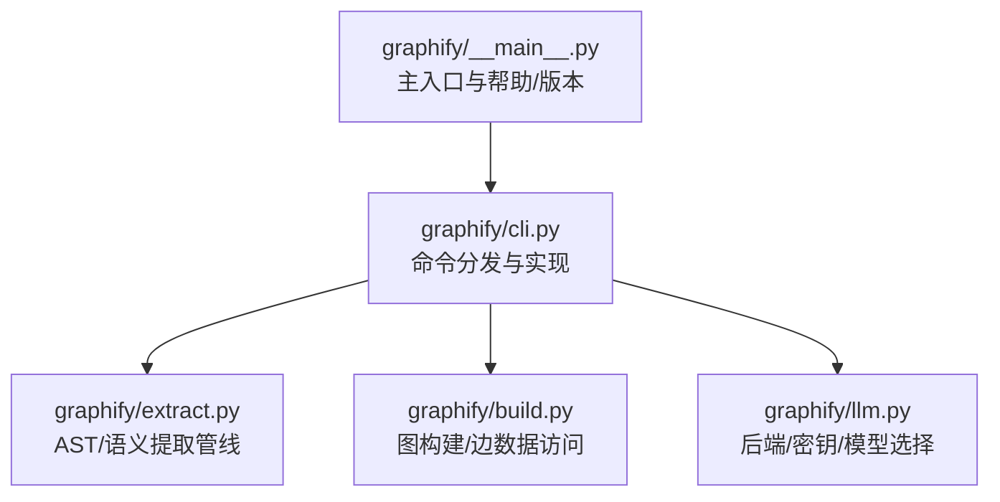
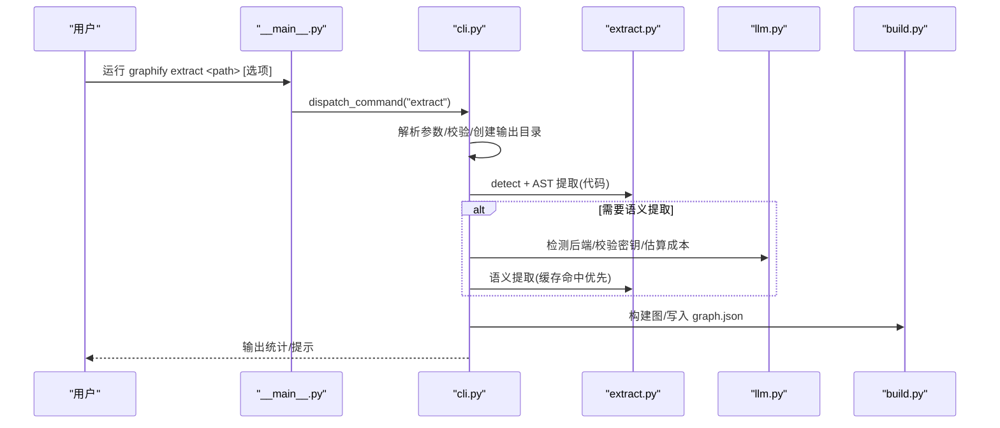
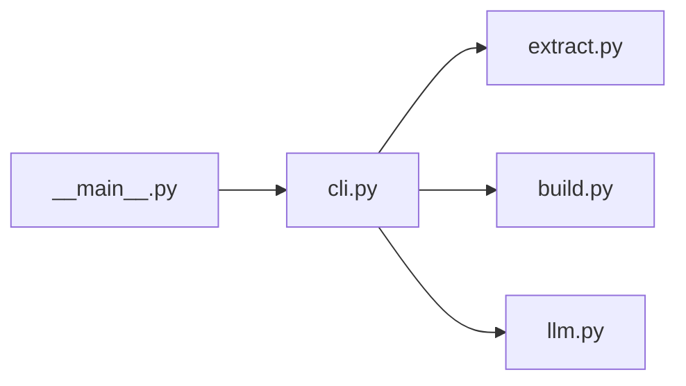

# CLI命令参考

<cite>
**本文引用的文件**   
- [__main__.py](file://graphify/__main__.py)
- [cli.py](file://graphify/cli.py)
- [README.md](file://README.md)
- [extract.py](file://graphify/extract.py)
- [build.py](file://graphify/build.py)
- [llm.py](file://graphify/llm.py)
</cite>

## 目录
1. [简介](#简介)
2. [项目结构](#项目结构)
3. [核心组件](#核心组件)
4. [架构总览](#架构总览)
5. [详细命令参考](#详细命令参考)
6. [依赖关系分析](#依赖关系分析)
7. [性能与调优](#性能与调优)
8. [故障排除指南](#故障排除指南)
9. [结论](#结论)
10. [附录：常用工作流组合](#附录常用工作流组合)

## 简介
本参考文档系统化梳理 graphify 的命令行接口，覆盖安装、提取、查询、路径、解释、社区重聚类、导出等命令，并提供参数说明、使用示例、输出格式、环境变量配置、不同AI助手平台的特定用法以及错误处理与排障建议。读者无需深入源码即可高效上手并构建稳定可复现的工作流。

## 项目结构
graphify 的CLI入口位于主模块，负责分发到各子命令；具体实现分散在 cli.py 与各功能模块中。下图展示关键入口与分发关系。

图表来源
- [__main__.py:460-712](file://graphify/__main__.py#L460-L712)
- [cli.py:259-353](file://graphify/cli.py#L259-L353)
- [extract.py:1-200](file://graphify/extract.py#L1-L200)
- [build.py:177-200](file://graphify/build.py#L177-L200)
- [llm.py:916-943](file://graphify/llm.py#L916-L943)

章节来源
- [__main__.py:460-712](file://graphify/__main__.py#L460-L712)
- [cli.py:259-353](file://graphify/cli.py#L259-L353)

## 核心组件
- 入口与帮助：提供 --version/-h/--help 与完整命令列表，统一处理管道关闭异常与编码设置。
- 命令分发：根据首参路由至 install/provider/hook/cypher/query/path/explain/diagnose/add/watch/cluster-only/label/update/tree/merge-driver/merge-graphs/clone/export/benchmark/global/extract 等分支。
- 提取管线：detect -> AST(代码) -> 语义(LLM, 可选) -> build -> cluster -> 报告/可视化。
- 后端与密钥：按优先级自动检测后端（Gemini/Kimi/Claude/OpenAI/DeepSeek/Azure/Bedrock/Ollama/自定义），支持 base_url/model/env_key 等覆盖。
- 安全与容量：对 graph.json 大小进行上限检查，避免解析阶段内存耗尽。

章节来源
- [__main__.py:460-712](file://graphify/__main__.py#L460-L712)
- [cli.py:259-353](file://graphify/cli.py#L259-L353)
- [cli.py:1970-2399](file://graphify/cli.py#L1970-L2399)
- [llm.py:916-943](file://graphify/llm.py#L916-L943)

## 架构总览
下图展示了从 CLI 到核心功能的调用序列，以 extract 为例。

图表来源
- [__main__.py:460-712](file://graphify/__main__.py#L460-L712)
- [cli.py:1970-2399](file://graphify/cli.py#L1970-L2399)
- [extract.py:1-200](file://graphify/extract.py#L1-L200)
- [llm.py:916-943](file://graphify/llm.py#L916-L943)
- [build.py:177-200](file://graphify/build.py#L177-L200)

## 详细命令参考

### 通用
- 版本与帮助
  - 命令: graphify --version / graphify -v
  - 行为: 打印已安装包版本
  - 示例: graphify --version
  - 输出: 一行版本号文本

- 帮助
  - 命令: graphify -h / graphify --help
  - 行为: 列出所有可用命令及简要说明
  - 示例: graphify --help
  - 输出: 多行帮助文本

章节来源
- [__main__.py:502-691](file://graphify/__main__.py#L502-L691)

### install/uninstall（平台技能安装）
- 命令: graphify install [--platform P] [--project]
  - 作用: 将 graphify 技能安装到指定平台（默认Windows为windows，其他为claude）
  - 参数:
    - --platform P: 目标平台（如 claude|windows|codebuddy|codex|opencode|aider|amp|agents|claw|droid|trae|trae-cn|gemini|cursor|antigravity|hermes|kiro|pi|devin）
    - --project: 仅在当前仓库范围安装
  - 示例:
    - graphify install
    - graphify install --platform codex
    - graphify install --project --platform agents
  - 输出: 安装结果与提示

- 命令: graphify uninstall [--purge] [--project] [--platform P]
  - 作用: 卸载所有或指定平台的安装；--purge 同时删除 graphify-out/
  - 示例: graphify uninstall --purge

章节来源
- [__main__.py:506-691](file://graphify/__main__.py#L506-L691)
- [cli.py:1884-1945](file://graphify/cli.py#L1884-L1945)

### provider（自定义LLM后端注册）
- 命令: graphify provider list
  - 作用: 列出全局注册的自定义后端
  - 输出: 名称与base_url

- 命令: graphify provider show <name>
  - 作用: 显示某后端配置详情
  - 输出: JSON

- 命令: graphify provider add <name> --base-url URL --default-model MODEL --env-key KEY [--pricing-input N] [--pricing-output N]
  - 作用: 添加自定义OpenAI兼容后端
  - 校验: 不允许覆盖内置后端；base_url需通过安全检查
  - 输出: 成功提示

- 命令: graphify provider remove <name>
  - 作用: 移除自定义后端

章节来源
- [cli.py:259-353](file://graphify/cli.py#L259-L353)

### hook（Git钩子管理）
- 命令: graphify hook install | uninstall | status
  - 作用: 安装/卸载/查看 post-commit/post-checkout 钩子
  - 输出: 状态信息

章节来源
- [cli.py:377-396](file://graphify/cli.py#L377-L396)

### cypher（本地图数据库查询）
- 命令: graphify cypher "MATCH ..." [--db path]
  - 前置: 需安装 neug 扩展
  - 行为: 执行Cypher语句，逐行列出字段
  - 示例: graphify cypher "MATCH (n) RETURN n LIMIT 10"
  - 输出: 制表符分隔的行

章节来源
- [cli.py:397-421](file://graphify/cli.py#L397-L421)

### query（基于图的问答）
- 命令: graphify query "<问题>" [--dfs] [--context C] [--budget N] [--graph path]
  - 作用: 在 graph.json 上进行BFS/DFS遍历，返回聚焦子图答案
  - 参数:
    - --dfs: 深度优先
    - --context C: 边上下文过滤（可重复）
    - --budget N: 输出token预算（默认2000）
    - --graph path: 指定图文件
  - 示例: graphify query "认证如何连接到数据库？" --budget 1500
  - 输出: 自然语言回答（含子图摘要）

章节来源
- [cli.py:422-518](file://graphify/cli.py#L422-L518)

### affected（影响面分析）
- 命令: graphify affected "<节点或标签>" [--relation R] [--depth N] [--graph path]
  - 作用: 反向遍历查找受影响的节点
  - 参数:
    - --relation R: 反向遍历的关系类型（可重复）
    - --depth N: 反向遍历深度（默认2）
  - 示例: graphify affected "UserService" --relation calls --depth 3
  - 输出: 受影响节点列表与关系

章节来源
- [cli.py:519-578](file://graphify/cli.py#L519-L578)

### save-result（记录问答结果）
- 命令: graphify save-result --question Q --answer A [--type T] [--nodes N1 N2 ...] [--outcome useful|dead_end|corrected] [--correction TEXT] [--memory-dir DIR]
  - 作用: 将问答结果保存到 memory 目录，用于反馈闭环
  - 示例: graphify save-result --question "Q" --answer "A" --nodes Foo Bar --outcome useful
  - 输出: 保存路径

章节来源
- [cli.py:579-609](file://graphify/cli.py#L579-L609)

### reflect（反思聚合）
- 命令: graphify reflect [--memory-dir DIR] [--out FILE] [--graph PATH] [--analysis PATH] [--labels PATH] [--half-life-days N] [--min-corroboration N] [--if-stale]
  - 作用: 聚合 memory 中的结果生成 LESSONS.md，并可结合图社区分组
  - 示例: graphify reflect --if-stale
  - 输出: 聚合统计与输出路径

章节来源
- [cli.py:610-666](file://graphify/cli.py#L610-L666)

### path（最短路径）
- 命令: graphify path "<源>" "<目标>" [--graph path]
  - 作用: 计算两个节点间的最短路径
  - 示例: graphify path "FastAPI" "ModelField"
  - 输出: 路径描述（跳数与边关系）

章节来源
- [cli.py:667-767](file://graphify/cli.py#L667-L767)

### explain（节点解释）
- 命令: graphify explain "<节点>" [--graph path]
  - 作用: 输出节点基本信息、度、邻居连接（最多20条）
  - 示例: graphify explain "APIRouter"
  - 输出: 节点属性与连接列表

章节来源
- [cli.py:769-856](file://graphify/cli.py#L769-L856)

### diagnose multigraph（多图诊断）
- 命令: graphify diagnose multigraph [--graph path] [--json] [--max-examples N] [--directed|--undirected] [--extract-path path]
  - 作用: 诊断同一端点边折叠风险
  - 示例: graphify diagnose multigraph --json
  - 输出: 人类可读报告或JSON

章节来源
- [cli.py:858-950](file://graphify/cli.py#L858-L950)

### add（抓取并入库）
- 命令: graphify add <url> [--author Name] [--contributor Name] [--dir ./raw]
  - 作用: 抓取URL内容保存到 raw 目录，随后可在AI助手内更新图
  - 示例: graphify add https://arxiv.org/abs/1706.03762
  - 输出: 保存路径与提示

章节来源
- [cli.py:952-985](file://graphify/cli.py#L952-L985)

### watch（监听变更）
- 命令: graphify watch <path>
  - 作用: 监听目录变化并重建图
  - 示例: graphify watch ./src
  - 输出: 实时日志

章节来源
- [cli.py:987-998](file://graphify/cli.py#L987-L998)

### cluster-only / label（社区重聚类与命名）
- 命令: graphify cluster-only <path> [--no-viz] [--graph path] [--no-label] [--backend=name] [--model=name] [--max-concurrency=N] [--batch-size=N] [--resolution=1.0] [--exclude-hubs=N]
  - 作用: 对现有 graph.json 重新聚类并生成报告/HTML
  - 示例: graphify cluster-only . --no-label
  - 输出: 社区数量与文件更新提示

- 命令: graphify label <path> [--missing-only] [--backend=name] [--model=name] [--max-concurrency=N] [--batch-size=N]
  - 作用: 使用配置的LLM后端（或hub启发式）为社区命名
  - 示例: graphify label . --backend=openai --model gpt-4o
  - 输出: 命名结果与提示

章节来源
- [cli.py:1000-1305](file://graphify/cli.py#L1000-L1305)

### update（增量更新）
- 命令: graphify update <path> [--force] [--no-cluster]
  - 作用: 仅重新提取代码文件（无需LLM），可选择跳过聚类
  - 示例: graphify update ./src --force
  - 输出: 更新结果与提示

章节来源
- [cli.py:1306-1360](file://graphify/cli.py#L1306-L1360)

### tree（树视图导出）
- 命令: graphify tree [--graph PATH] [--output HTML] [--root PATH] [--max-children N] [--top-k-edges N] [--label NAME]
  - 作用: 生成可交互的D3树形HTML
  - 示例: graphify tree --output docs/graph_tree.html
  - 输出: 文件路径与打开提示

章节来源
- [cli.py:1381-1436](file://graphify/cli.py#L1381-L1436)

### merge-driver（git合并驱动）
- 命令: graphify merge-driver <base> <current> <other>
  - 作用: 对 graph.json 做集合合并，防止冲突标记
  - 示例: 在 .git/config 中注册后由git自动调用
  - 输出: 无（直接写回 current）

章节来源
- [cli.py:1438-1490](file://graphify/cli.py#L1438-L1490)

### merge-graphs（多图合并）
- 命令: graphify merge-graphs <g1.json> <g2.json> [...] [--out merged.json]
  - 作用: 合并多个 graph.json 为一个跨仓库图
  - 示例: graphify merge-graphs a.json b.json --out merged.json
  - 输出: 节点/边计数与输出路径

章节来源
- [cli.py:1492-1564](file://graphify/cli.py#L1492-L1564)

### clone（克隆仓库）
- 命令: graphify clone <github-url> [--branch <branch>] [--out <dir>]
  - 作用: 克隆GitHub仓库到本地缓存目录
  - 示例: graphify clone https://github.com/karpathy/nanoGPT
  - 输出: 本地路径

章节来源
- [cli.py:1566-1588](file://graphify/cli.py#L1566-L1588)

### export（导出）
- 命令: graphify export html [--graph PATH] [--labels PATH] [--node-limit N] [--no-viz]
  - 作用: 生成交互式HTML图
  - 示例: graphify export html --node-limit 5000
  - 输出: 文件路径与提示

- 命令: graphify export callflow-html [GRAPH|DIR] [--graph PATH] [--labels PATH] [--report PATH] [--sections PATH] [--output HTML] [--lang auto|zh-CN|en] [--max-sections N] [--diagram-scale N] [--max-diagram-nodes N] [--max-diagram-edges N]
  - 作用: 生成Mermaid架构图/调用流HTML
  - 示例: graphify export callflow-html --max-sections 8
  - 输出: 文件路径与提示

- 命令: graphify export obsidian [--graph PATH] [--labels PATH] [--dir PATH]
  - 作用: 导出Obsidian笔记与画布
  - 示例: graphify export obsidian --dir ~/vault
  - 输出: 笔记数量与路径

- 命令: graphify export wiki [--graph PATH] [--labels PATH]
  - 作用: 生成可被Agent爬取的Wiki
  - 示例: graphify export wiki
  - 输出: 文章数量与路径

- 命令: graphify export svg [--graph PATH] [--labels PATH]
  - 作用: 导出SVG图
  - 示例: graphify export svg
  - 输出: 文件路径

- 命令: graphify export graphml [--graph PATH]
  - 作用: 导出GraphML
  - 示例: graphify export graphml
  - 输出: 文件路径

- 命令: graphify export neo4j [--graph PATH] [--push URI] [--user U] [--password P]
  - 作用: 生成cypher.txt或直接推送Neo4j
  - 示例: graphify export neo4j --push bolt://localhost:7687 --user neo4j --password secret
  - 输出: 生成文件或推送统计

- 命令: graphify export falkordb [--graph PATH] [--push URI] [--user U] [--password P]
  - 作用: 生成OpenCypher或直接推送FalkorDB
  - 示例: graphify export falkordb --push falkordb://localhost:6379
  - 输出: 生成文件或推送统计

章节来源
- [cli.py:1590-1896](file://graphify/cli.py#L1590-L1896)

### benchmark（基准测试）
- 命令: graphify benchmark [graph.json]
  - 作用: 评估token节省效果
  - 示例: graphify benchmark
  - 输出: 基准指标

章节来源
- [cli.py:1897-1912](file://graphify/cli.py#L1897-L1912)

### global（全局图）
- 命令: graphify global add <graph.json> [--as <tag>]
  - 作用: 将项目图加入全局图
  - 示例: graphify global add graphify-out/graph.json --as myrepo
  - 输出: 新增/跳过统计与全局图路径

- 命令: graphify global remove <tag>
  - 作用: 从全局图移除项目
  - 示例: graphify global remove myrepo

- 命令: graphify global list
  - 作用: 列出已注册项目
  - 示例: graphify global list

- 命令: graphify global path
  - 作用: 打印全局图路径
  - 示例: graphify global path

章节来源
- [cli.py:1914-1968](file://graphify/cli.py#L1914-L1968)

### extract（全量/增量提取）
- 命令: graphify extract <path> [--backend gemini|kimi|claude|openai|deepseek|ollama|azure|bedrock|claude-cli] [--model M] [--mode deep] [--out DIR] [--google-workspace] [--no-cluster] [--dedup-llm] [--code-only] [--postgres DSN] [--cargo] [--max-workers N] [--token-budget N] [--max-concurrency N] [--api-timeout S] [--resolution F] [--exclude-hubs F] [--exclude GLOB] [--timing]
  - 作用: 头模式全流水线提取（detect -> AST -> 语义 -> build -> cluster -> 输出）
  - 关键参数:
    - --backend: 指定后端（未指定时自动检测）
    - --model: 覆盖默认模型
    - --mode deep: 更丰富的语义抽取
    - --out: 输出根目录（默认扫描根）
    - --no-cluster: 仅原始提取，跳过聚类
    - --code-only: 仅索引代码（无需API密钥）
    - --google-workspace: 先导出Google Workspace快捷方式
    - --postgres DSN: 直接从PostgreSQL抽取模式
    - --cargo: 抽取Rust Cargo依赖
    - --max-workers/--token-budget/--max-concurrency/--api-timeout: 性能与并发控制
    - --resolution/--exclude-hubs/--exclude: 聚类与排除策略
    - --timing: 打印每阶段耗时
  - 示例:
    - graphify extract ./docs --backend openai --model gpt-4.1-mini
    - OPENAI_BASE_URL=http://localhost:8080/v1 OPENAI_MODEL=my-model graphify extract ./docs --backend openai
    - GRAPHIFY_OLLAMA_NUM_CTX=32768 graphify extract ./docs --backend ollama
    - graphify extract ./my-workspace --cargo
    - graphify extract ./docs --token-budget 30000 --max-concurrency 2
  - 输出: 扫描统计、缓存命中、AST/语义提取进度、最终文件位置与提示

章节来源
- [cli.py:1970-2399](file://graphify/cli.py#L1970-L2399)
- [extract.py:1-200](file://graphify/extract.py#L1-L200)

## 依赖关系分析
- 入口与分发
  - __main__.py 负责版本/帮助/安装分发，并将非安装命令交由 cli.py 的 dispatch_command 处理。
- 命令实现
  - cli.py 集中实现大多数命令逻辑，包括参数解析、安全校验、图加载、调用服务函数与输出格式化。
- 提取与构建
  - extract.py 提供AST与语义抽取能力；build.py 负责将节点/边组装为NetworkX图，并提供 edge_data/edge_datas 等工具。
- 后端与密钥
  - llm.py 提供后端发现、密钥读取、模型选择与价格估算等。

图表来源
- [__main__.py:460-712](file://graphify/__main__.py#L460-L712)
- [cli.py:259-353](file://graphify/cli.py#L259-L353)
- [extract.py:1-200](file://graphify/extract.py#L1-L200)
- [build.py:177-200](file://graphify/build.py#L177-L200)
- [llm.py:916-943](file://graphify/llm.py#L916-L943)

章节来源
- [__main__.py:460-712](file://graphify/__main__.py#L460-L712)
- [cli.py:259-353](file://graphify/cli.py#L259-L353)

## 性能与调优
- 并行与并发
  - --max-workers: AST提取并行度（也受 GRAPHIFY_MAX_WORKERS 控制）
  - --max-concurrency: 语义提取并发度
- 令牌预算与超时
  - --token-budget: 单块语义输入上限
  - --api-timeout: 单次请求超时（秒）
- Ollama优化
  - GRAPHIFY_OLLAMA_NUM_CTX: KV缓存窗口
  - GRAPHIFY_OLLAMA_KEEP_ALIVE: 模型驻留时长（分钟）
- 输出上限
  - GRAPHIFY_MAX_OUTPUT_TOKENS: 提升密集语料的输出上限
- 图大小限制
  - GRAPHIFY_MAX_GRAPH_BYTES: 覆盖默认512MB上限

章节来源
- [README.md:485-522](file://README.md#L485-L522)
- [cli.py:2074-2112](file://graphify/cli.py#L2074-L2112)

## 故障排除指南
- 常见错误与修复
  - 未找到graph文件: 确保先运行 /graphify 或 graphify extract
  - 未知后端: 检查 --backend 值或使用自动检测
  - 缺少API密钥: 设置对应后端的环境变量（见“环境变量”）
  - 图过大导致渲染失败: 使用 --no-viz 或降低 node-limit
  - 增量更新后节点减少: 使用 --force 强制覆盖
- 调试与日志
  - --timing: 打印每阶段耗时
  - GRAPHIFY_QUERY_LOG_ENABLE/GRAPHIFY_QUERY_LOG: 开启查询日志
  - GRAPHIFY_DEBUG: 在提取异常时打印堆栈

章节来源
- [cli.py:422-518](file://graphify/cli.py#L422-L518)
- [cli.py:1970-2399](file://graphify/cli.py#L1970-L2399)
- [README.md:485-522](file://README.md#L485-L522)

## 结论
graphify 提供了完整的CLI生态，覆盖从安装、提取、查询、路径、解释、社区重聚类到导出的全流程。通过合理配置后端与性能参数，可在本地或云端灵活构建高质量知识图谱，并以多种格式输出供团队与工具链复用。

## 附录：常用工作流组合
- 首次构建
  - 步骤: graphify extract <path> --backend <your-backend>
  - 产出: graphify-out/graph.json, GRAPH_REPORT.md, graph.html
- 增量更新
  - 步骤: graphify update <path> [--no-cluster]
  - 适用: 代码变更频繁场景
- 社区重聚类
  - 步骤: graphify cluster-only <path> [--no-label]
  - 命名: graphify label <path> [--backend=openai --model gpt-4o]
- 数据导出
  - HTML: graphify export html
  - Callflow: graphify export callflow-html --max-sections 8
  - Obsidian: graphify export obsidian --dir ~/vault
  - Wiki: graphify export wiki
  - Neo4j/FalkorDB: graphify export neo4j/falkordb --push ...

章节来源
- [cli.py:1970-2399](file://graphify/cli.py#L1970-L2399)
- [cli.py:1000-1305](file://graphify/cli.py#L1000-L1305)
- [cli.py:1590-1896](file://graphify/cli.py#L1590-L1896)