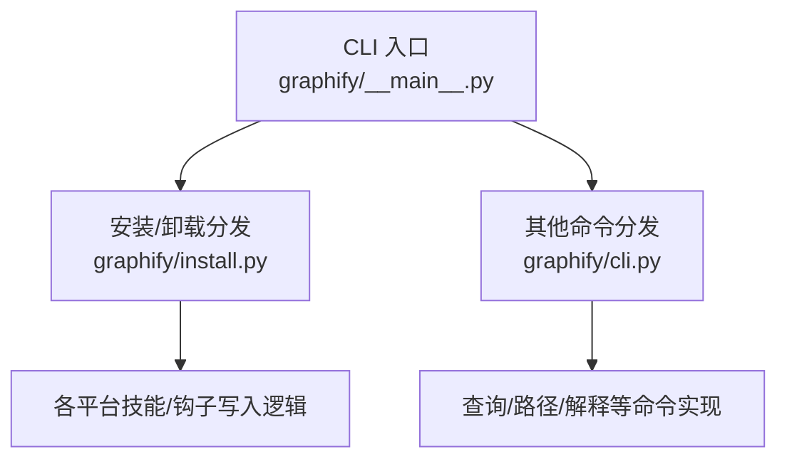
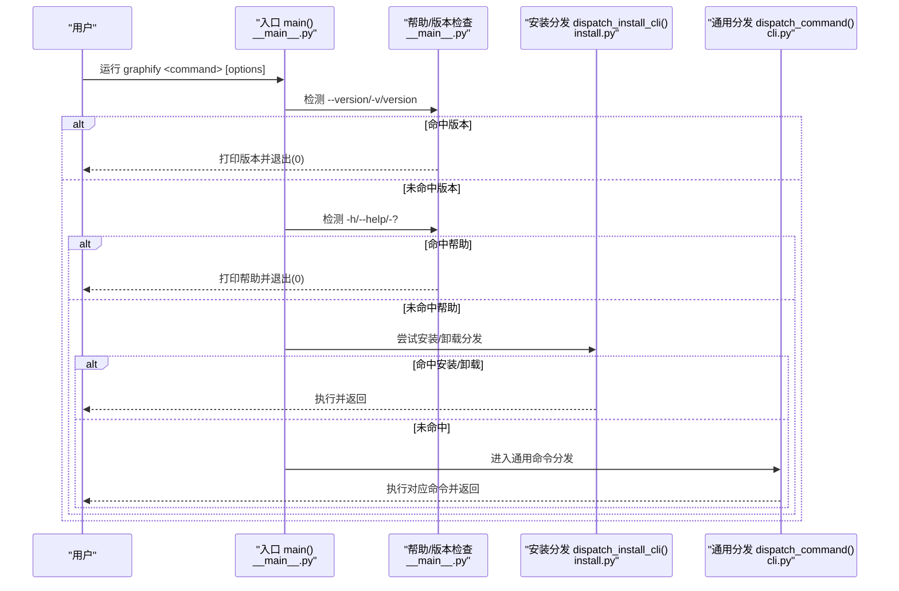
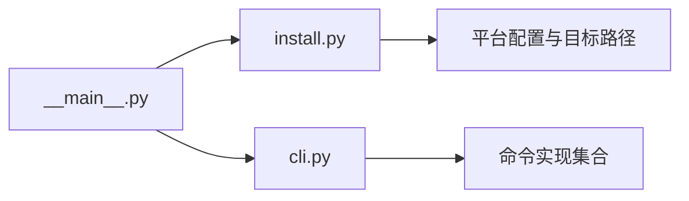

# 基础命令

<cite>
**本文引用的文件**   
- [graphify/__main__.py](file://graphify/__main__.py)
- [graphify/cli.py](file://graphify/cli.py)
- [graphify/install.py](file://graphify/install.py)
- [README.md](file://README.md)
</cite>

## 目录
1. [简介](#简介)
2. [项目结构](#项目结构)
3. [核心组件](#核心组件)
4. [架构总览](#架构总览)
5. [详细组件分析](#详细组件分析)
6. [依赖关系分析](#依赖关系分析)
7. [性能与行为特性](#性能与行为特性)
8. [故障排查指南](#故障排查指南)
9. [结论](#结论)
10. [附录：常用命令速查](#附录常用命令速查)

## 简介
本章节聚焦 graphify 的基础命令，包括 install、uninstall、version、help 等。文档将说明每个命令的语法、参数选项、使用场景、执行流程与返回值含义，并提供常见用法模式与最佳实践建议，帮助初学者快速上手。

## 项目结构
graphify 的命令行入口位于包内模块，负责解析顶层命令并分发到具体实现：
- 入口与全局控制流：graphify/__main__.py
- 非安装类命令分发与实现：graphify/cli.py
- 安装/卸载子系统（多平台）：graphify/install.py
- 用户可见的命令参考与示例：README.md

图表来源
- [graphify/__main__.py:460-712](file://graphify/__main__.py#L460-L712)
- [graphify/cli.py:259-396](file://graphify/cli.py#L259-L396)
- [graphify/install.py:1884-2149](file://graphify/install.py#L1884-L2149)

章节来源
- [graphify/__main__.py:460-712](file://graphify/__main__.py#L460-L712)
- [graphify/cli.py:259-396](file://graphify/cli.py#L259-L396)
- [graphify/install.py:1884-2149](file://graphify/install.py#L1884-L2149)

## 核心组件
- 版本与帮助输出：在入口中直接处理 --version/-v/version 与 -h/--help/-?，打印版本或帮助信息后退出。
- 安装/卸载分发：install/uninstall 及其平台子命令由安装子系统统一解析与执行。
- 其他命令：query/path/explain 等通过 cli.py 的分发器调用对应实现。

章节来源
- [graphify/__main__.py:502-707](file://graphify/__main__.py#L502-L707)
- [graphify/install.py:1884-2149](file://graphify/install.py#L1884-L2149)
- [graphify/cli.py:259-396](file://graphify/cli.py#L259-L396)

## 架构总览
下图展示了基础命令从 CLI 入口到具体实现的调用链路与关键分支。

图表来源
- [graphify/__main__.py:502-707](file://graphify/__main__.py#L502-L707)
- [graphify/install.py:1884-2149](file://graphify/install.py#L1884-L2149)
- [graphify/cli.py:259-396](file://graphify/cli.py#L259-L396)

## 详细组件分析

### 版本命令 version
- 触发方式
  - 短选项：-v 或 --version
  - 长命令：version
- 行为
  - 打印当前安装的 graphify 版本号
  - 立即退出（成功）
- 典型用法
  - graphify --version
  - graphify -v
  - graphify version
- 预期输出
  - 一行文本，包含“graphify”和版本号
- 返回值
  - 成功时退出码为 0；错误情况极少（如元数据不可用），会回退为未知版本但仍正常退出

章节来源
- [graphify/__main__.py:502-504](file://graphify/__main__.py#L502-L504)

### 帮助命令 help
- 触发方式
  - 无参数运行：graphify
  - 显式帮助：-h、--help、-?
- 行为
  - 打印简要使用说明与所有可用命令列表
  - 立即退出（成功）
- 典型用法
  - graphify
  - graphify --help
  - graphify -h
- 预期输出
  - 包含 Usage 行与各命令简述
- 返回值
  - 成功时退出码为 0

章节来源
- [graphify/__main__.py:506-691](file://graphify/__main__.py#L506-L691)

### 安装命令 install
- 作用
  - 将 graphify 的技能/指令文件安装到目标 AI 助手平台配置目录，支持用户级与项目级两种范围
- 基本语法
  - graphify install [--platform P] [--project]
- 主要选项
  - --platform P：指定平台，如 claude、windows、codebuddy、codex、opencode、aider、amp、agents、claw、droid、trae、trae-cn、gemini、cursor、antigravity、hermes、kiro、pi、devin 等
  - --project：将安装范围限定在当前项目目录（而非用户主目录）
- 平台别名
  - skills 是 agents 的别名
- 默认平台
  - Windows 下默认为 windows，其他系统默认为 claude
- 典型用法
  - graphify install
  - graphify install --platform codex
  - graphify install --project
  - graphify install --project --platform kiro
- 行为要点
  - 复制打包好的 SKILL.md 到目标平台目录
  - 对支持渐进披露的平台，同时安装 references/ 侧车目录
  - 写入 .graphify_version 时间戳用于版本一致性检查
  - 部分平台会更新其专属配置文件（如 CLAUDE.md、GEMINI.md、VS Code 指令等）
  - 若以 --project 安装，会提示 git add 相关变更
- 返回值
  - 成功时退出码为 0；遇到未知平台或缺少必要资源时会报错并退出非零

章节来源
- [graphify/install.py:539-622](file://graphify/install.py#L539-L622)
- [graphify/install.py:1884-1937](file://graphify/install.py#L1884-L1937)
- [graphify/install.py:1477-1512](file://graphify/install.py#L1477-L1512)
- [README.md:169-188](file://README.md#L169-L188)

### 卸载命令 uninstall
- 作用
  - 从已检测到的平台移除 graphify 的安装产物；可选择清理输出目录
- 基本语法
  - graphify uninstall [--purge] [--project] [--platform P]
- 主要选项
  - --purge：同时删除 graphify-out/ 目录
  - --project：仅移除项目范围内的安装产物
  - --platform P：针对指定平台进行卸载（在全局模式下仍会按策略执行）
- 典型用法
  - graphify uninstall
  - graphify uninstall --purge
  - graphify uninstall --project
  - graphify uninstall --project --platform codex
- 行为要点
  - 根据平台与范围删除 SKILL.md、references/、版本戳以及平台特定配置片段
  - 某些平台还会清理其插件或规则文件
- 返回值
  - 成功时退出码为 0；遇到无效选项或路径问题时报错并退出非零

章节来源
- [graphify/install.py:1938-1969](file://graphify/install.py#L1938-L1969)
- [graphify/install.py:1504-1512](file://graphify/install.py#L1504-L1512)
- [README.md:652-654](file://README.md#L652-L654)

### 命令执行流程与返回值含义
- 版本/帮助
  - 直接打印信息并退出，成功退出码为 0
- 安装/卸载
  - 成功完成操作后退出码为 0
  - 出现错误（如未知平台、缺少资源、非法参数）时，打印错误信息并退出非零
- 其他命令（如 query/path/explain）
  - 成功时退出码为 0；失败时打印错误并退出非零

章节来源
- [graphify/__main__.py:502-707](file://graphify/__main__.py#L502-L707)
- [graphify/install.py:1884-2149](file://graphify/install.py#L1884-L2149)
- [graphify/cli.py:259-396](file://graphify/cli.py#L259-L396)

### 常见使用模式与最佳实践
- 首次使用
  - 先安装：graphify install
  - 在 AI 助手内输入 /graphify . 构建知识图谱
- 团队协作
  - 将 graphify-out/ 提交到仓库，团队成员可直接读取图
  - 安装 hook 以便在 git commit 后自动重建
- 项目级安装
  - 使用 --project 将安装产物写入当前仓库，便于共享与版本管理
- 多平台切换
  - 使用 --platform 指定目标平台；Windows 上可显式选择 windows
- 清理与重装
  - 使用 uninstall 清理旧配置；必要时加 --purge 一并清理输出目录
- 版本检查
  - 使用 --version 确认当前安装版本，避免与 IDE 中的技能版本不一致

章节来源
- [README.md:169-188](file://README.md#L169-L188)
- [README.md:652-654](file://README.md#L652-L654)
- [README.md:747](file://README.md#L747)

## 依赖关系分析
- 入口模块 __main__.py 负责：
  - 版本/帮助处理
  - 安装/卸载分发（调用 install.py）
  - 其他命令分发（调用 cli.py）
- 安装/卸载子系统 install.py：
  - 维护平台配置与目标路径
  - 提供统一的 install/uninstall 分发器
  - 处理多平台技能与钩子的增删改
- 通用命令分发 cli.py：
  - 处理 query、path、explain、diagnose、add、watch、cluster-only、label 等命令

图表来源
- [graphify/__main__.py:460-712](file://graphify/__main__.py#L460-L712)
- [graphify/install.py:1884-2149](file://graphify/install.py#L1884-L2149)
- [graphify/cli.py:259-396](file://graphify/cli.py#L259-L396)

章节来源
- [graphify/__main__.py:460-712](file://graphify/__main__.py#L460-L712)
- [graphify/install.py:1884-2149](file://graphify/install.py#L1884-L2149)
- [graphify/cli.py:259-396](file://graphify/cli.py#L259-L396)

## 性能与行为特性
- 管道友好：入口对 BrokenPipeError 做了静默处理，避免下游关闭管道导致异常退出
- 编码安全：stdout/stderr 重设为 UTF-8 并容错替换，减少跨平台编码问题
- 版本一致性：安装后写入 .graphify_version，启动时检查并给出升级/修复提示（安装/卸载/钩子检查除外）

章节来源
- [graphify/__main__.py:448-481](file://graphify/__main__.py#L448-L481)
- [graphify/__main__.py:483-501](file://graphify/__main__.py#L483-L501)
- [graphify/install.py:56-66](file://graphify/install.py#L56-L66)

## 故障排查指南
- 找不到 graphify 命令
  - 检查 PATH 是否包含工具 bin 目录；或使用 python -m graphify
- 安装/卸载报错
  - 确认平台名称正确；查看错误提示并修正参数
- 版本不匹配警告
  - 升级 graphifyy 包后重新安装，确保技能与包版本一致
- 管道早闭导致异常
  - 入口已做兼容处理；若仍有问题，检查上游消费者是否正确消费输出

章节来源
- [README.md:539-549](file://README.md#L539-L549)
- [graphify/__main__.py:448-481](file://graphify/__main__.py#L448-L481)

## 结论
graphify 的基础命令设计简洁直观：version/help 提供即时反馈，install/uninstall 覆盖多平台与双范围（用户/项目），并通过严格的参数校验与清晰的错误提示保障易用性。配合 README 中的完整命令参考与示例，用户可以快速完成安装、配置与日常维护。

## 附录：常用命令速查
- 版本
  - graphify --version
  - graphify -v
  - graphify version
- 帮助
  - graphify
  - graphify --help
  - graphify -h
- 安装
  - graphify install
  - graphify install --platform <平台>
  - graphify install --project
  - graphify install --project --platform <平台>
- 卸载
  - graphify uninstall
  - graphify uninstall --purge
  - graphify uninstall --project
  - graphify uninstall --project --platform <平台>

章节来源
- [graphify/__main__.py:502-707](file://graphify/__main__.py#L502-L707)
- [graphify/install.py:1884-2149](file://graphify/install.py#L1884-L2149)
- [README.md:169-188](file://README.md#L169-L188)
- [README.md:652-654](file://README.md#L652-L654)
- [README.md:747](file://README.md#L747)