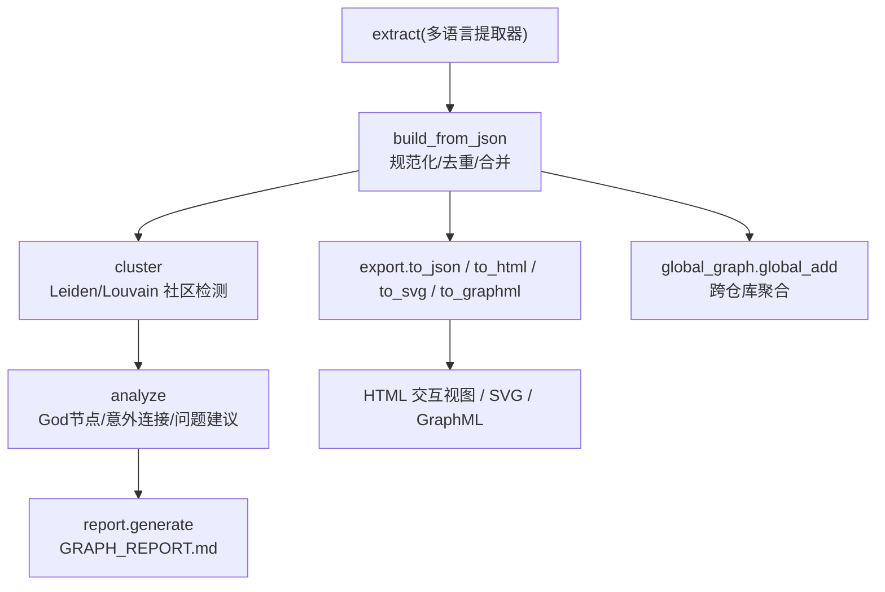
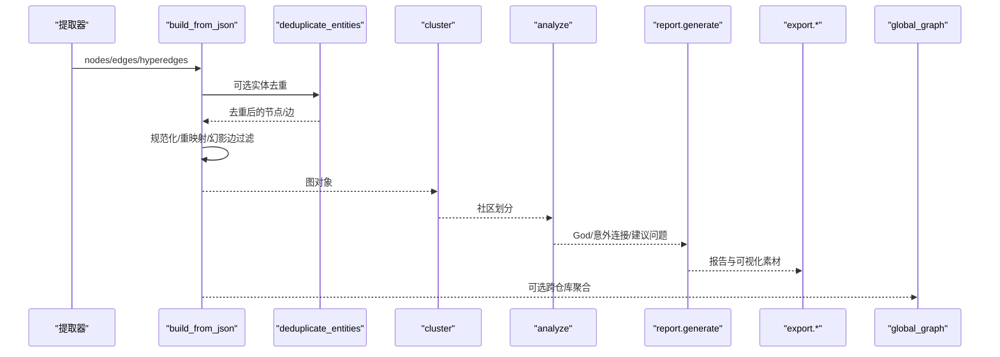
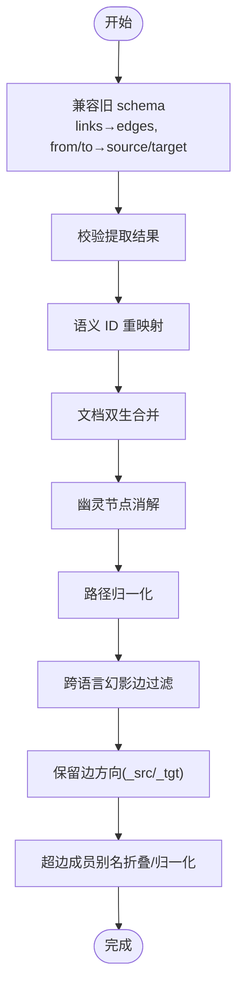
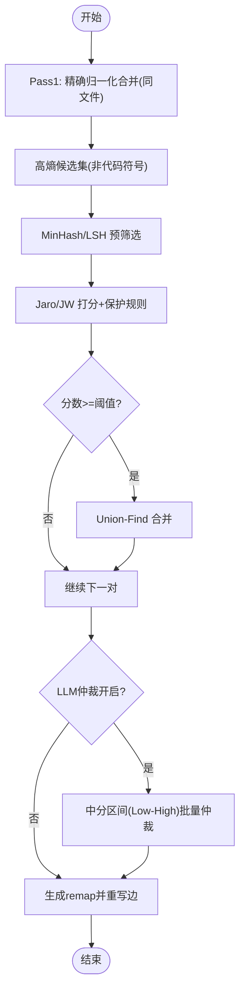
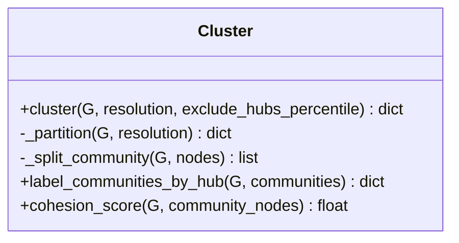
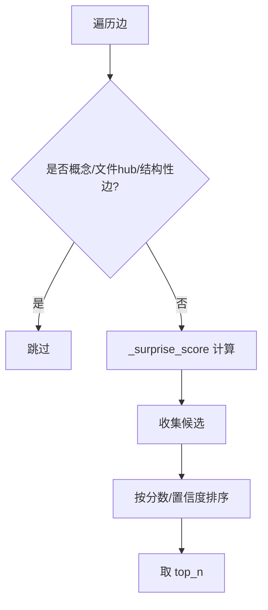
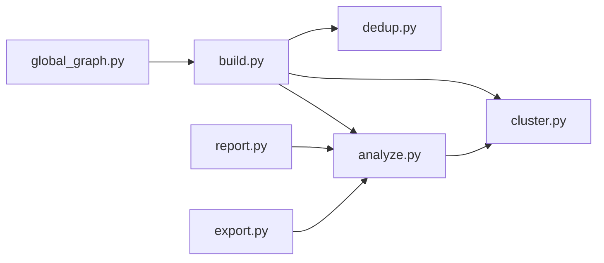

# 图构建和分析

<cite>
**本文引用的文件**   
- [graphify/build.py](file://graphify/build.py)
- [graphify/analyze.py](file://graphify/analyze.py)
- [graphify/cluster.py](file://graphify/cluster.py)
- [graphify/report.py](file://graphify/report.py)
- [graphify/dedup.py](file://graphify/dedup.py)
- [graphify/export.py](file://graphify/export.py)
- [graphify/tree_html.py](file://graphify/tree_html.py)
- [graphify/callflow_html.py](file://graphify/callflow_html.py)
- [graphify/global_graph.py](file://graphify/global_graph.py)
- [worked/httpx/GRAPH_REPORT.md](file://worked/httpx/GRAPH_REPORT.md)
</cite>

## 目录
1. [简介](#简介)
2. [项目结构](#项目结构)
3. [核心组件](#核心组件)
4. [架构总览](#架构总览)
5. [详细组件分析](#详细组件分析)
6. [依赖关系分析](#依赖关系分析)
7. [性能与内存优化](#性能与内存优化)
8. [故障排查指南](#故障排查指南)
9. [结论](#结论)
10. [附录](#附录)

## 简介
本文件系统性阐述 Graphify 的“从提取结果到完整知识图谱”的构建与分析流程，覆盖节点去重、边合并、属性填充、社区检测（Leiden）、分析指标（God 节点、意外连接、置信度评估）、报告生成（GRAPH_REPORT.md）以及可视化输出。同时提供大规模项目的性能优化建议与内存管理策略，帮助读者高效使用并扩展该能力。

## 项目结构
围绕图构建与分析的关键模块如下：
- 构建与规范化：build.py
- 实体去重：dedup.py
- 社区检测与标签：cluster.py
- 分析与指标：analyze.py
- 报告生成：report.py
- 可视化导出：export.py、tree_html.py、callflow_html.py
- 全局图聚合：global_graph.py

图表来源
- [graphify/build.py:383-762](file://graphify/build.py#L383-L762)
- [graphify/cluster.py:134-236](file://graphify/cluster.py#L134-L236)
- [graphify/analyze.py:100-154](file://graphify/analyze.py#L100-L154)
- [graphify/report.py:71-301](file://graphify/report.py#L71-L301)
- [graphify/export.py:183-200](file://graphify/export.py#L183-L200)
- [graphify/global_graph.py:77-156](file://graphify/global_graph.py#L77-L156)

章节来源
- [graphify/build.py:383-762](file://graphify/build.py#L383-L762)
- [graphify/cluster.py:134-236](file://graphify/cluster.py#L134-L236)
- [graphify/analyze.py:100-154](file://graphify/analyze.py#L100-L154)
- [graphify/report.py:71-301](file://graphify/report.py#L71-L301)
- [graphify/export.py:183-200](file://graphify/export.py#L183-L200)
- [graphify/global_graph.py:77-156](file://graphify/global_graph.py#L77-L156)

## 核心组件
- 构建与规范化（build_from_json）
  - 将提取产物（nodes/edges/hyperedges）合并为 NetworkX 图；支持有向/无向模式。
  - 关键步骤：schema 兼容（links→edges、from/to→source/target）、源路径归一化、语义 ID 重映射、文档双生节点合并、幽灵节点消解、跨语言幻影边过滤、方向保留、超边写入。
- 实体去重（deduplicate_entities）
  - 三阶段：精确归一化合并 → MinHash/LSH + Jaro/Jaro-Winkler 模糊匹配 → 可选 LLM 仲裁。
  - 保护规则：代码符号按 ID 而非 label 合并；短标签防误并；数字变体阻断；跨文件 file-anchored 类型阻断；同社区加分等。
- 社区检测（cluster）
  - 首选 Leiden（graspologic），回退 Louvain；支持分辨率参数、枢纽节点排除、超大社区二次拆分、低内聚再拆分、稳定排序与编号。
- 分析指标（analyze）
  - God 节点（排除文件级 hub、概念节点、JSON key 噪声）。
  - 意外连接（跨文件/跨社区/跨类型/跨仓库/低度到高度等综合评分）。
  - 建议问题（AMBIGUOUS 边、桥接节点、INFERRED 验证、孤立节点、低内聚社区）。
- 报告生成（report.generate）
  - 产出 GRAPH_REPORT.md：语料检查、摘要、God 节点、意外连接、导入环、超边、社区导航、知识缺口、工作记忆教训、建议问题。
- 可视化导出（export）
  - JSON/HTML/SVG/GraphML/Obsidian/Cypher 等；HTML 基于 vis-network 交互；SVG 轻量嵌入；GraphML 原子写入。
- 全局图（global_graph）
  - 跨仓库聚合：ID 前缀隔离、外部库节点按 label 复用、增量更新与清理。

章节来源
- [graphify/build.py:383-762](file://graphify/build.py#L383-L762)
- [graphify/dedup.py:285-549](file://graphify/dedup.py#L285-L549)
- [graphify/cluster.py:134-236](file://graphify/cluster.py#L134-L236)
- [graphify/analyze.py:100-154](file://graphify/analyze.py#L100-L154)
- [graphify/report.py:71-301](file://graphify/report.py#L71-L301)
- [graphify/export.py:183-200](file://graphify/export.py#L183-L200)
- [graphify/global_graph.py:77-156](file://graphify/global_graph.py#L77-L156)

## 架构总览
下图展示从提取到报告与可视化的端到端数据流。

图表来源
- [graphify/build.py:383-762](file://graphify/build.py#L383-L762)
- [graphify/dedup.py:285-549](file://graphify/dedup.py#L285-L549)
- [graphify/cluster.py:134-236](file://graphify/cluster.py#L134-L236)
- [graphify/analyze.py:100-154](file://graphify/analyze.py#L100-L154)
- [graphify/report.py:71-301](file://graphify/report.py#L71-L301)
- [graphify/export.py:183-200](file://graphify/export.py#L183-L200)
- [graphify/global_graph.py:77-156](file://graphify/global_graph.py#L77-L156)

## 详细组件分析

### 构建与规范化（build_from_json）
- 输入兼容：自动将旧版 links→edges、from/to→source/target；校验 schema 并忽略“悬空边”警告。
- 路径归一化：统一斜杠、相对化绝对路径，避免跨平台差异导致匹配失败。
- 语义 ID 重映射：对非 AST 节点依据 source_file 重新推导规范 ID，解决缓存碎片导致的幽灵节点。
- 文档双生合并：将快速扫描产生的 bare doc 节点与语义 _doc 节点合并，避免重复。
- 幽灵节点消解：AST 节点优先，非 AST 同名同文件节点若与 AST 对应则合并，消除幽灵。
- 跨语言幻影边过滤：calls/imports/references 在已知不同语言族时丢弃，防止误绑。
- 方向保留：在无向图中通过 _src/_tgt 保存原始方向，保证渲染正确。
- 超边处理：成员列表别名折叠、source_file 归一化后持久化到图元数据。

图表来源
- [graphify/build.py:383-762](file://graphify/build.py#L383-L762)

章节来源
- [graphify/build.py:383-762](file://graphify/build.py#L383-L762)

### 实体去重（deduplicate_entities）
- 精确归一化：同一文件内相同 label 直接合并；跨文件进入模糊匹配。
- 模糊匹配：MinHash/LSH 预筛选，Jaro/Jaro-Winkler 打分；长标签跨文件用 Jaro（无前缀奖励）降低误并。
- 保护规则：
  - 代码符号按 ID 合并，不基于 label 模糊合并。
  - 短标签仅允许单字符替换才合并。
  - 数字变体（如版本号）阻断合并。
  - 跨文件的 rationale/document 类型阻断合并。
  - 同社区加分提升合并可靠性。
- LLM 仲裁（可选）：对中等分区间（75–92）的歧义对批量提交 LLM 决策。
- 结果应用：生成 remap 表，重写边端点，移除自环，输出统计信息。

图表来源
- [graphify/dedup.py:285-549](file://graphify/dedup.py#L285-L549)
- [graphify/dedup.py:564-670](file://graphify/dedup.py#L564-L670)

章节来源
- [graphify/dedup.py:285-549](file://graphify/dedup.py#L285-L549)
- [graphify/dedup.py:564-670](file://graphify/dedup.py#L564-L670)

### 社区检测（cluster）
- 算法选择：优先 Leiden（graspologic），回退 Louvain（networkx）。
- 参数：
  - resolution：>1 产生更多更小的社区，<1 产生更少更大的社区。
  - exclude_hubs_percentile：按度数百分位排除超级枢纽，避免其拉偏社区。
- 稳定性与质量：
  - 孤立点单独成社区；超大社区（>25% 或最小阈值）二次 Leiden 拆分。
  - 低内聚社区（阈值与最小规模）二次拆分。
  - 最终按大小降序与确定性排序分配稳定 CID。
- 标签：默认以社区最高度节点作为名称（可被 LLM 命名覆盖）。

图表来源
- [graphify/cluster.py:22-77](file://graphify/cluster.py#L22-L77)
- [graphify/cluster.py:134-236](file://graphify/cluster.py#L134-L236)
- [graphify/cluster.py:86-110](file://graphify/cluster.py#L86-L110)
- [graphify/cluster.py:257-269](file://graphify/cluster.py#L257-L269)

章节来源
- [graphify/cluster.py:134-236](file://graphify/cluster.py#L134-L236)
- [graphify/cluster.py:86-110](file://graphify/cluster.py#L86-L110)
- [graphify/cluster.py:257-269](file://graphify/cluster.py#L257-L269)

### 分析指标（analyze）
- God 节点：按度排序，排除文件级 hub、概念节点、JSON key 噪声与内置类型。
- 意外连接：
  - 多文件语料：跨文件真实实体边，按 AMBIGUOUS > INFERRED > EXTRACTED 排序，并结合跨类型/跨仓库/跨社区/低度到高度等加分。
  - 单文件语料：跨社区边或高 betweenness 边。
- 建议问题：AMBIGUOUS 边、桥接节点、INFERRED 验证、孤立节点、低内聚社区。
- 导入环：基于 imports_from/re_exports 构建文件级有向图，限制长度枚举并去重旋转。

图表来源
- [graphify/analyze.py:100-154](file://graphify/analyze.py#L100-L154)
- [graphify/analyze.py:194-265](file://graphify/analyze.py#L194-L265)
- [graphify/analyze.py:268-328](file://graphify/analyze.py#L268-L328)
- [graphify/analyze.py:331-416](file://graphify/analyze.py#L331-L416)
- [graphify/analyze.py:419-544](file://graphify/analyze.py#L419-L544)
- [graphify/analyze.py:631-741](file://graphify/analyze.py#L631-L741)

章节来源
- [graphify/analyze.py:100-154](file://graphify/analyze.py#L100-L154)
- [graphify/analyze.py:194-265](file://graphify/analyze.py#L194-L265)
- [graphify/analyze.py:268-328](file://graphify/analyze.py#L268-L328)
- [graphify/analyze.py:331-416](file://graphify/analyze.py#L331-L416)
- [graphify/analyze.py:419-544](file://graphify/analyze.py#L419-L544)
- [graphify/analyze.py:631-741](file://graphify/analyze.py#L631-L741)

### 报告生成（GRAPH_REPORT.md）
- 内容结构：
  - 语料检查与摘要（节点/边/社区数、置信度分布、Token 成本）
  - God 节点
  - 意外连接（含置信度与说明）
  - 导入环（仅在含代码时显示）
  - 超边（组关系）
  - 社区导航（可切换 Obsidian 链接）
  - 知识缺口（孤立节点、薄社区、高 AMBIGUOUS 比例）
  - 工作记忆教训（优选来源与死胡同）
  - 建议问题
- 示例参考：[worked/httpx/GRAPH_REPORT.md:1-78](file://worked/httpx/GRAPH_REPORT.md#L1-L78)

章节来源
- [graphify/report.py:71-301](file://graphify/report.py#L71-L301)
- [worked/httpx/GRAPH_REPORT.md:1-78](file://worked/httpx/GRAPH_REPORT.md#L1-L78)

### 可视化输出与自定义选项
- HTML 交互视图（vis-network）
  - 支持搜索、侧边栏信息面板、社区图例、超边展示。
  - 通过 export.html 生成，数据内嵌，无需后端。
- 树形视图（tree_html）
  - 基于文件系统层级构建可折叠树，支持最大子节点截断与深度配色。
- 调用流架构图（callflow_html）
  - 生成深色主题 HTML，包含 Mermaid 流程图、导航、表格骨架等。
- 其他格式
  - JSON：标准 node_link 格式，带社区与标签。
  - SVG：matplotlib spring layout，适合嵌入 Markdown。
  - GraphML：原子写入（临时文件+替换），安全健壮。
  - Obsidian：社区标签与页面生成。
  - Neo4j/FalkorDB：导出为 Cypher 或直接推送。

章节来源
- [graphify/export.py:183-200](file://graphify/export.py#L183-L200)
- [graphify/tree_html.py:68-169](file://graphify/tree_html.py#L68-L169)
- [graphify/callflow_html.py:1-200](file://graphify/callflow_html.py#L1-L200)

## 依赖关系分析
- build_from_json 依赖 dedup（可选）、validate、ids、paths、extractors.base（用于 ID 与路径工具）。
- analyze 依赖 build.edge_data 与 cluster.cohesion_score。
- cluster 依赖 graspologic（可选）或 networkx.community.louvain。
- report 依赖 analyze 与 reflect（学习记忆）。
- export 依赖 exporters（html/svg/graphml 等）与 security。
- global_graph 依赖 build 的前缀/裁剪工具。

图表来源
- [graphify/build.py:383-762](file://graphify/build.py#L383-L762)
- [graphify/analyze.py:100-154](file://graphify/analyze.py#L100-L154)
- [graphify/cluster.py:134-236](file://graphify/cluster.py#L134-L236)
- [graphify/report.py:71-301](file://graphify/report.py#L71-L301)
- [graphify/export.py:183-200](file://graphify/export.py#L183-L200)
- [graphify/global_graph.py:77-156](file://graphify/global_graph.py#L77-L156)

章节来源
- [graphify/build.py:383-762](file://graphify/build.py#L383-L762)
- [graphify/analyze.py:100-154](file://graphify/analyze.py#L100-L154)
- [graphify/cluster.py:134-236](file://graphify/cluster.py#L134-L236)
- [graphify/report.py:71-301](file://graphify/report.py#L71-L301)
- [graphify/export.py:183-200](file://graphify/export.py#L183-L200)
- [graphify/global_graph.py:77-156](file://graphify/global_graph.py#L77-L156)

## 性能与内存优化
- 社区检测
  - 大稀疏图回退 Louvain 时启用 max_level 与 threshold，避免长时间运行。
  - 合理设置 resolution 与 exclude_hubs_percentile，减少巨型社区与超级枢纽影响。
- 去重
  - 控制候选集规模（仅高熵非代码符号参与模糊匹配），显著降低 O(n^2) 风险。
  - 关闭 LLM 仲裁以提升速度；必要时仅对高分歧对批处理。
- 构建
  - 使用 directed=False 可减少存储开销；需要方向时使用 DiGraph。
  - 利用 dedup=True 提前合并，降低后续分析复杂度。
- 可视化
  - HTML 视图适合中小规模；大图建议导出 SVG/GraphML 或使用 tree 视图。
  - 树视图支持 max_children 截断，避免浏览器卡顿。
- 全局图
  - 跨仓库聚合时外部库按 label 复用，避免重复膨胀。
- 安全与容量
  - 读取 graph.json 前进行文件大小上限检查，防止 DoS。
  - 原子写入 GraphML，避免中间态损坏。

章节来源
- [graphify/cluster.py:70-77](file://graphify/cluster.py#L70-L77)
- [graphify/dedup.py:380-491](file://graphify/dedup.py#L380-L491)
- [graphify/build.py:383-762](file://graphify/build.py#L383-L762)
- [graphify/export.py:951-974](file://graphify/export.py#L951-L974)
- [graphify/global_graph.py:77-156](file://graphify/global_graph.py#L77-L156)

## 故障排查指南
- 节点 ID 冲突与幽灵节点
  - 现象：同一实体出现多个节点或边指向不存在节点。
  - 排查：确认 AST 与语义 ID 一致性；查看语义 ID 重映射与幽灵消解逻辑。
  - 参考：[graphify/build.py:437-489](file://graphify/build.py#L437-L489)、[graphify/build.py:514-594](file://graphify/build.py#L514-L594)
- 跨语言幻影边
  - 现象：Python import time 绑定到 time.ts。
  - 排查：检查语言族判定与 relation 过滤。
  - 参考：[graphify/build.py:710-734](file://graphify/build.py#L710-L734)
- 社区不稳定
  - 现象：CID 频繁变化。
  - 排查：确认社区排序与 tie-break 是否生效；检查是否启用了 LLM 命名覆盖。
  - 参考：[graphify/cluster.py:229-236](file://graphify/cluster.py#L229-L236)
- 报告缺失导入环
  - 现象：纯文档语料仍显示“未检测到”。
  - 排查：仅当存在 code 节点或 imports 边时才显示。
  - 参考：[graphify/report.py:191-211](file://graphify/report.py#L191-L211)
- 可视化崩溃
  - 现象：HTML 视图报错或空白。
  - 排查：确保 .graphify_analysis.json 存在或社区字段可用；否则回退为空集合。
  - 参考：[tests/test_cli_export.py:502-522](file://tests/test_cli_export.py#L502-L522)

章节来源
- [graphify/build.py:437-489](file://graphify/build.py#L437-L489)
- [graphify/build.py:514-594](file://graphify/build.py#L514-L594)
- [graphify/build.py:710-734](file://graphify/build.py#L710-L734)
- [graphify/cluster.py:229-236](file://graphify/cluster.py#L229-L236)
- [graphify/report.py:191-211](file://graphify/report.py#L191-L211)
- [tests/test_cli_export.py:502-522](file://tests/test_cli_export.py#L502-L522)

## 结论
Graphify 的图构建与分析管线以稳健的规范化与去重为核心，结合高质量的社区检测与多维分析指标，形成从源码到洞察的闭环。通过灵活的可视化与报告机制，用户可快速定位核心抽象、发现意外耦合与潜在风险，并在大规模项目中借助参数调优与内存策略保持良好性能。

## 附录
- 示例报告结构参考：[worked/httpx/GRAPH_REPORT.md:1-78](file://worked/httpx/GRAPH_REPORT.md#L1-L78)
- 相关实现入口与函数路径：
  - 构建：[graphify/build.py:383-762](file://graphify/build.py#L383-L762)
  - 去重：[graphify/dedup.py:285-549](file://graphify/dedup.py#L285-L549)
  - 社区：[graphify/cluster.py:134-236](file://graphify/cluster.py#L134-L236)
  - 分析：[graphify/analyze.py:100-154](file://graphify/analyze.py#L100-L154)
  - 报告：[graphify/report.py:71-301](file://graphify/report.py#L71-L301)
  - 导出：[graphify/export.py:183-200](file://graphify/export.py#L183-L200)
  - 全局图：[graphify/global_graph.py:77-156](file://graphify/global_graph.py#L77-L156)