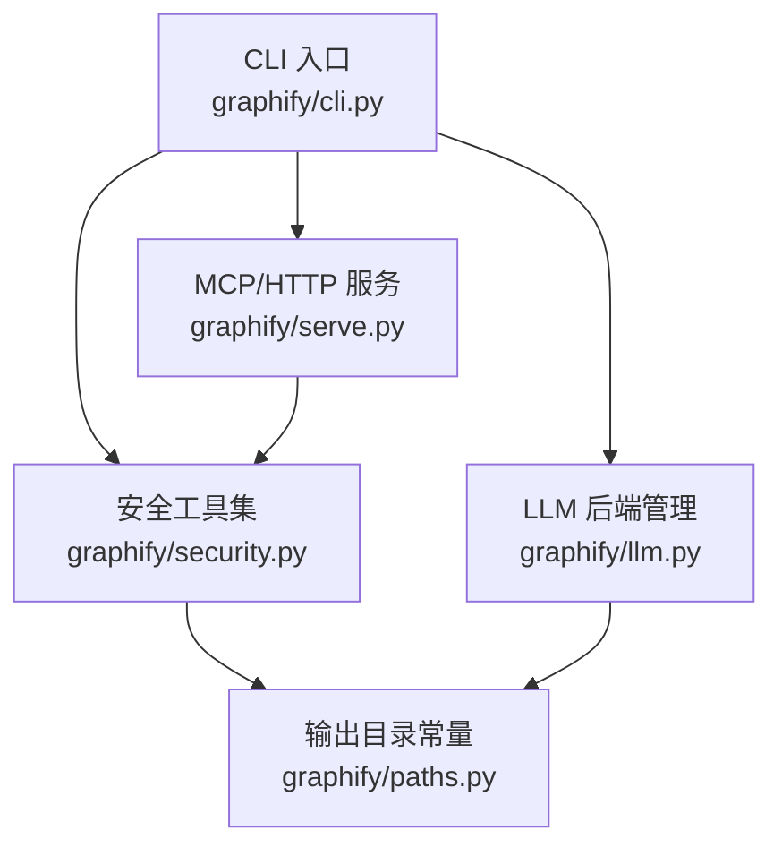
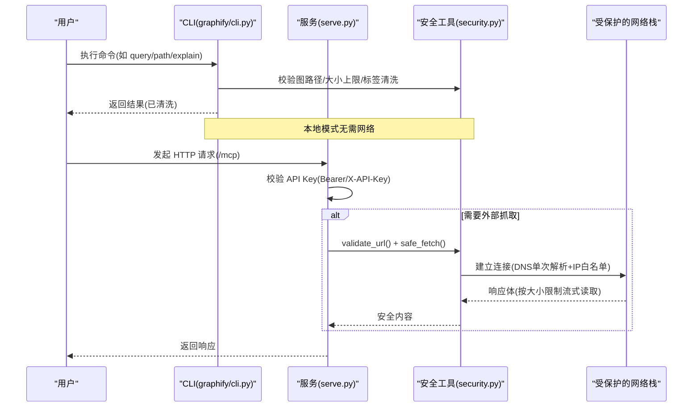
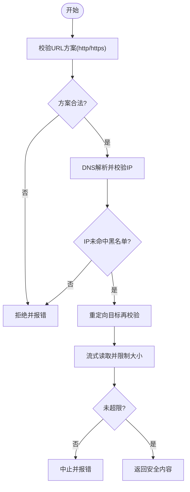
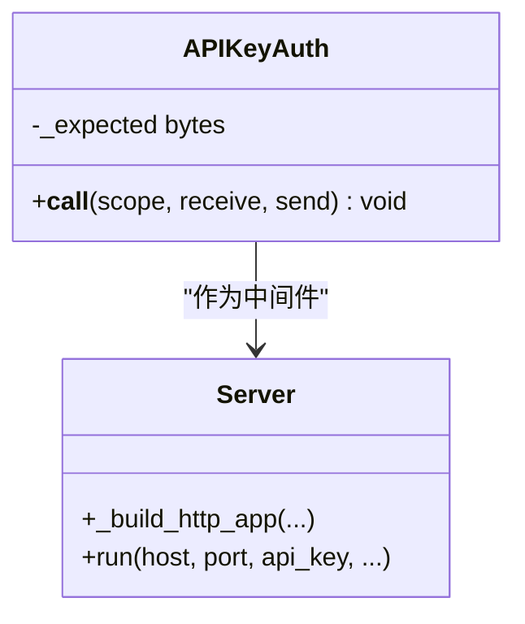
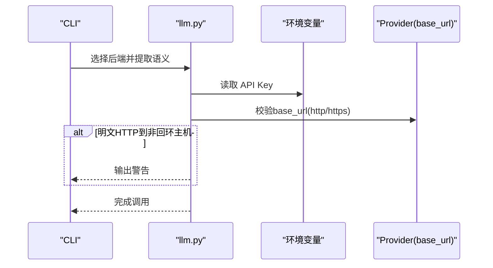
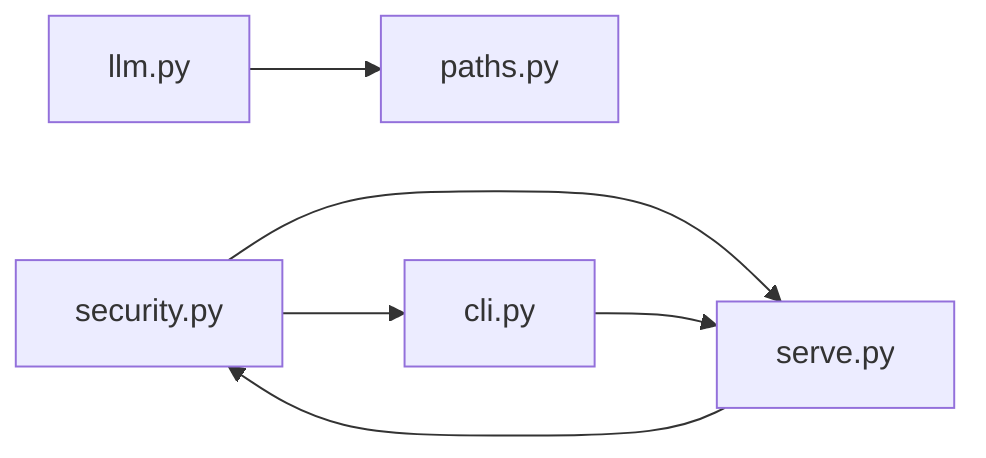

# 安全和隐私

<cite>
**本文引用的文件**   
- [graphify/security.py](file://graphify/security.py)
- [SECURITY.md](file://SECURITY.md)
- [graphify/serve.py](file://graphify/serve.py)
- [graphify/cli.py](file://graphify/cli.py)
- [graphify/llm.py](file://graphify/llm.py)
- [graphify/paths.py](file://graphify/paths.py)
- [tests/test_security.py](file://tests/test_security.py)
</cite>

## 目录
1. [简介](#简介)
2. [项目结构](#项目结构)
3. [核心组件](#核心组件)
4. [架构总览](#架构总览)
5. [详细组件分析](#详细组件分析)
6. [依赖关系分析](#依赖关系分析)
7. [性能与安全权衡](#性能与安全权衡)
8. [故障排查指南](#故障排查指南)
9. [结论](#结论)
10. [附录：配置与合规建议](#附录配置与合规建议)

## 简介
本文件系统性阐述 Graphify 的安全模型与隐私保护措施，覆盖输入验证与清洗、防恶意代码执行与路径遍历、数据隔离策略、API 密钥管理与敏感信息保护、网络请求安全（HTTPS 强制、证书校验、超时控制）、安全审计与漏洞扫描流程、最佳实践与合规建议，以及已知安全问题与修复方案。Graphify 定位为本地开发工具，默认不监听网络；仅在显式启用 HTTP 传输或用户主动抓取 URL 时涉及外部通信。

## 项目结构
围绕安全的关键模块与职责如下：
- 安全基础能力：URL 校验、SSRF 防护、下载大小限制、路径白名单、标签与元数据清洗、图文件大小上限等
- 服务层安全：HTTP 传输的 API Key 鉴权、Host 头校验、会话超时、DNS 重绑定防护开关
- LLM 后端安全：自定义 Provider base_url 结构校验、明文 HTTP 告警、本地 Provider 加载门控、环境变量注入 API Key
- CLI 入口：命令参数校验、图文件尺寸上限拦截、提示引导避免直接读取源码
- 输出目录规范：统一输出目录名与路径解析，配合路径守卫防止越界访问

图示来源
- [graphify/cli.py:1-800](file://graphify/cli.py#L1-L800)
- [graphify/serve.py:1-800](file://graphify/serve.py#L1-L800)
- [graphify/security.py:1-461](file://graphify/security.py#L1-L461)
- [graphify/llm.py:1-400](file://graphify/llm.py#L1-L400)
- [graphify/paths.py:1-235](file://graphify/paths.py#L1-L235)

章节来源
- [graphify/security.py:1-461](file://graphify/security.py#L1-L461)
- [SECURITY.md:1-55](file://SECURITY.md#L1-L55)
- [graphify/serve.py:1-800](file://graphify/serve.py#L1-L800)
- [graphify/cli.py:1-800](file://graphify/cli.py#L1-L800)
- [graphify/llm.py:1-400](file://graphify/llm.py#L1-L400)
- [graphify/paths.py:1-235](file://graphify/paths.py#L1-L235)

## 核心组件
- 输入与路径安全
  - URL 白名单与 SSRF 防护：仅允许 http/https，拒绝私有/保留/环回/链路本地/共享地址空间 IP，阻断云元数据主机名；对重定向目标再次校验；连接前 DNS 解析一次并直连已验证 IP，避免 DNS 重绑定 TOCTOU
  - 下载体积限制：二进制与文本分别设置硬上限，流式读取并在超过阈值时中止
  - 路径遍历防护：要求目标路径必须位于 graphify-out 目录内，且该目录必须存在
  - 图文件内存炸弹防护：在 JSON 解析前检查文件大小，支持通过环境变量调整上限
  - 标签与元数据清洗：去除控制字符、长度截断、HTML 转义，防止 XSS 与提示注入
- 服务与传输安全
  - HTTP 传输可选开启，默认关闭；启用时需设置 API Key，支持 Authorization: Bearer 与 X-API-Key 两种头部
  - Host 头白名单：非通配符绑定时限制允许的 Host 值，降低 Host 头注入风险
  - 会话空闲超时：可配置 idle timeout，减少长连接资源占用
- LLM 后端安全
  - 自定义 Provider base_url 结构校验：拒绝非 http(s) 方案；对非回环主机的明文 HTTP 发出警告
  - 本地 providers.json 加载需显式授权，防止随仓库传播的配置泄露
  - API Key 从环境变量注入，不在源码或配置中持久化存储
- 输出目录与数据隔离
  - 统一输出目录名 GRAPHIFY_OUT，所有路径守卫基于此实现，避免跨目录访问
  - 检测阶段显式禁止跟随符号链接，防止绕过扫描范围

章节来源
- [graphify/security.py:1-461](file://graphify/security.py#L1-L461)
- [graphify/serve.py:1560-1654](file://graphify/serve.py#L1560-L1654)
- [graphify/llm.py:186-260](file://graphify/llm.py#L186-L260)
- [graphify/paths.py:1-235](file://graphify/paths.py#L1-L235)
- [SECURITY.md:23-55](file://SECURITY.md#L23-L55)

## 架构总览
下图展示关键安全边界与调用链：CLI 进入后，查询/导出等命令可能加载图文件并进行文本渲染；若启用 HTTP 传输，则经过鉴权中间件；当进行 URL 抓取时，走安全封装的网络栈。

图示来源
- [graphify/cli.py:422-518](file://graphify/cli.py#L422-L518)
- [graphify/serve.py:1560-1654](file://graphify/serve.py#L1560-L1654)
- [graphify/security.py:103-300](file://graphify/security.py#L103-L300)

## 详细组件分析

### 安全工具集（security.py）
- URL 校验与 SSRF 防护
  - 仅允许 http/https；拒绝 file/ftp/data 等危险方案
  - 预检 DNS 解析，拒绝私有/保留/环回/链路本地/共享地址空间 IP，并阻断云元数据主机名
  - 连接阶段采用子类化 HTTP(S)Connection，DNS 解析一次后直连已验证 IP，避免 DNS 重绑定
  - 重定向处理器在每个跳转处重新校验目标 URL
- 安全下载
  - 流式读取并按类型限制最大字节数，超过即中止
  - 非 2xx 状态码抛出错误，避免将错误页当作有效内容处理
- 路径与图文件安全
  - validate_graph_path 确保目标路径在 graphify-out 下且目录存在
  - check_graph_file_size_cap 在解析前检查文件大小，支持环境变量调整上限
- 标签与元数据清洗
  - sanitize_label 去除控制字符、限制长度，供 MCP 文本输出使用
  - sanitize_metadata 递归清洗键值，HTML 转义、长度与列表项数量限制，保持 JSON 兼容

图示来源
- [graphify/security.py:103-300](file://graphify/security.py#L103-L300)

章节来源
- [graphify/security.py:1-461](file://graphify/security.py#L1-L461)
- [tests/test_security.py:1-464](file://tests/test_security.py#L1-L464)

### 服务与传输安全（serve.py）
- API Key 鉴权
  - 支持 Authorization: Bearer 与 X-API-Key 两种头部
  - 使用恒定时间比较，缺失或不匹配时返回 401
- Host 头白名单
  - 非通配符绑定时限制允许的 Host 值（含端口），降低 Host 头注入风险
- 会话空闲超时
  - 根据 stateless 与 session_timeout 计算 idle_timeout，避免长连接资源泄漏

图示来源
- [graphify/serve.py:1560-1654](file://graphify/serve.py#L1560-L1654)

章节来源
- [graphify/serve.py:1560-1654](file://graphify/serve.py#L1560-L1654)
- [tests/test_serve_http.py:87-118](file://tests/test_serve_http.py#L87-L118)

### LLM 后端安全（llm.py）
- 自定义 Provider base_url 校验
  - 拒绝非 http(s) 方案
  - 对非回环主机的明文 HTTP 发出警告，提醒潜在泄露风险
- 本地 providers.json 加载门控
  - 默认忽略项目级 providers.json，需显式设置环境变量才加载，防止随仓库传播的配置泄露
- API Key 注入
  - 从环境变量读取，不在源码或配置中持久化
  - 针对 Ollama 无 Key 场景给出可见警告，避免静默外发

图示来源
- [graphify/llm.py:186-260](file://graphify/llm.py#L186-L260)
- [graphify/llm.py:916-943](file://graphify/llm.py#L916-L943)

章节来源
- [graphify/llm.py:186-260](file://graphify/llm.py#L186-L260)
- [graphify/llm.py:916-943](file://graphify/llm.py#L916-L943)

### CLI 入口与命令安全（cli.py）
- 命令参数校验与提示
  - 对 query/path/explain 等命令进行参数合法性检查
  - 提供“先查询再读源码”的钩子提示，降低直接 grep 的风险
- 图文件尺寸上限拦截
  - 在解析前调用安全工具检查大小，超出则退出并提示

章节来源
- [graphify/cli.py:1-800](file://graphify/cli.py#L1-L800)

### 输出目录与数据隔离（paths.py）
- 统一输出目录名 GRAPHIFY_OUT，便于全局一致的路径守卫
- 提供 out_path 与 default_graph_json 等辅助函数，确保所有读写均落在受控目录

章节来源
- [graphify/paths.py:1-235](file://graphify/paths.py#L1-L235)

## 依赖关系分析
- 低耦合高内聚
  - security.py 提供通用安全原语，被 serve.py、cli.py 等多处复用
  - llm.py 独立管理后端配置与网络策略，避免与 UI/IO 层耦合
- 外部依赖与集成点
  - 标准库 urllib/http.client/ipaddress/socket 用于安全网络栈
  - networkx 用于图构建与查询（不涉及网络）
  - 第三方 SDK（OpenAI/Anthropic/Azure/Bedrock/Ollama）通过 llm.py 抽象

图示来源
- [graphify/security.py:1-461](file://graphify/security.py#L1-L461)
- [graphify/serve.py:1-800](file://graphify/serve.py#L1-L800)
- [graphify/cli.py:1-800](file://graphify/cli.py#L1-L800)
- [graphify/llm.py:1-400](file://graphify/llm.py#L1-L400)
- [graphify/paths.py:1-235](file://graphify/paths.py#L1-L235)

章节来源
- [graphify/security.py:1-461](file://graphify/security.py#L1-L461)
- [graphify/serve.py:1-800](file://graphify/serve.py#L1-L800)
- [graphify/cli.py:1-800](file://graphify/cli.py#L1-L800)
- [graphify/llm.py:1-400](file://graphify/llm.py#L1-L400)
- [graphify/paths.py:1-235](file://graphify/paths.py#L1-L235)

## 性能与安全权衡
- 下载体积限制与用户体验
  - 合理设置 max_bytes，避免大文件拖慢进程；文本抓取默认更严格的上限
- 图文件大小上限
  - 默认 512 MiB，可通过环境变量提升以适配大型代码库，但需评估内存压力
- 搜索与遍历优化
  - trigram 索引与 IDF 权重加速查询，同时避免过度扩展高连通节点（hub 阈值）
- 会话空闲超时
  - 合理设置 idle_timeout，平衡并发与资源占用

[本节为通用指导，不直接分析具体文件]

## 故障排查指南
- 常见错误与定位
  - 非 2xx 响应：safe_fetch 会抛出 HTTPError，检查目标 URL 与权限
  - 大小限制：OSError 提示超过限制，调整 max_bytes 或优化抓取逻辑
  - 路径越界：ValueError 提示路径逃逸，确认 base 目录与相对路径
  - 图文件过大：ValueError 提示超过 cap，设置 GRAPHIFY_MAX_GRAPH_BYTES 提高上限
  - API Key 鉴权失败：401 响应，检查 Authorization 或 X-API-Key 头部
  - Host 头拒绝：非通配符绑定时 Host 不在白名单，修正客户端 Host 或放宽绑定
- 诊断与恢复
  - 损坏的 graph.json：服务层捕获 JSONDecodeError 并提示重建
  - 诊断工具对超大图文件的拒绝行为已在测试中覆盖

章节来源
- [graphify/security.py:258-384](file://graphify/security.py#L258-L384)
- [graphify/serve.py:21-63](file://graphify/serve.py#L21-L63)
- [tests/test_security.py:279-343](file://tests/test_security.py#L279-L343)

## 结论
Graphify 的安全模型围绕“最小信任面”设计：默认不暴露网络接口，必要时通过严格的鉴权与 Host 白名单限制；对外部 URL 抓取实施方案白名单、IP 黑名单、重定向二次校验与体积限制；对本地文件系统实施路径白名单与目录存在性检查；对输出文本进行标签与元数据清洗，防范 XSS 与提示注入；对 LLM 后端进行 base_url 结构校验与明文 HTTP 告警，并通过环境变量注入 API Key，避免敏感信息落地。整体实现兼顾安全性与可用性，并提供丰富的环境变量与配置选项以满足不同部署需求。

[本节为总结，不直接分析具体文件]

## 附录：配置与合规建议
- 安全配置最佳实践
  - 始终启用 HTTP 传输时的 API Key，优先使用 Authorization: Bearer
  - 在非公网环境谨慎使用通配符绑定；生产环境建议使用反向代理与 TLS 终止
  - 合理设置 GRAPHIFY_MAX_GRAPH_BYTES、GRAPHIFY_API_TIMEOUT、GRAPHIFY_MAX_RETRIES 等环境变量
  - 对自定义 Provider 的 base_url 使用 https，避免明文 HTTP 外发
  - 如需加载项目级 providers.json，显式设置 GRAPHIFY_ALLOW_LOCAL_PROVIDERS=1
- 合规性建议
  - 遵循最小权限原则：仅授予必要的文件系统与网络访问
  - 日志脱敏：避免记录 API Key、Token 与敏感路径
  - 定期更新依赖与版本，关注安全公告与漏洞披露流程
- 已知安全问题与修复方案
  - SSRF 与 DNS 重绑定：通过 validate_url 与单次 DNS 解析直连已验证 IP 缓解
  - 路径遍历：validate_graph_path 强制路径位于 graphify-out 下
  - XSS 与提示注入：sanitize_label/sanitize_metadata 清洗输出
  - 明文 HTTP 泄露：provider_base_url_ok 对非回环主机的 http 发出警告
  - 本地配置泄露：默认忽略项目级 providers.json，需显式授权
  - 图文件内存炸弹：check_graph_file_size_cap 在解析前拒绝超大文件

章节来源
- [SECURITY.md:23-55](file://SECURITY.md#L23-L55)
- [graphify/llm.py:186-260](file://graphify/llm.py#L186-L260)
- [graphify/security.py:315-384](file://graphify/security.py#L315-L384)
- [graphify/serve.py:1560-1654](file://graphify/serve.py#L1560-L1654)