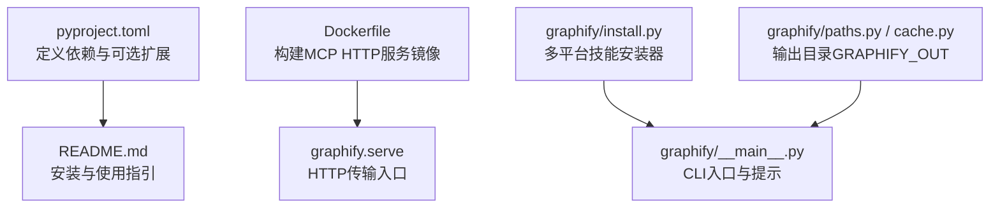
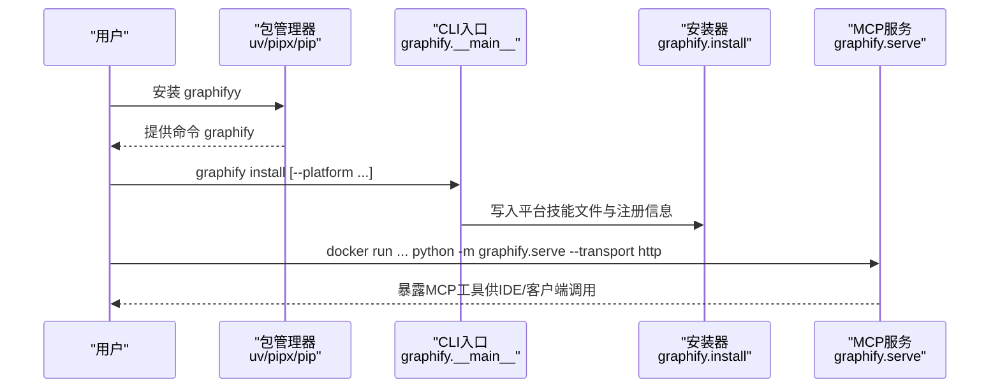
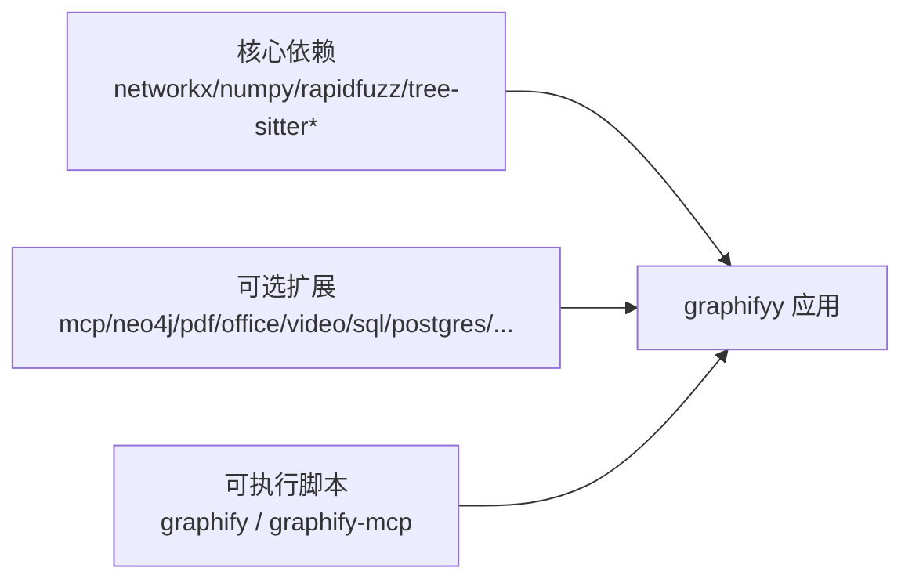

# 安装和设置

<cite>
**本文引用的文件**   
- [pyproject.toml](file://pyproject.toml)
- [README.md](file://README.md)
- [Dockerfile](file://Dockerfile)
- [graphify/install.py](file://graphify/install.py)
- [graphify/__main__.py](file://graphify/__main__.py)
- [graphify/paths.py](file://graphify/paths.py)
- [graphify/cache.py](file://graphify/cache.py)
- [docs/docker-mcp-sqlite.md](file://docs/docker-mcp-sqlite.md)
</cite>

## 目录
1. [简介](#简介)
2. [项目结构](#项目结构)
3. [核心组件](#核心组件)
4. [架构总览](#架构总览)
5. [详细组件分析](#详细组件分析)
6. [依赖分析](#依赖分析)
7. [性能考虑](#性能考虑)
8. [故障排除指南](#故障排除指南)
9. [结论](#结论)
10. [附录](#附录)

## 简介
本指南聚焦于 graphifyy 的安装与设置，覆盖 Python 版本要求、依赖项、多种安装方式（uv tool install 推荐、pipx install、pip install）、各平台特定步骤（macOS Homebrew、Windows winget、Ubuntu/Debian apt）、可选功能模块（pdf、office、video、mcp、neo4j 等）、常见问题排查，以及 Docker 容器化部署与环境变量配置。

## 项目结构
与安装相关的关键位置：
- 包元数据与依赖声明：pyproject.toml
- 用户快速上手与安装说明：README.md
- 容器镜像构建与运行入口：Dockerfile
- 平台技能安装逻辑与路径解析：graphify/install.py
- CLI 主入口与输出目录常量：graphify/__main__.py、graphify/paths.py、graphify/cache.py
- Docker MCP Toolkit + SQLite 参考文档：docs/docker-mcp-sqlite.md

图表来源
- [pyproject.toml:1-149](file://pyproject.toml#L1-L149)
- [README.md:124-265](file://README.md#L124-L265)
- [Dockerfile:1-26](file://Dockerfile#L1-L26)
- [graphify/install.py:1-230](file://graphify/install.py#L1-L230)
- [graphify/__main__.py:164-194](file://graphify/__main__.py#L164-L194)
- [graphify/paths.py](file://graphify/paths.py)
- [graphify/cache.py:13-20](file://graphify/cache.py#L13-L20)

章节来源
- [pyproject.toml:1-149](file://pyproject.toml#L1-L149)
- [README.md:124-265](file://README.md#L124-L265)
- [Dockerfile:1-26](file://Dockerfile#L1-L26)
- [graphify/install.py:1-230](file://graphify/install.py#L1-L230)
- [graphify/__main__.py:164-194](file://graphify/__main__.py#L164-L194)
- [graphify/paths.py](file://graphify/paths.py)
- [graphify/cache.py:13-20](file://graphify/cache.py#L13-L20)

## 核心组件
- Python 版本要求：>=3.10
- 基础依赖：networkx、numpy、rapidfuzz、tree-sitter 及多语言语法树子包
- 可选扩展：mcp、neo4j、falkordb、pdf、watch、svg、leiden、office、google、postgres、video、kimi、ollama、bedrock、anthropic、gemini、openai、chinese、sql、neug、pascal、dm、terraform、all
- 可执行脚本：graphify、graphify-mcp

章节来源
- [pyproject.toml:11-88](file://pyproject.toml#L11-L88)

## 架构总览
下图展示从“安装”到“运行”的主要路径：通过 uv/pipx/pip 安装后，命令行入口为 graphify；在 IDE 中通过“install”写入平台技能文件；Docker 场景下以 graphify.serve 暴露 HTTP 服务。

图表来源
- [README.md:151-198](file://README.md#L151-L198)
- [graphify/install.py:539-622](file://graphify/install.py#L539-L622)
- [Dockerfile:14-26](file://Dockerfile#L14-L26)

## 详细组件分析

### 环境要求与前置条件
- Python 版本：>=3.10
- 推荐工具：uv（用于隔离安装与更新）
- 备选工具：pipx、pip

章节来源
- [pyproject.toml:11-12](file://pyproject.toml#L11-L12)
- [README.md:124-148](file://README.md#L124-L148)

### 安装方式一：uv tool install（推荐）
- 安装命令：uv tool install graphifyy
- 若安装后找不到命令，运行 uv tool update-shell 并重启终端
- 升级：uv tool upgrade graphifyy

章节来源
- [README.md:151-198](file://README.md#L151-L198)

### 安装方式二：pipx install
- 安装命令：pipx install graphifyy
- 若找不到命令，运行 pipx ensurepath 并重启终端

章节来源
- [README.md:151-198](file://README.md#L151-L198)

### 安装方式三：pip install
- 安装命令：pip install graphifyy
- 注意：可能需要手动将用户 bin 目录加入 PATH（Linux: ~/.local/bin；macOS: ~/Library/Python/3.x/bin），或直接使用 python -m graphify 运行

章节来源
- [README.md:151-198](file://README.md#L151-L198)

### 平台特定安装指导
- macOS（Homebrew）：brew install python@3.12 uv
- Windows（winget）：winget install astral-sh.uv
- Ubuntu/Debian（apt）：sudo apt install python3.12 python3-pip pipx；或按官方脚本安装 uv

章节来源
- [README.md:132-147](file://README.md#L132-L147)

### 可选功能模块安装
以下为常用扩展的 uv 安装示例（按需选择）：
- pdf：uv tool install "graphifyy[pdf]"
- office：uv tool install "graphifyy[office]"
- google：uv tool install "graphifyy[google]"
- video：uv tool install "graphifyy[video]"
- mcp：uv tool install "graphifyy[mcp]"
- neo4j：uv tool install "graphifyy[neo4j]"
- falkordb：uv tool install "graphifyy[falkordb]"
- neug：uv tool install "graphifyy[neug]"
- svg：uv tool install "graphifyy[svg]"
- leiden：uv tool install "graphifyy[leiden]"
- ollama：uv tool install "graphifyy[ollama]"
- openai：uv tool install "graphifyy[openai]"
- gemini：uv tool install "graphifyy[gemini]"
- anthropic：uv tool install "graphifyy[anthropic]"
- bedrock：uv tool install "graphifyy[bedrock]"
- azure：uv tool install "graphifyy[openai]"
- sql：uv tool install "graphifyy[sql]"
- postgres：uv tool install "graphifyy[postgres]"
- dm：uv tool install "graphifyy[dm]"
- terraform：uv tool install "graphifyy[terraform]"
- pascal：uv tool install "graphifyy[pascal]"
- chinese：uv tool install "graphifyy[chinese]"
- all：uv tool install "graphifyy[all]"

章节来源
- [README.md:237-265](file://README.md#L237-L265)
- [pyproject.toml:50-84](file://pyproject.toml#L50-L84)

### 安装后注册与平台集成
- 全局注册：graphify install
- 项目级注册：graphify install --project
- 指定平台：graphify install --platform <平台名>
- 卸载：graphify uninstall（支持 --purge 与 --project）

章节来源
- [README.md:166-198](file://README.md#L166-L198)
- [graphify/install.py:539-622](file://graphify/install.py#L539-L622)

### Docker 容器化部署
- 构建镜像：docker build -t graphify .
- 运行示例（HTTP 模式）：
  - docker run -p 8080:8080 -v "$(pwd)/graphify-out:/data" graphify /data/graph.json --transport http --host 0.0.0.0 --port 8080
- 环境变量：
  - GRAPHIFY_API_KEY：当启用 --api-key 时用于鉴权
  - 其他 LLM 后端相关变量见“环境变量”小节

章节来源
- [Dockerfile:1-26](file://Dockerfile#L1-L26)
- [README.md:455-476](file://README.md#L455-L476)

### 环境变量配置
以下变量主要用于无头/CI 提取（graphify extract）或 MCP HTTP 服务：
- ANTHROPIC_API_KEY / ANTHROPIC_BASE_URL / ANTHROPIC_MODEL
- GEMINI_API_KEY 或 GOOGLE_API_KEY
- OPENAI_API_KEY / OPENAI_BASE_URL / OPENAI_MODEL
- DEEPSEEK_API_KEY
- MOONSHOT_API_KEY
- OLLAMA_BASE_URL / OLLAMA_MODEL / GRAPHIFY_OLLAMA_NUM_CTX / GRAPHIFY_OLLAMA_KEEP_ALIVE
- AZURE_OPENAI_API_KEY / AZURE_OPENAI_ENDPOINT / AZURE_OPENAI_API_VERSION / AZURE_OPENAI_DEPLOYMENT 或 GRAPHIFY_AZURE_MODEL
- AWS_*（Bedrock 使用标准凭证链）
- GRAPHIFY_MAX_WORKERS / GRAPHIFY_MAX_OUTPUT_TOKENS / GRAPHIFY_API_TIMEOUT / GRAPHIFY_MAX_RETRIES / GRAPHIFY_FORCE
- GRAPHIFY_GOOGLE_WORKSPACE
- GRAPHIFY_TRIAGE_BACKEND / GRAPHIFY_TRIAGE_MODEL
- GRAPHIFY_QUERY_LOG_ENABLE / GRAPHIFY_QUERY_LOG / GRAPHIFY_QUERY_LOG_DISABLE / GRAPHIFY_QUERY_LOG_RESPONSES
- GRAPHIFY_MAX_GRAPH_BYTES
- GRAPHIFY_LLM_TEMPERATURE
- GRAPHIFY_OUT：自定义输出目录（默认 graphify-out）

章节来源
- [README.md:485-523](file://README.md#L485-L523)
- [graphify/__main__.py:164-194](file://graphify/__main__.py#L164-L194)
- [graphify/paths.py](file://graphify/paths.py)
- [graphify/cache.py:13-20](file://graphify/cache.py#L13-L20)

### 常见安装问题与排障
- 命令找不到（command not found）
  - uv：运行 uv tool update-shell 并重启终端
  - pipx：运行 pipx ensurepath 并重启终端
  - pip：将用户 bin 目录加入 PATH，或使用 python -m graphify
- PowerShell 中 /graphify . 报错
  - 使用 graphify .（无前导斜杠）
- uvx/uv tool run 无法解析 graphify
  - 使用 uvx --from graphifyy graphify install
- 技能版本不匹配警告
  - 运行 uv tool upgrade graphifyy 后重新执行 graphify install
- 图节点减少或重复
  - 使用 --force 强制重建；旧版 ghost duplicates 可通过全量重建清理

章节来源
- [README.md:537-607](file://README.md#L537-L607)
- [graphify/__main__.py:164-194](file://graphify/__main__.py#L164-L194)

## 依赖分析
- 必需依赖：networkx、numpy、rapidfuzz、tree-sitter 及其多语言语法树子包
- 可选依赖分组：mcp、neo4j、falkordb、pdf、watch、svg、leiden、office、google、postgres、video、kimi、ollama、bedrock、anthropic、gemini、openai、chinese、sql、neug、pascal、dm、terraform、all
- 可执行脚本：graphify、graphify-mcp

图表来源
- [pyproject.toml:13-88](file://pyproject.toml#L13-L88)

章节来源
- [pyproject.toml:13-88](file://pyproject.toml#L13-L88)

## 性能考虑
- AST 并行度：GRAPHIFY_MAX_WORKERS 或 --max-workers
- 语义抽取输出上限：GRAPHIFY_MAX_OUTPUT_TOKENS 或 --mode deep 配合 --token-budget
- 本地推理（Ollama）上下文窗口：GRAPHIFY_OLLAMA_NUM_CTX、GRAPHIFY_OLLAMA_KEEP_ALIVE
- 并发与超时：GRAPHIFY_MAX_RETRIES、GRAPHIFY_API_TIMEOUT

章节来源
- [README.md:509-523](file://README.md#L509-L523)

## 故障排除指南
- PATH 未包含命令目录：根据安装方式执行对应修复命令并重启终端
- uvx 解析失败：显式指定包名 uvx --from graphifyy graphify ...
- 技能 references/ 缺失：运行 graphify install 修复
- 图过大导致浏览器卡顿：跳过 HTML 生成，直接使用 JSON 查询
- 多人协作冲突：安装 hooks 并使用内置合并驱动自动合并 graph.json

章节来源
- [README.md:537-607](file://README.md#L537-L607)
- [graphify/install.py:174-230](file://graphify/install.py#L174-L230)

## 结论
通过 uv/pipx/pip 三种方式均可完成安装，推荐使用 uv 以获得更好的隔离与更新体验。按需启用可选扩展以满足 PDF、Office、视频、MCP、Neo4j 等能力。Docker 部署适合团队共享 MCP HTTP 服务。合理配置环境变量与性能参数可获得稳定高效的体验。

## 附录

### 快速开始（三步）
- 安装：uv tool install graphifyy
- 注册：graphify install
- 使用：在 AI 助手输入 /graphify .

章节来源
- [README.md:38-58](file://README.md#L38-L58)