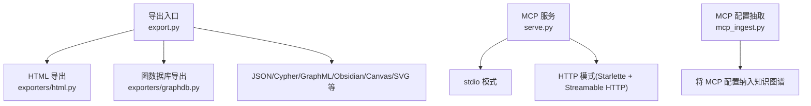
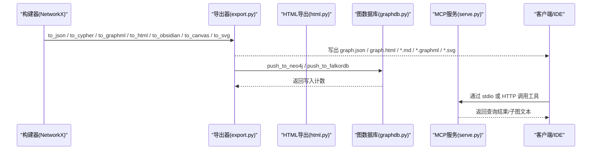
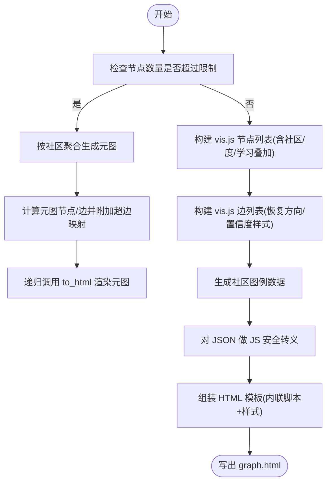
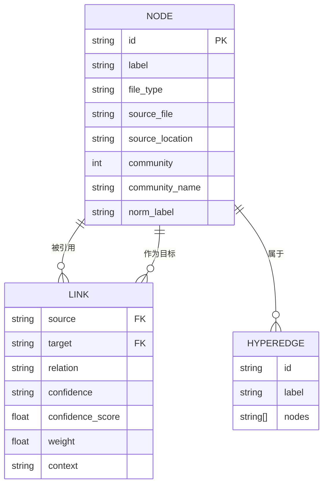
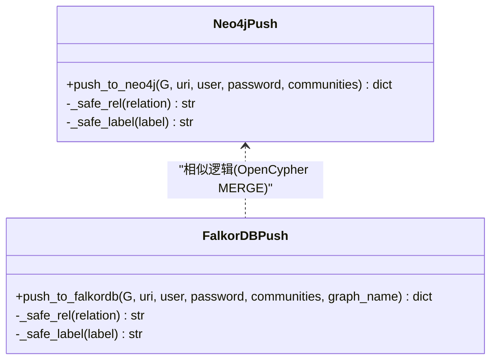
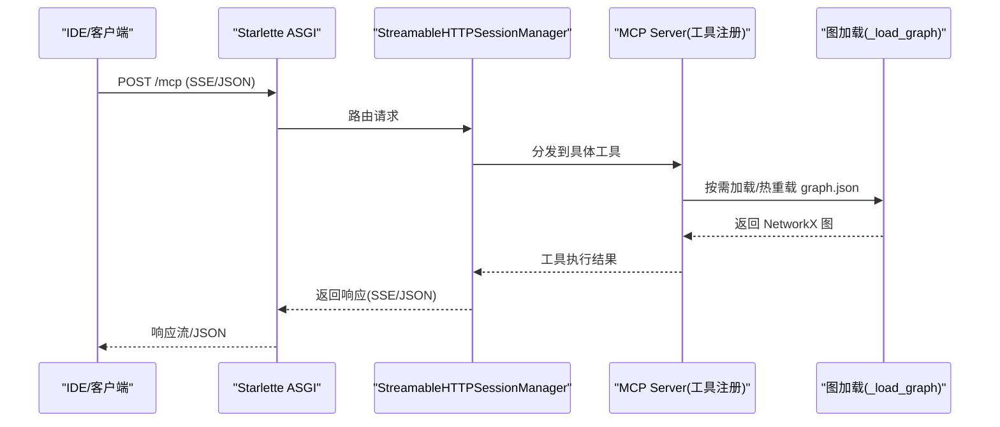
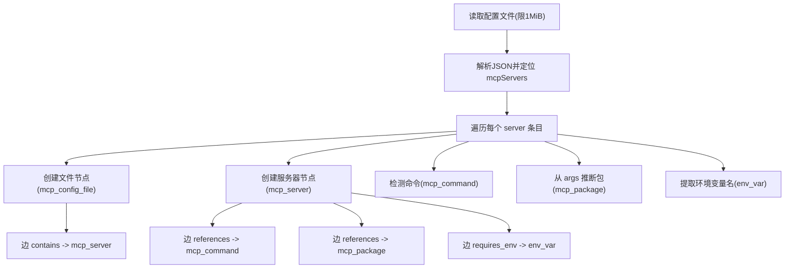
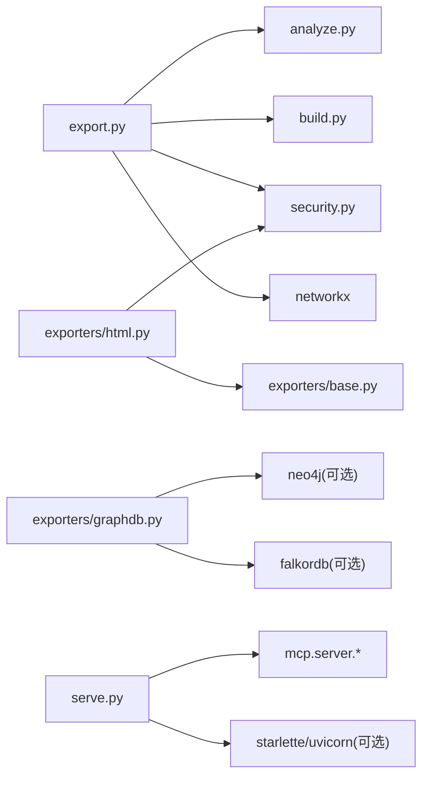

# 导出和集成

<cite>
**本文引用的文件**   
- [graphify/export.py](file://graphify/export.py)
- [graphify/exporters/base.py](file://graphify/exporters/base.py)
- [graphify/exporters/html.py](file://graphify/exporters/html.py)
- [graphify/exporters/graphdb.py](file://graphify/exporters/graphdb.py)
- [graphify/serve.py](file://graphify/serve.py)
- [graphify/mcp_ingest.py](file://graphify/mcp_ingest.py)
- [README.md](file://README.md)
- [tests/test_export.py](file://tests/test_export.py)
- [tests/test_falkordb_integration.py](file://tests/test_falkordb_integration.py)
</cite>

## 目录
1. [简介](#简介)
2. [项目结构](#项目结构)
3. [核心组件](#核心组件)
4. [架构总览](#架构总览)
5. [详细组件分析](#详细组件分析)
6. [依赖关系分析](#依赖关系分析)
7. [性能考虑](#性能考虑)
8. [故障排查指南](#故障排查指南)
9. [结论](#结论)
10. [附录](#附录)

## 简介
本章节聚焦 Graphify 的导出系统与外部集成能力，涵盖：
- HTML 交互式图表生成机制与自定义选项（布局、颜色、交互）
- JSON 数据格式规范与结构（节点、边、属性）
- 数据库集成（Neo4j、FalkorDB）的连接配置与数据推送
- MCP 服务器实现与配置（stdio/HTTP 传输、认证、会话管理）
- 自定义导出器开发指南
- 与其他工具的集成示例与最佳实践

## 项目结构
Graphify 的导出子系统位于 graphify/export.py 与 graphify/exporters/* 中；MCP 服务在 graphify/serve.py；MCP 配置抽取在 graphify/mcp_ingest.py。测试覆盖导出与 FalkorDB 集成。

图示来源
- [graphify/export.py:183-271](file://graphify/export.py#L183-L271)
- [graphify/exporters/html.py:325-561](file://graphify/exporters/html.py#L325-L561)
- [graphify/exporters/graphdb.py:9-174](file://graphify/exporters/graphdb.py#L9-L174)
- [graphify/serve.py:887-1689](file://graphify/serve.py#L887-L1689)
- [graphify/mcp_ingest.py:86-166](file://graphify/mcp_ingest.py#L86-L166)

章节来源
- [graphify/export.py:183-271](file://graphify/export.py#L183-L271)
- [graphify/exporters/html.py:325-561](file://graphify/exporters/html.py#L325-L561)
- [graphify/exporters/graphdb.py:9-174](file://graphify/exporters/graphdb.py#L9-L174)
- [graphify/serve.py:887-1689](file://graphify/serve.py#L887-L1689)
- [graphify/mcp_ingest.py:86-166](file://graphify/mcp_ingest.py#L86-L166)

## 核心组件
- 导出编排与多格式输出：to_json、to_cypher、to_graphml、to_html、to_obsidian、to_canvas、to_svg 等
- HTML 可视化：基于 vis-network 的交互式渲染，支持社区着色、搜索、邻居面板、超边区域高亮
- 图数据库推送：Neo4j 与 FalkorDB 的 MERGE upsert 写入
- MCP 服务：提供 query/get_node/neighbors/path 等工具，支持 stdio 与 HTTP 两种传输
- MCP 配置抽取：将 .mcp.json 等配置文件解析为图节点与边，便于跨配置关联分析

章节来源
- [graphify/export.py:183-271](file://graphify/export.py#L183-L271)
- [graphify/exporters/html.py:325-561](file://graphify/exporters/html.py#L325-L561)
- [graphify/exporters/graphdb.py:9-174](file://graphify/exporters/graphdb.py#L9-L174)
- [graphify/serve.py:887-1689](file://graphify/serve.py#L887-L1689)
- [graphify/mcp_ingest.py:86-166](file://graphify/mcp_ingest.py#L86-L166)

## 架构总览
下图展示从构建好的 NetworkX 图到多种导出产物与外部系统的整体流程。

图示来源
- [graphify/export.py:183-271](file://graphify/export.py#L183-L271)
- [graphify/exporters/html.py:325-561](file://graphify/exporters/html.py#L325-L561)
- [graphify/exporters/graphdb.py:9-174](file://graphify/exporters/graphdb.py#L9-L174)
- [graphify/serve.py:887-1689](file://graphify/serve.py#L887-L1689)

## 详细组件分析

### HTML 交互式图表导出
- 生成机制
  - 使用 vis-network 渲染，内置物理布局（forceAtlas2Based），稳定后关闭物理引擎以提升交互性能
  - 节点大小按度或社区成员数缩放；社区颜色来自共享调色板
  - 侧边栏包含搜索框、节点信息面板、社区筛选图例
  - 支持“超边”以阴影区域高亮一组节点并标注标签
  - 学习叠加层（可选）：根据工作记忆旁路文件为节点添加状态环与悬停提示
- 自定义选项
  - 环境变量 GRAPHIFY_VIZ_NODE_LIMIT 控制可视化节点上限，超过时可按社区聚合生成元图
  - 可传入 community_labels、member_counts、learning_overlay 等参数定制显示
- 安全与健壮性
  - 对嵌入 JSON 进行转义，避免 </script> 逃逸
  - 邻接链接采用 data-nid + 委托监听，修复了存储型 XSS 风险
  - 固定 vis-network 版本并附带 SRI 校验

图示来源
- [graphify/exporters/html.py:325-561](file://graphify/exporters/html.py#L325-L561)
- [graphify/exporters/base.py:11-14](file://graphify/exporters/base.py#L11-L14)

章节来源
- [graphify/exporters/html.py:325-561](file://graphify/exporters/html.py#L325-L561)
- [graphify/exporters/base.py:11-14](file://graphify/exporters/base.py#L11-L14)
- [tests/test_export.py:144-200](file://tests/test_export.py#L144-L200)

### JSON 数据格式规范与结构
- 根对象字段
  - nodes: 节点数组
  - links/edges: 边数组（兼容旧版 edges）
  - hyperedges: 可选，超边集合（用于 HTML 区域高亮）
  - built_at_commit: 可选，构建时的 git commit
- 节点字段
  - id: 唯一标识
  - label: 显示名称
  - file_type/source_file/source_location: 来源信息
  - community/community_name: 社区编号与名称
  - norm_label: 归一化小写标签（用于搜索）
  - 其他任意标量属性（如 metadata 等）
- 边字段
  - source/target: 端点 id
  - relation/confidence/confidence_score: 关系类型与置信度
  - weight/context: 权重与上下文（如 import/call 等）
- 验证与兼容性
  - 导出器会补全 confidence_score 默认值
  - 恢复原始方向（_src/_tgt）以保证有向语义
  - 验证器要求 edges/links 存在且端点必须匹配节点集

图示来源
- [graphify/export.py:183-271](file://graphify/export.py#L183-L271)
- [graphify/export.py:274-286](file://graphify/export.py#L274-L286)
- [graphify/export.py:162-171](file://graphify/export.py#L162-L171)

章节来源
- [graphify/export.py:183-271](file://graphify/export.py#L183-L271)
- [graphify/export.py:274-286](file://graphify/export.py#L274-L286)
- [graphify/export.py:162-171](file://graphify/export.py#L162-L171)

### 图数据库集成（Neo4j 与 FalkorDB）
- Neo4j
  - 使用 Python 驱动连接，按 file_type 动态设置节点标签，relation 清洗为大写下划线形式
  - 使用 MERGE 保证幂等 upsert
- FalkorDB
  - 使用 FalkorDB SDK，URI 支持 redis:// 或 falkordb:// 前缀，自动选择 named graph
  - 同样使用 OpenCypher MERGE 语句，支持可选认证
- 共同特性
  - 仅持久化标量属性，过滤内部标记（以下划线开头的键）
  - 返回写入统计（nodes/edges 计数）

图示来源
- [graphify/exporters/graphdb.py:9-78](file://graphify/exporters/graphdb.py#L9-L78)
- [graphify/exporters/graphdb.py:80-174](file://graphify/exporters/graphdb.py#L80-L174)

章节来源
- [graphify/exporters/graphdb.py:9-174](file://graphify/exporters/graphdb.py#L9-L174)
- [tests/test_falkordb_integration.py:53-92](file://tests/test_falkordb_integration.py#L53-L92)

### MCP 服务器实现与配置
- 功能概览
  - 暴露 query_graph、get_node、get_neighbors、shortest_path、list_prs、get_pr_impact、triage_prs 等工具
  - 支持热重载 graph.json，加载学习叠加层以增强输出
- 传输模式
  - stdio：每个开发者本地进程
  - HTTP：基于 Starlette + Streamable HTTP，支持 SSE 流式响应或 JSON 响应
- 认证与会话
  - API Key 中间件（Authorization: Bearer 或 X-API-Key）
  - 可选 stateless 模式；stateful 模式下支持 session-timeout 清理空闲会话
- 启动与部署
  - 可通过命令行参数指定 host/port/path/api-key/json-response/stateless/session-timeout
  - 推荐容器化部署，挂载 graphify-out 目录

图示来源
- [graphify/serve.py:887-1689](file://graphify/serve.py#L887-L1689)
- [graphify/serve.py:21-63](file://graphify/serve.py#L21-L63)
- [README.md:455-484](file://README.md#L455-L484)

章节来源
- [graphify/serve.py:887-1689](file://graphify/serve.py#L887-L1689)
- [graphify/serve.py:21-63](file://graphify/serve.py#L21-L63)
- [README.md:455-484](file://README.md#L455-L484)

### MCP 配置抽取（将 MCP 配置纳入知识图谱）
- 支持的文件名：.mcp.json、claude_desktop_config.json、mcp.json、mcp_servers.json
- 节点类型：mcp_config_file、mcp_server、mcp_command、mcp_package、env_var
- 边关系：contains、references、requires_env
- 安全策略：不读取 env 值，仅记录变量名；限制文件大小与每文件服务器数量；所有标签经 sanitize_label 处理

图示来源
- [graphify/mcp_ingest.py:86-166](file://graphify/mcp_ingest.py#L86-L166)
- [graphify/mcp_ingest.py:169-268](file://graphify/mcp_ingest.py#L169-L268)
- [graphify/mcp_ingest.py:284-314](file://graphify/mcp_ingest.py#L284-L314)

章节来源
- [graphify/mcp_ingest.py:86-166](file://graphify/mcp_ingest.py#L86-L166)
- [graphify/mcp_ingest.py:169-268](file://graphify/mcp_ingest.py#L169-L268)
- [graphify/mcp_ingest.py:284-314](file://graphify/mcp_ingest.py#L284-L314)

### 自定义导出器开发指南
- 参考现有导出器
  - HTML 导出器：展示如何构建 vis.js 数据集、注入样式与脚本、处理安全转义与交互事件
  - 图数据库导出器：展示如何用 OpenCypher MERGE 实现幂等写入
- 建议步骤
  - 定义导出函数签名：接收 NetworkX 图、社区映射、输出路径及可选参数
  - 复用社区颜色常量与社区映射工具
  - 对敏感字段进行安全转义（HTML/JS/Cypher/YAML 场景）
  - 若需要外部依赖（如 matplotlib、neo4j、falkordb），在导入失败时给出明确安装提示
  - 编写单元测试，覆盖基本输出与边界情况（空图、超大图、缺失属性等）

章节来源
- [graphify/exporters/html.py:325-561](file://graphify/exporters/html.py#L325-L561)
- [graphify/exporters/graphdb.py:9-174](file://graphify/exporters/graphdb.py#L9-L174)
- [graphify/exporters/base.py:11-14](file://graphify/exporters/base.py#L11-L14)

### 与其他工具的集成示例与最佳实践
- Obsidian
  - 导出为 vault：每个节点一个 .md，社区汇总笔记，Dataview 查询块，.obsidian/graph.json 社区着色
  - 导出 Canvas：按社区分组卡片网格，边按权重排序限制数量
- Gephi/yEd
  - 导出 GraphML，保留 community 属性与置信度，非标量属性 JSON 序列化
- 图数据库
  - Neo4j/FalkorDB：MERGE 幂等写入，适合增量更新与跨系统共享
- MCP
  - 团队共享 HTTP 服务，统一鉴权与会话管理；CI 可用无状态模式

章节来源
- [graphify/export.py:404-732](file://graphify/export.py#L404-L732)
- [graphify/export.py:735-911](file://graphify/export.py#L735-L911)
- [graphify/export.py:913-974](file://graphify/export.py#L913-L974)
- [graphify/export.py:976-1044](file://graphify/export.py#L976-L1044)
- [README.md:455-484](file://README.md#L455-L484)

## 依赖关系分析
- 导出模块依赖
  - export.py 依赖 analyze/build/security 等内部模块，以及 networkx、json、re 等标准库
  - HTML 导出依赖 vis-network（前端）与 security/sanitize_label
  - 图数据库导出依赖 neo4j/falkordb（可选）
- MCP 服务依赖
  - stdio 模式：纯 Python 运行
  - HTTP 模式：starlette、uvicorn、mcp.server.streamable_http_manager（需额外安装）

图示来源
- [graphify/export.py:183-271](file://graphify/export.py#L183-L271)
- [graphify/exporters/html.py:325-561](file://graphify/exporters/html.py#L325-L561)
- [graphify/exporters/graphdb.py:9-174](file://graphify/exporters/graphdb.py#L9-L174)
- [graphify/serve.py:1592-1671](file://graphify/serve.py#L1592-L1671)

章节来源
- [graphify/export.py:183-271](file://graphify/export.py#L183-L271)
- [graphify/exporters/html.py:325-561](file://graphify/exporters/html.py#L325-L561)
- [graphify/exporters/graphdb.py:9-174](file://graphify/exporters/graphdb.py#L9-L174)
- [graphify/serve.py:1592-1671](file://graphify/serve.py#L1592-L1671)

## 性能考虑
- HTML 可视化
  - 节点规模受 GRAPHIFY_VIZ_NODE_LIMIT 控制，超出阈值自动聚合为社区级元图
  - 稳定后关闭物理引擎，减少重绘开销
- JSON 导出
  - 避免静默缩小已有 graph.json（保护已人工标注/LLM 成本高的内容）
- GraphML 导出
  - 原子写入（临时文件替换）防止中断导致损坏
- MCP 服务
  - IDF/trigram 索引缓存于图对象，热重载自动失效
  - BFS/DFS 遍历对高连通节点设置阈值，避免爆炸式展开

[本节为通用指导，无需列出具体文件来源]

## 故障排查指南
- HTML 导出异常
  - 节点过多：调整 GRAPHIFY_VIZ_NODE_LIMIT 或使用 --no-viz
  - 浏览器控制台报错：确认 vis-network 资源完整性（SRI 校验）
- JSON 导出失败
  - 现有 graph.json 过大或损坏：强制覆盖或重建
  - 边端点不匹配：检查 prune_dangling_edges 与验证器
- 图数据库推送失败
  - 缺少依赖：安装 neo4j 或 falkordb
  - 连接失败：核对 URI、用户名/密码、端口与防火墙
- MCP 服务问题
  - HTTP 模式未安装依赖：安装 mcp extra（starlette/uvicorn）
  - 鉴权失败：检查 Authorization/X-API-Key 头
  - 会话泄漏：启用 stateless 或合理设置 session-timeout

章节来源
- [graphify/export.py:183-271](file://graphify/export.py#L183-L271)
- [graphify/export.py:274-286](file://graphify/export.py#L274-L286)
- [graphify/exporters/graphdb.py:9-174](file://graphify/exporters/graphdb.py#L9-L174)
- [graphify/serve.py:1592-1671](file://graphify/serve.py#L1592-L1671)

## 结论
Graphify 的导出系统提供了丰富的输出格式与强大的外部集成能力：
- HTML 可视化兼顾性能与安全，支持社区与学习叠加层
- JSON 规范清晰，兼容性强，便于下游工具消费
- 图数据库推送幂等可靠，适配 Neo4j 与 FalkorDB
- MCP 服务支持 stdio/HTTP 双模，具备鉴权与会话管理能力
- 通过 MCP 配置抽取，可将工具生态纳入知识图谱，提升可观测性与可维护性

[本节为总结性内容，无需列出具体文件来源]

## 附录
- 常用导出函数速查
  - to_json：生成 graph.json（含社区、置信度分数、超边）
  - to_html：生成交互式 graph.html
  - to_cypher：生成 Neo4j 导入脚本
  - to_graphml：Gephi/yEd 兼容
  - to_obsidian/to_canvas：Obsidian 生态集成
  - to_svg：轻量静态图
  - push_to_neo4j/push_to_falkordb：直接推送到图数据库

章节来源
- [graphify/export.py:183-271](file://graphify/export.py#L183-L271)
- [graphify/export.py:334-359](file://graphify/export.py#L334-L359)
- [graphify/export.py:913-974](file://graphify/export.py#L913-L974)
- [graphify/export.py:976-1044](file://graphify/export.py#L976-L1044)
- [graphify/exporters/graphdb.py:9-174](file://graphify/exporters/graphdb.py#L9-L174)