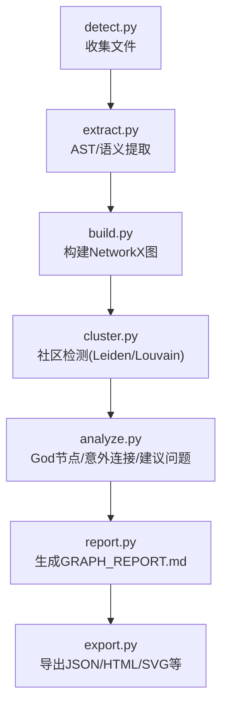
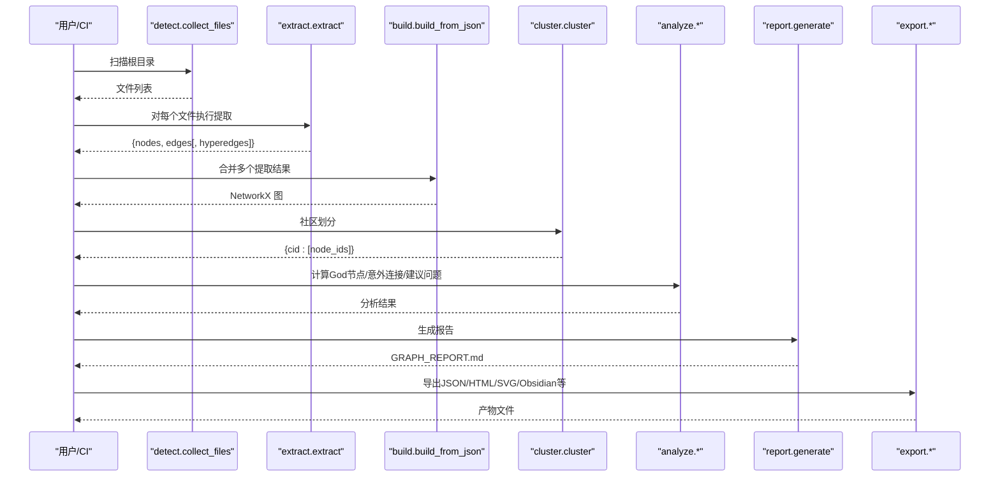
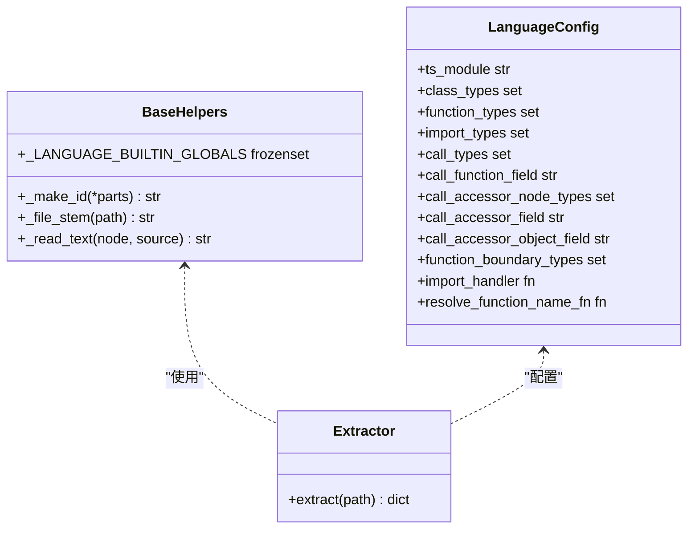
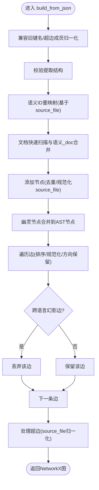
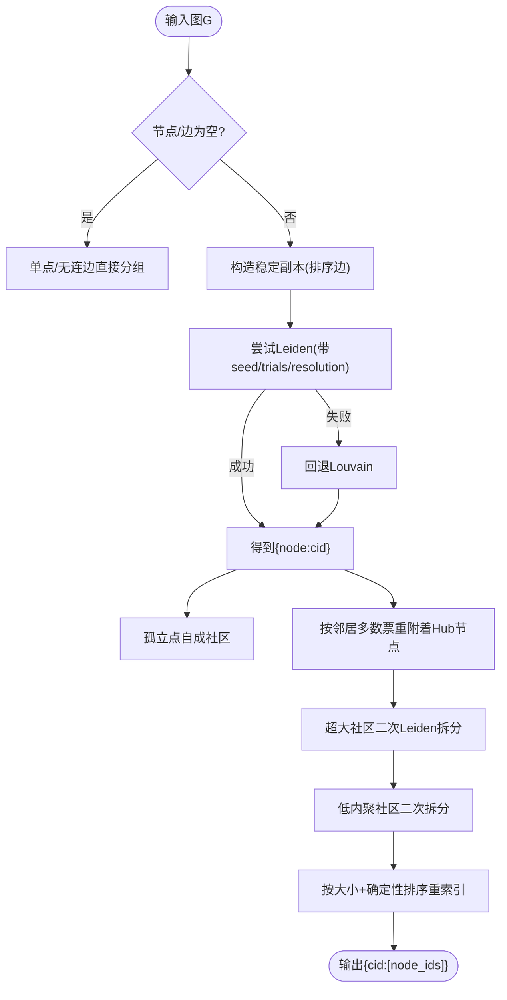
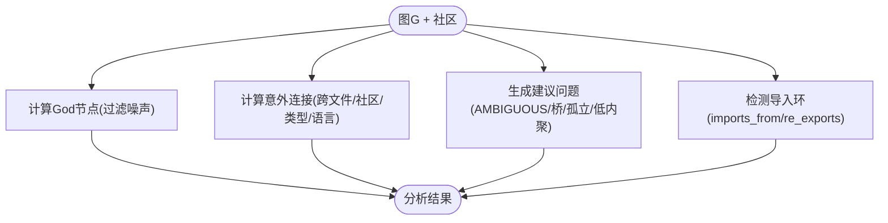
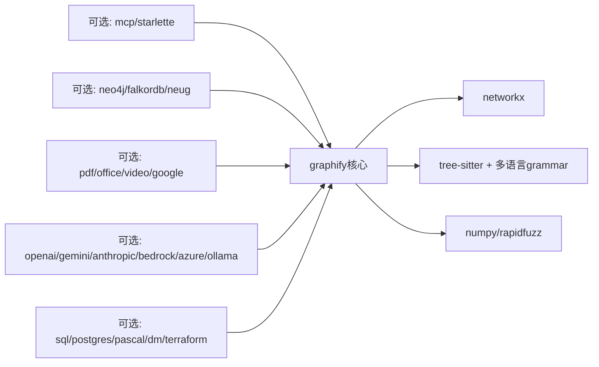

# 开发者指南

<cite>
**本文引用的文件**   
- [README.md](file://README.md)
- [ARCHITECTURE.md](file://ARCHITECTURE.md)
- [pyproject.toml](file://pyproject.toml)
- [graphify/__init__.py](file://graphify/__init__.py)
- [graphify/extract.py](file://graphify/extract.py)
- [graphify/build.py](file://graphify/build.py)
- [graphify/cluster.py](file://graphify/cluster.py)
- [graphify/analyze.py](file://graphify/analyze.py)
- [graphify/report.py](file://graphify/report.py)
- [graphify/extractors/base.py](file://graphify/extractors/base.py)
</cite>

## 目录
1. [简介](#简介)
2. [项目结构](#项目结构)
3. [核心组件](#核心组件)
4. [架构总览](#架构总览)
5. [详细组件分析](#详细组件分析)
6. [依赖分析](#依赖分析)
7. [性能考量](#性能考量)
8. [故障排除指南](#故障排除指南)
9. [结论](#结论)
10. [附录](#附录)

## 简介
本指南面向贡献者与高级开发者，系统化阐述 graphify 的模块化架构、设计模式与接口规范；提供新增语言支持（提取器）的完整流程；说明测试策略与框架使用方法；给出代码质量要求与开发工作流；并包含调试技巧、环境搭建与依赖管理。

## 项目结构
graphify 采用“流水线式”模块组织：每个阶段为独立函数与模块，通过纯 Python 字典与 NetworkX 图进行数据交换，避免共享状态与副作用。顶层入口通过懒加载暴露常用 API，降低安装与导入成本。

图表来源
- [ARCHITECTURE.md:1-87](file://ARCHITECTURE.md#L1-L87)

章节来源
- [ARCHITECTURE.md:1-87](file://ARCHITECTURE.md#L1-L87)
- [graphify/__init__.py:1-31](file://graphify/__init__.py#L1-L31)

## 核心组件
- 懒加载门面：graphify.__init__ 使用 __getattr__ 延迟导入各模块，使轻量命令（如 install）无需重型依赖即可运行。
- 提取管线：extract.py 负责多语言 AST 解析、跨文件解析、符号关系抽取与置信度标注。
- 图构建：build.py 将多个提取结果合并为 NetworkX 图，执行节点去重、幽灵节点合并、边方向保留与跨语言幻影边过滤。
- 社区发现：cluster.py 优先 Leiden，回退 Louvain，支持超大规模社区拆分与低内聚二次拆分。
- 分析：analyze.py 计算 God 节点、跨社区/跨文件“意外连接”、建议问题与导入环检测。
- 报告：report.py 生成人类可读的 GRAPH_REPORT.md，汇总统计、社区导航、可疑连接与知识缺口。

章节来源
- [graphify/__init__.py:1-31](file://graphify/__init__.py#L1-L31)
- [graphify/extract.py:1-800](file://graphify/extract.py#L1-L800)
- [graphify/build.py:1-800](file://graphify/build.py#L1-L800)
- [graphify/cluster.py:1-321](file://graphify/cluster.py#L1-L321)
- [graphify/analyze.py:1-741](file://graphify/analyze.py#L1-L741)
- [graphify/report.py:1-301](file://graphify/report.py#L1-L301)

## 架构总览
下图展示从检测到导出的端到端流程，以及关键数据形态（nodes/edges/hyperedges）在各阶段的流转。

图表来源
- [ARCHITECTURE.md:1-87](file://ARCHITECTURE.md#L1-L87)

## 详细组件分析

### 提取器子系统（多语言 AST 抽取）
- 统一基类与工具：graphify/extractors/base.py 提供 ID 生成、文件名前缀规则、内置全局名过滤等通用能力。
- 语言配置：extract.py 中为每种语言定义 LanguageConfig（语法模块、类/函数/导入/调用节点类型、访问器字段、导入处理器等），并通过统一的 walk 与 import 处理逻辑驱动抽取。
- 跨文件解析：集中实现 JS/TS/Python/C/C++/Java/C# 等语言的导入/引用解析与别名、命名空间、相对路径、tsconfig 别名、workspace 包清单等复杂场景。
- 置信度标签：所有边携带 confidence（EXTRACTED/INFERRED/AMBIGUOUS），用于后续分析与报告。

图表来源
- [graphify/extractors/base.py:1-67](file://graphify/extractors/base.py#L1-L67)
- [graphify/extract.py:596-800](file://graphify/extract.py#L596-L800)

章节来源
- [graphify/extractors/base.py:1-67](file://graphify/extractors/base.py#L1-L67)
- [graphify/extract.py:1-800](file://graphify/extract.py#L1-L800)

### 图构建与规范化（build）
- 输入兼容：兼容旧版 links→edges、from/to→source/target 等历史键名。
- 节点去重与幽灵合并：同一 id 以最后写入为准；非 AST 节点若与 AST 节点同名同文件则视为“幽灵”并入 AST 节点。
- 语义 ID 重映射：根据 source_file 重新推导非 AST 节点的 id，避免缓存漂移导致“幽灵节点”。
- 边方向与跨语言幻影边过滤：在 undirected 图中保存 _src/_tgt 以维持方向；按语言家族过滤跨语言 calls/imports/references 的误匹配。
- 超边成员标准化：members/node_ids→nodes 归一化。

图表来源
- [graphify/build.py:383-762](file://graphify/build.py#L383-L762)

章节来源
- [graphify/build.py:1-800](file://graphify/build.py#L1-L800)

### 社区检测（cluster）
- 算法选择：优先 Leiden（graspologic），不可用时回退 Louvain（networkx）。
- 稳定性：固定随机种子、稳定排序、按大小降序分配 cid，保证可重复。
- 大型社区拆分：超过阈值或内聚度低的社区会二次 Leiden 拆分。
- Hub 节点排除：可按分位数排除超级枢纽，避免污染分区。

图表来源
- [graphify/cluster.py:22-77](file://graphify/cluster.py#L22-L77)
- [graphify/cluster.py:134-236](file://graphify/cluster.py#L134-L236)

章节来源
- [graphify/cluster.py:1-321](file://graphify/cluster.py#L1-L321)

### 分析（analyze）
- God 节点：按度排序，过滤文件级枢纽、概念节点与 JSON 键噪声。
- 意外连接：跨文件/跨社区/跨语言/跨类型文件的综合评分，突出 AMBIGUOUS/INFERRED 与桥接关系。
- 建议问题：基于 AMBIGUOUS 边、桥节点、高 INFERRED 度的 God 节点、孤立节点与低内聚社区生成。
- 导入环检测：基于 imports_from/re_exports 构建文件级有向图，枚举简单环并去重。

图表来源
- [graphify/analyze.py:100-121](file://graphify/analyze.py#L100-L121)
- [graphify/analyze.py:124-153](file://graphify/analyze.py#L124-L153)
- [graphify/analyze.py:419-544](file://graphify/analyze.py#L419-L544)
- [graphify/analyze.py:631-741](file://graphify/analyze.py#L631-L741)

章节来源
- [graphify/analyze.py:1-741](file://graphify/analyze.py#L1-L741)

### 报告（report）
- 统计摘要：节点/边/社区数量、置信度分布、token 消耗。
- 社区导航：可选 Obsidian wikilink 形式。
- 意外连接与导入环：结构化呈现。
- 知识缺口：孤立节点、薄社区、高 AMBIGUOUS 比例提示。
- 工作记忆：叠加学习覆盖层与死胡同总结（可选）。

章节来源
- [graphify/report.py:1-301](file://graphify/report.py#L1-L301)

## 依赖分析
- 运行时核心：networkx、numpy、tree-sitter 及多语言 grammar 包。
- 可选扩展：mcp/http 服务、neo4j/falkordb/neug 存储、pdf/office/video/google 媒体、leiden 社区、openai/gemini/anthropic/bedrock/azure/ollama 后端、sql/postgres/pascal/dm/terraform 等。
- 开发工具：pytest、ruff、pyright、pre-commit、bandit、hypothesis、nuitka 等。

图表来源
- [pyproject.toml:1-149](file://pyproject.toml#L1-L149)

章节来源
- [pyproject.toml:1-149](file://pyproject.toml#L1-L149)

## 性能考量
- 并行与递归限制：提取阶段提升递归上限以避免深层 AST 遍历溢出；可通过环境变量控制最大并发。
- 社区检测稳定性：固定随机种子与稳定排序，避免运行间抖动导致的“社区漂移”。
- 大社区拆分：对过大或低内聚社区二次 Leiden 拆分，提高可读性与查询效率。
- 跨语言幻影边过滤：减少错误边带来的噪声与下游分析开销。
- 序列化与去重：边与节点去重确保增量更新与多次构建的可重复性。

[本节为通用指导，不直接分析具体文件]

## 故障排除指南
- 常见安装与 PATH 问题：详见 README 中的“Troubleshooting”段落。
- 图节点数变少：使用 --force 强制覆盖重建。
- 幽灵重复节点：全量重建以清理历史残留。
- Ollama 上下文窗口不足：调整 KV-cache 窗口与 token-budget。
- LLM JSON 截断：提高输出上限或减小 chunk 尺寸。
- HTML 过大：跳过可视化直接使用 JSON。
- 多人并行提交冲突：启用 hook 自动合并 graph.json。
- 文档/PDF 提取为空：检查后端与 API Key。
- 技能版本不匹配：升级并重写技能文件。
- Claude Code 缓存失效：忽略输出目录。

章节来源
- [README.md:537-607](file://README.md#L537-L607)

## 结论
graphify 以清晰的流水线与强约束的数据契约，实现了可扩展的多语言知识图谱构建与分析。通过标准化的提取器接口、稳健的图构建与社区检测、以及丰富的分析与报告能力，既满足本地离线需求，又可与多种 LLM 后端集成。遵循本指南的流程与规范，可高效地扩展新语言、完善测试与发布流程。

[本节为总结，不直接分析具体文件]

## 附录

### 如何添加新的语言支持（完整流程）
- 步骤概览
  1) 在 extract.py 中为该语言定义 LanguageConfig，并实现必要的导入/调用/名称解析辅助函数。
  2) 在 extract() 调度处注册文件后缀与对应提取器。
  3) 在 detect.py 的 CODE_EXTENSIONS 与 watch.py 的 _WATCHED_EXTENSIONS 中添加后缀。
  4) 在 pyproject.toml 中添加 tree-sitter grammar 依赖（必要时作为可选依赖）。
  5) 在 tests/fixtures/ 下添加样例文件，并在 tests/test_languages.py 编写用例。
- 参考依据
  - 新增语言步骤说明见 ARCHITECTURE.md。
  - 语言配置与导入处理示例见 extract.py。
  - 依赖声明位置见 pyproject.toml。

章节来源
- [ARCHITECTURE.md:59-66](file://ARCHITECTURE.md#L59-L66)
- [graphify/extract.py:596-800](file://graphify/extract.py#L596-L800)
- [pyproject.toml:13-84](file://pyproject.toml#L13-L84)

### 测试策略与框架使用
- 测试组织：tests/ 下每模块一个测试文件，全部为纯单元测试，禁止网络与持久化副作用（除 tmp_path）。
- 运行方式：使用 pytest 执行。
- 基准与覆盖率：项目包含 benchmark 与 coverage 相关依赖，可在 CI 中启用。
- 参考依据
  - 测试说明见 ARCHITECTURE.md。
  - pytest 配置见 pyproject.toml。

章节来源
- [ARCHITECTURE.md:78-87](file://ARCHITECTURE.md#L78-L87)
- [pyproject.toml:126-132](file://pyproject.toml#L126-L132)

### 代码质量与开发工作流
- 代码风格：ruff 行宽与目标版本已配置；lint 规则保守，便于逐步演进。
- 类型检查：pyright basic 模式，覆盖 graphify 与 tests。
- 安全扫描：bandit 默认跳过部分规则，可按需增强。
- 预提交：pre-commit 钩子可用，结合 ruff/pyright/bandit 等工具。
- 参考依据
  - 工具链配置见 pyproject.toml。

章节来源
- [pyproject.toml:137-149](file://pyproject.toml#L137-L149)

### 调试技巧
- 开启调试信息：设置 GRAPHIFY_DEBUG 打印异常堆栈。
- 观察耗时：使用 --timing 查看各阶段耗时。
- 定位幽灵节点：关注 build 阶段的警告与 ID 重映射日志。
- 验证社区稳定性：对比前后两次 cluster-only 的 community signature。

章节来源
- [graphify/extract.py:156-168](file://graphify/extract.py#L156-L168)
- [graphify/cluster.py:113-131](file://graphify/cluster.py#L113-L131)

### 开发环境搭建与依赖管理
- 推荐工具：uv（也可用 pipx/pip）。
- 安装 CLI：uv tool install graphifyy。
- 可选功能：按需安装 extras（如 pdf、video、mcp、neog、leiden、openai/gemini/anthropic/bedrock/azure/ollama 等）。
- 参考依据
  - 安装与环境变量说明见 README。
  - 可选依赖与脚本入口见 pyproject.toml。

章节来源
- [README.md:151-265](file://README.md#L151-L265)
- [pyproject.toml:50-89](file://pyproject.toml#L50-L89)