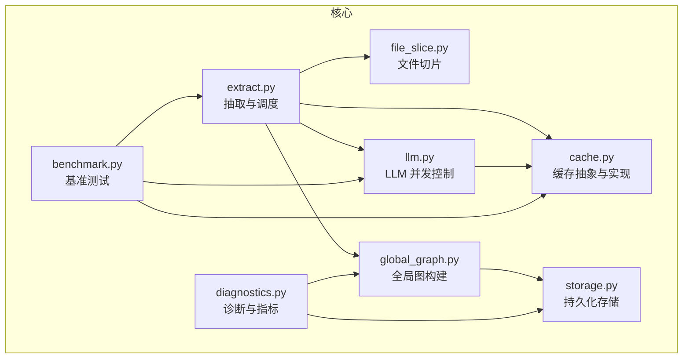
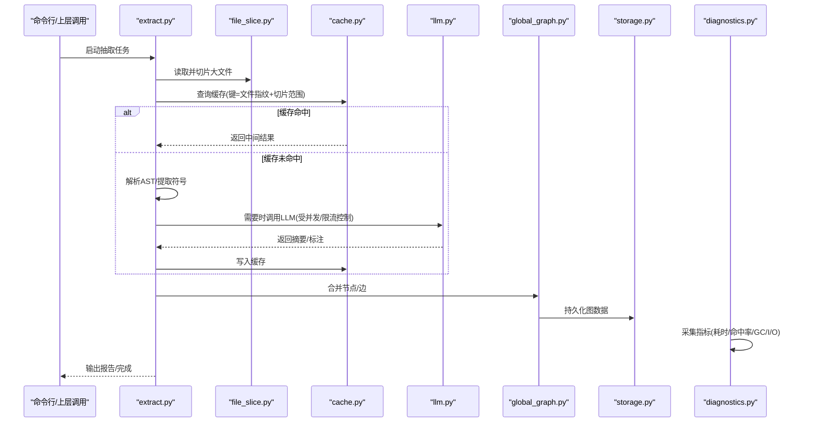
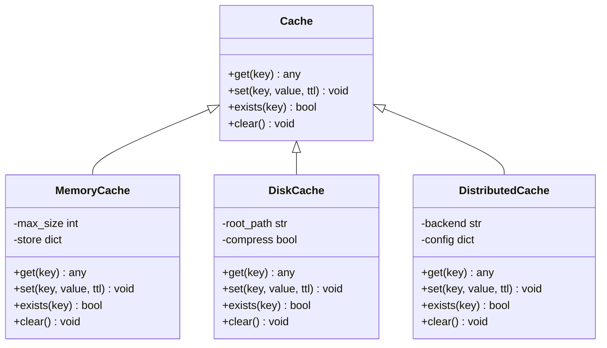
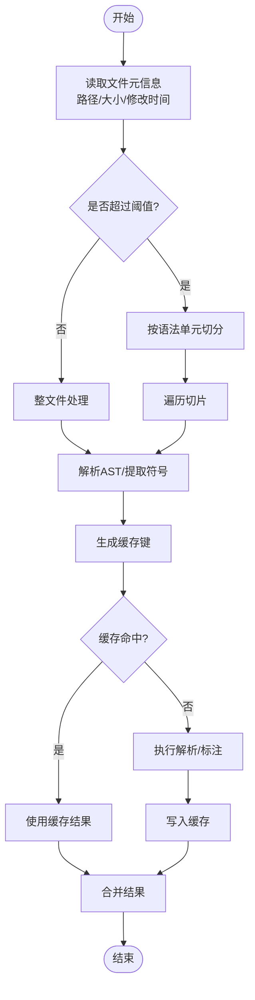
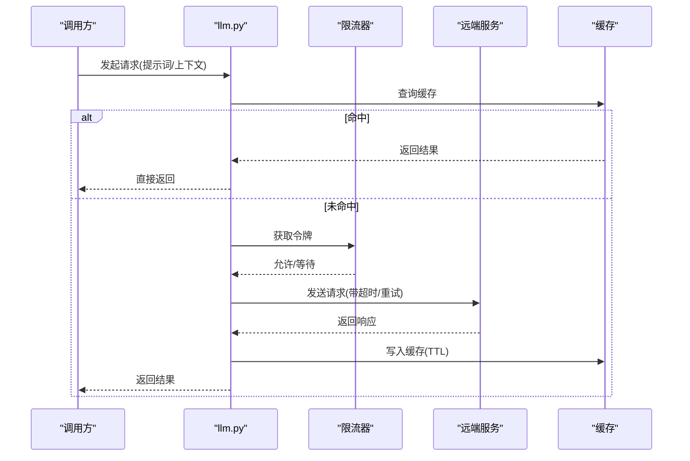
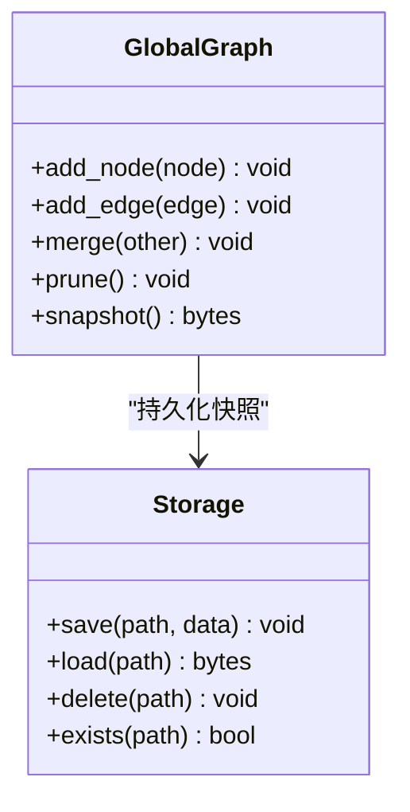
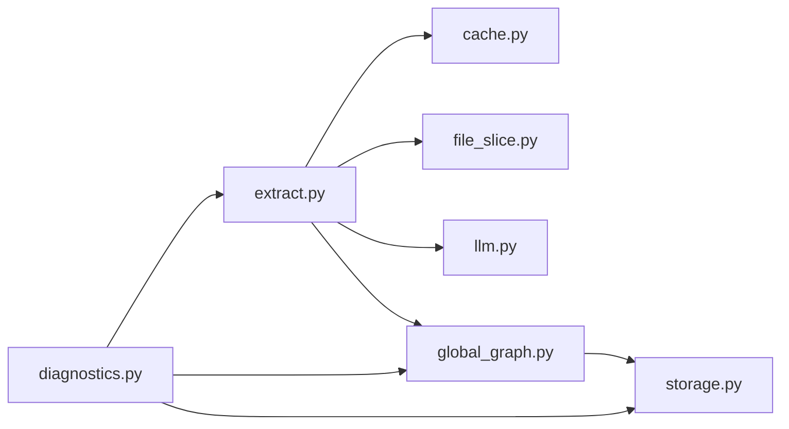

# 性能优化

<cite>
**本文引用的文件**   
- [graphify/cache.py](file://graphify/cache.py)
- [graphify/extract.py](file://graphify/extract.py)
- [graphify/benchmark.py](file://graphify/benchmark.py)
- [graphify/diagnostics.py](file://graphify/diagnostics.py)
- [graphify/global_graph.py](file://graphify/global_graph.py)
- [graphify/storage.py](file://graphify/storage.py)
- [graphify/llm.py](file://graphify/llm.py)
- [graphify/file_slice.py](file://graphify/file_slice.py)
- [BENCHMARKS.md](file://BENCHMARKS.md)
</cite>

## 目录
1. [简介](#简介)
2. [项目结构](#项目结构)
3. [核心组件](#核心组件)
4. [架构总览](#架构总览)
5. [详细组件分析](#详细组件分析)
6. [依赖关系分析](#依赖关系分析)
7. [性能考量](#性能考量)
8. [故障排查指南](#故障排查指南)
9. [结论](#结论)
10. [附录](#附录)

## 简介
本文件聚焦 Graphify 的性能优化策略与最佳实践，围绕以下主题展开：
- 并行处理配置：AST 提取的线程池、LLM 调用的并发控制
- 缓存系统：文件系统缓存、内存缓存、分布式缓存（扩展点）
- 内存管理：大文件处理、图数据压缩、垃圾回收优化
- 大规模项目技巧：增量更新、分块处理、资源限制
- 性能监控与诊断工具使用
- 基准测试结果与优化案例研究

## 项目结构
Graphify 在性能相关的关键模块分布如下：
- 缓存层：cache.py
- 抽取与切片：extract.py、file_slice.py
- LLM 调用与并发：llm.py
- 全局图与存储：global_graph.py、storage.py
- 诊断与指标：diagnostics.py
- 基准测试：benchmark.py、BENCHMARKS.md

图表来源
- [graphify/extract.py](file://graphify/extract.py)
- [graphify/file_slice.py](file://graphify/file_slice.py)
- [graphify/llm.py](file://graphify/llm.py)
- [graphify/cache.py](file://graphify/cache.py)
- [graphify/global_graph.py](file://graphify/global_graph.py)
- [graphify/storage.py](file://graphify/storage.py)
- [graphify/diagnostics.py](file://graphify/diagnostics.py)
- [graphify/benchmark.py](file://graphify/benchmark.py)

章节来源
- [graphify/extract.py](file://graphify/extract.py)
- [graphify/cache.py](file://graphify/cache.py)
- [graphify/llm.py](file://graphify/llm.py)
- [graphify/global_graph.py](file://graphify/global_graph.py)
- [graphify/storage.py](file://graphify/storage.py)
- [graphify/diagnostics.py](file://graphify/diagnostics.py)
- [graphify/benchmark.py](file://graphify/benchmark.py)

## 核心组件
- 缓存抽象与实现（cache.py）
  - 提供统一的缓存接口，支持多级缓存策略（内存优先、磁盘落盘、可扩展至分布式后端）
  - 键生成策略、过期策略、命中率统计
- 抽取与切片（extract.py、file_slice.py）
  - 按语言解析器进行 AST 提取；对超大文件进行切片以减少单次内存峰值
  - 可配置的并发度与任务队列
- LLM 并发控制（llm.py）
  - 限流、重试、退避、超时、并发上限等
- 全局图与存储（global_graph.py、storage.py）
  - 图节点/边聚合、去重、合并；持久化到磁盘或外部存储
- 诊断与指标（diagnostics.py）
  - 关键路径耗时、缓存命中、GC 行为、I/O 吞吐等
- 基准测试（benchmark.py、BENCHMARKS.md）
  - 端到端流程基准、单模块基准、对比不同配置下的性能差异

章节来源
- [graphify/cache.py](file://graphify/cache.py)
- [graphify/extract.py](file://graphify/extract.py)
- [graphify/file_slice.py](file://graphify/file_slice.py)
- [graphify/llm.py](file://graphify/llm.py)
- [graphify/global_graph.py](file://graphify/global_graph.py)
- [graphify/storage.py](file://graphify/storage.py)
- [graphify/diagnostics.py](file://graphify/diagnostics.py)
- [graphify/benchmark.py](file://graphify/benchmark.py)
- [BENCHMARKS.md](file://BENCHMARKS.md)

## 架构总览
下图展示了从输入代码到图输出的主要性能相关路径，以及各组件间的交互。

图表来源
- [graphify/extract.py](file://graphify/extract.py)
- [graphify/file_slice.py](file://graphify/file_slice.py)
- [graphify/cache.py](file://graphify/cache.py)
- [graphify/llm.py](file://graphify/llm.py)
- [graphify/global_graph.py](file://graphify/global_graph.py)
- [graphify/storage.py](file://graphify/storage.py)
- [graphify/diagnostics.py](file://graphify/diagnostics.py)

## 详细组件分析

### 缓存系统（cache.py）
- 设计要点
  - 统一接口：get/set/exists/clear，屏蔽底层差异
  - 多级策略：内存缓存作为热路径，磁盘缓存作为持久层，预留分布式扩展点
  - 键策略：基于文件路径、修改时间、内容哈希、切片范围等组合
  - 失效与清理：TTL、LRU、容量上限、按需清理
- 配置项建议
  - 内存缓存大小、最大条目数、淘汰策略
  - 磁盘缓存根目录、压缩开关、保留策略
  - 分布式缓存连接参数（可选）
- 性能影响
  - 高命中率显著降低 I/O 与解析开销
  - 合理 TTL 避免脏读，同时减少重复计算

图表来源
- [graphify/cache.py](file://graphify/cache.py)

章节来源
- [graphify/cache.py](file://graphify/cache.py)

### 抽取与切片（extract.py、file_slice.py）
- 并行与线程池
  - 通过可配置的工作线程数控制 AST 提取并发度
  - 任务粒度建议以“文件”或“切片”为单位，避免过大任务导致锁竞争
- 大文件处理
  - 基于 file_slice.py 将大文件切分为多个片段，逐段解析，降低峰值内存
  - 切片边界尽量对齐语法单元，保证语义完整性
- 增量更新
  - 结合缓存键包含文件指纹与切片范围，仅重算变更部分
- 并发与背压
  - 当下游 LLM 或存储成为瓶颈时，动态降低上游并发度

图表来源
- [graphify/extract.py](file://graphify/extract.py)
- [graphify/file_slice.py](file://graphify/file_slice.py)
- [graphify/cache.py](file://graphify/cache.py)

章节来源
- [graphify/extract.py](file://graphify/extract.py)
- [graphify/file_slice.py](file://graphify/file_slice.py)

### LLM 并发控制（llm.py）
- 并发与限流
  - 设置最大并发请求数，避免触发服务端限流
  - 令牌桶/漏桶式限流，平滑突发流量
- 重试与退避
  - 指数退避、抖动、最大重试次数
  - 区分可重试错误（网络/超时）与不可重试错误（鉴权/格式）
- 超时与取消
  - 请求级超时、整体任务超时
  - 支持优雅取消，释放资源
- 缓存联动
  - 相同提示词与上下文可复用缓存，减少重复调用

图表来源
- [graphify/llm.py](file://graphify/llm.py)
- [graphify/cache.py](file://graphify/cache.py)

章节来源
- [graphify/llm.py](file://graphify/llm.py)

### 全局图与存储（global_graph.py、storage.py）
- 图构建与合并
  - 多进程/多线程产出的子图需合并节点/边，去重与冲突解决
  - 增量合并：仅合并变更片段，减少全量重建
- 存储与压缩
  - 支持多种后端（本地文件、对象存储等）
  - 序列化压缩（如 gzip/zstd）以降低磁盘占用与 I/O
- 一致性
  - 原子写入、校验和、失败回滚，确保图数据一致性

图表来源
- [graphify/global_graph.py](file://graphify/global_graph.py)
- [graphify/storage.py](file://graphify/storage.py)

章节来源
- [graphify/global_graph.py](file://graphify/global_graph.py)
- [graphify/storage.py](file://graphify/storage.py)

### 诊断与指标（diagnostics.py）
- 关键指标
  - 抽取阶段耗时、LLM 调用耗时、缓存命中率、GC 次数与停顿、I/O 吞吐
- 采样与上报
  - 低开销采样，避免干扰主流程
  - 结构化日志与指标导出，便于可视化
- 定位热点
  - 基于调用栈与标签聚合，识别慢路径与瓶颈

章节来源
- [graphify/diagnostics.py](file://graphify/diagnostics.py)

### 基准测试（benchmark.py、BENCHMARKS.md）
- 测试维度
  - 端到端流水线：扫描→解析→LLM→图构建→存储
  - 单模块：缓存命中/未命中、切片大小、并发度
- 场景覆盖
  - 小/中/大型仓库、混合语言、含大文件
- 结果呈现
  - 吞吐、延迟分布、资源利用率、成本估算

章节来源
- [graphify/benchmark.py](file://graphify/benchmark.py)
- [BENCHMARKS.md](file://BENCHMARKS.md)

## 依赖关系分析
- 耦合与内聚
  - extract.py 强依赖 cache.py、file_slice.py、llm.py；global_graph.py 依赖 storage.py
  - diagnostics.py 横向观测各模块，保持松耦合
- 外部依赖
  - LLM 客户端、存储后端、序列化库
- 潜在循环
  - 通过接口解耦避免循环依赖；缓存与存储单向依赖

图表来源
- [graphify/extract.py](file://graphify/extract.py)
- [graphify/cache.py](file://graphify/cache.py)
- [graphify/file_slice.py](file://graphify/file_slice.py)
- [graphify/llm.py](file://graphify/llm.py)
- [graphify/global_graph.py](file://graphify/global_graph.py)
- [graphify/storage.py](file://graphify/storage.py)
- [graphify/diagnostics.py](file://graphify/diagnostics.py)

章节来源
- [graphify/extract.py](file://graphify/extract.py)
- [graphify/cache.py](file://graphify/cache.py)
- [graphify/file_slice.py](file://graphify/file_slice.py)
- [graphify/llm.py](file://graphify/llm.py)
- [graphify/global_graph.py](file://graphify/global_graph.py)
- [graphify/storage.py](file://graphify/storage.py)
- [graphify/diagnostics.py](file://graphify/diagnostics.py)

## 性能考量
- 并行处理配置
  - AST 提取线程池：根据 CPU 核数与 I/O 特性调整；I/O 密集可适当提高，CPU 密集不宜超过物理核数
  - 任务粒度：以文件或切片为最小单位，避免过细导致调度开销
- LLM 并发控制
  - 并发上限：依据供应商配额与网络带宽设定
  - 重试与退避：指数退避+抖动，避免雪崩
  - 超时：短请求超时，长任务采用分段超时
- 缓存策略
  - 内存缓存：高命中率路径，注意容量与淘汰策略
  - 磁盘缓存：开启压缩，合理 TTL，定期清理
  - 分布式缓存：跨实例共享，注意一致性与延迟
- 内存管理
  - 大文件切片：按语法单元切分，避免一次性加载
  - 图数据压缩：序列化时启用压缩，减少内存与磁盘占用
  - GC 优化：及时释放中间对象，避免持有大引用
- 大规模项目技巧
  - 增量更新：基于文件指纹与切片范围，仅重算变更
  - 分块处理：按目录/包分批，均衡负载
  - 资源限制：限制并发、内存上限、磁盘空间
- 监控与诊断
  - 采集关键指标，设置告警阈值
  - 记录慢请求与异常堆栈，辅助定位

[本节为通用指导，不直接分析具体文件]

## 故障排查指南
- 常见问题
  - 缓存未命中率高：检查键生成策略与 TTL 设置
  - LLM 限流/超时：调整并发上限、重试策略与超时
  - 内存溢出：减小切片大小、启用压缩、增加 GC 频率
  - 图不一致：检查合并逻辑与原子写入
- 诊断步骤
  - 查看诊断指标：耗时、命中率、GC、I/O
  - 复现最小用例：固定种子与输入，隔离变量
  - 逐步关闭功能：禁用缓存/LLM/压缩，定位瓶颈
- 恢复策略
  - 清理局部缓存并重试
  - 回滚到上一稳定快照
  - 降级模式：跳过 LLM 标注，仅做静态解析

章节来源
- [graphify/diagnostics.py](file://graphify/diagnostics.py)
- [graphify/cache.py](file://graphify/cache.py)
- [graphify/llm.py](file://graphify/llm.py)
- [graphify/global_graph.py](file://graphify/global_graph.py)
- [graphify/storage.py](file://graphify/storage.py)

## 结论
Graphify 的性能优化围绕“并行、缓存、内存、增量、监控”五大支柱展开。通过合理的线程池与并发控制、多级缓存、大文件切片与图压缩、增量更新与资源限制，以及完善的诊断与基准体系，可在大规模项目中获得稳定且高效的运行表现。

[本节为总结性内容，不直接分析具体文件]

## 附录
- 配置清单建议
  - 抽取：工作线程数、切片阈值、增量开关
  - LLM：最大并发、重试次数、退避系数、超时
  - 缓存：内存容量、TTL、压缩、清理策略
  - 存储：后端类型、压缩算法、保留策略
  - 诊断：采样率、指标导出目标
- 参考文档
  - 基准测试说明与结果见 BENCHMARKS.md

章节来源
- [BENCHMARKS.md](file://BENCHMARKS.md)