# 提取系统详解

<cite>
**本文引用的文件**   
- [graphify/extract.py](file://graphify/extract.py)
- [graphify/extractors/base.py](file://graphify/extractors/base.py)
- [graphify/extractors/engine.py](file://graphify/extractors/engine.py)
- [graphify/extractors/models.py](file://graphify/extractors/models.py)
- [graphify/extractors/__init__.py](file://graphify/extractors/__init__.py)
- [graphify/extractors/json_config.py](file://graphify/extractors/json_config.py)
- [graphify/extractors/go.py](file://graphify/extractors/go.py)
- [graphify/extractors/resolution.py](file://graphify/extractors/resolution.py)
- [graphify/detect.py](file://graphify/detect.py)
- [graphify/cache.py](file://graphify/cache.py)
- [graphify/build.py](file://graphify/build.py)
</cite>

## 目录
1. [引言](#引言)
2. [项目结构](#项目结构)
3. [核心组件](#核心组件)
4. [架构总览](#架构总览)
5. [详细组件分析](#详细组件分析)
6. [依赖关系分析](#依赖关系分析)
7. [性能与并行处理](#性能与并行处理)
8. [增量提取与缓存策略](#增量提取与缓存策略)
9. [自定义语言提取器开发指南](#自定义语言提取器开发指南)
10. [常见问题与排障](#常见问题与排障)
11. [结论](#结论)

## 引言
本文件系统性解析 Graphify 的多语言 AST 提取子系统，覆盖以下关键主题：
- 支持多语言的 AST 提取机制（tree-sitter 集成、语言检测、类型与符号识别）
- 提取器基类设计与插件化注册体系
- 符号关系推断算法（调用、导入、继承/实现、类型引用等）
- 跨语言依赖分析与类型解析机制
- 增量提取与缓存策略
- 自定义提取器的开发与最佳实践
- 性能优化技巧与常见问题解决方案

## 项目结构
Graphify 的提取子系统采用“配置驱动 + 插件化”的架构。核心入口位于 graphify/extract.py，它通过 LanguageConfig 描述每种语言的语法节点映射，并统一调度 tree-sitter 解析、通用遍历与关系推断；具体语言专属逻辑被迁移到 graphify/extractors/* 中，并通过 __init__.py 集中注册。

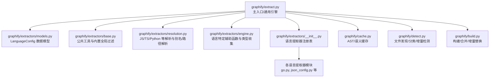

图表来源
- [graphify/extract.py:1-140](file://graphify/extract.py#L1-L140)
- [graphify/extractors/models.py:14-55](file://graphify/extractors/models.py#L14-L55)
- [graphify/extractors/base.py:1-67](file://graphify/extractors/base.py#L1-L67)
- [graphify/extractors/resolution.py:1-60](file://graphify/extractors/resolution.py#L1-L60)
- [graphify/extractors/engine.py:1-120](file://graphify/extractors/engine.py#L1-L120)
- [graphify/extractors/__init__.py:1-65](file://graphify/extractors/__init__.py#L1-L65)
- [graphify/cache.py:340-400](file://graphify/cache.py#L340-L400)
- [graphify/detect.py:406-440](file://graphify/detect.py#L406-L440)
- [graphify/build.py:925-952](file://graphify/build.py#L925-L952)

章节来源
- [graphify/extract.py:1-140](file://graphify/extract.py#L1-L140)
- [graphify/extractors/__init__.py:1-65](file://graphify/extractors/__init__.py#L1-L65)

## 核心组件
- LanguageConfig：声明式描述一种语言的 AST 节点类型、名称字段、调用访问器、函数边界、导入处理器等，是“配置驱动”的核心。
- 通用引擎 extract.py：加载 LanguageConfig，使用 tree-sitter 解析源码，按配置进行节点抽取、调用/导入/继承等关系推断，并输出统一的 nodes/edges 结果。
- 语言专用辅助：engine.py 提供多种语言的类型收集、作用域参数、注解/属性收集等辅助函数；resolution.py 提供 JS/TS/Python 等的导入路径解析、tsconfig 别名、工作区包解析等。
- 插件注册：__init__.py 维护 LANGUAGE_EXTRACTORS 字典，将语言名映射到 extract_<lang> 函数，便于外部扩展。
- 缓存与增量：cache.py 提供基于内容哈希的 AST/语义缓存；detect.py 提供增量检测；build.py 在增量更新时替换旧贡献。

章节来源
- [graphify/extractors/models.py:14-55](file://graphify/extractors/models.py#L14-L55)
- [graphify/extract.py:596-814](file://graphify/extract.py#L596-L814)
- [graphify/extractors/engine.py:1-120](file://graphify/extractors/engine.py#L1-L120)
- [graphify/extractors/resolution.py:28-84](file://graphify/extractors/resolution.py#L28-L84)
- [graphify/extractors/__init__.py:36-64](file://graphify/extractors/__init__.py#L36-L64)
- [graphify/cache.py:340-400](file://graphify/cache.py#L340-L400)
- [graphify/detect.py:1544-1621](file://graphify/detect.py#L1544-L1621)
- [graphify/build.py:925-952](file://graphify/build.py#L925-L952)

## 架构总览
下图展示了从文件发现到 AST 提取、关系推断、缓存写入与增量构建的整体流程。

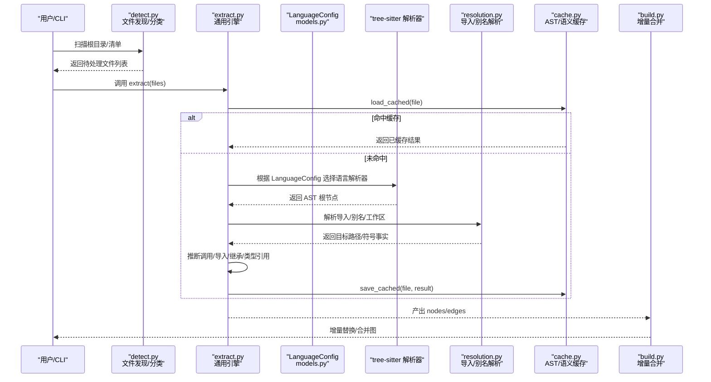

图表来源
- [graphify/detect.py:406-440](file://graphify/detect.py#L406-L440)
- [graphify/extract.py:1044-1064](file://graphify/extract.py#L1044-L1064)
- [graphify/extractors/models.py:14-55](file://graphify/extractors/models.py#L14-L55)
- [graphify/extractors/resolution.py:86-165](file://graphify/extractors/resolution.py#L86-L165)
- [graphify/cache.py:361-400](file://graphify/cache.py#L361-L400)
- [graphify/build.py:925-952](file://graphify/build.py#L925-L952)

## 详细组件分析

### 语言配置与通用引擎
- LanguageConfig 定义了每门语言的 AST 节点类型集合（class_types、function_types、import_types、call_types）、名称字段（name_field/body_field）、调用访问器（call_accessor_node_types/call_accessor_field/call_accessor_object_field）、函数边界（function_boundary_types）、导入处理器（import_handler）以及可选的额外钩子（extra_walk_fn、resolve_function_name_fn）。
- extract.py 为 Python/JS/TS/Java/C/C#/Kotlin/Scala/PHP/Lua/Swift 等语言定义了对应的 LanguageConfig，并在入口函数（如 extract_python、extract_js）中调用通用引擎 _extract_generic。

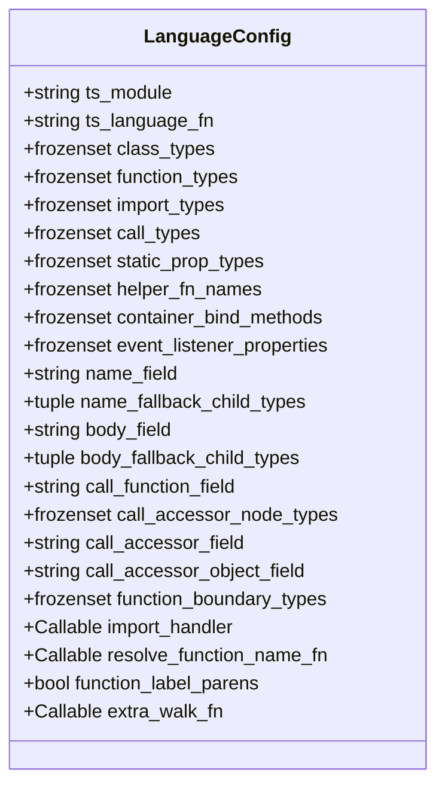

图表来源
- [graphify/extractors/models.py:14-55](file://graphify/extractors/models.py#L14-L55)

章节来源
- [graphify/extractors/models.py:14-55](file://graphify/extractors/models.py#L14-L55)
- [graphify/extract.py:596-814](file://graphify/extract.py#L596-L814)
- [graphify/extract.py:1044-1064](file://graphify/extract.py#L1044-L1064)

### 树形语法解析与语言检测
- 语言检测：detect.py 根据扩展名、shebang、包清单文件等对文件进行分类（代码/文档/论文/图片/视频），并将包清单路由到 AST 路径以避免重复节点。
- tree-sitter 集成：各语言提取器通过各自的 LanguageConfig 指定 ts_module 和 ts_language_fn，由通用引擎动态加载对应语言解析器并解析源码。

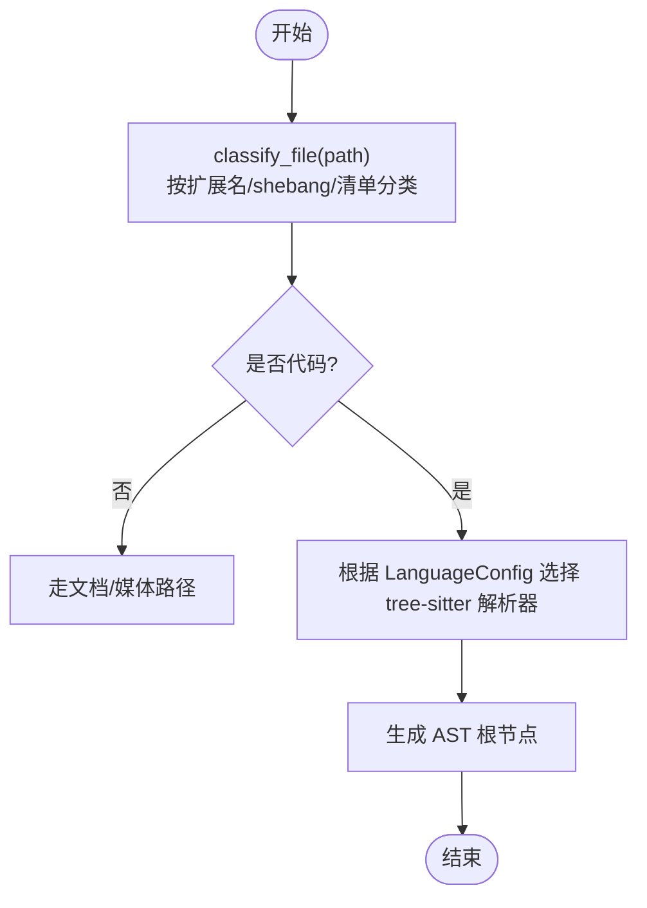

图表来源
- [graphify/detect.py:406-440](file://graphify/detect.py#L406-L440)
- [graphify/extract.py:596-662](file://graphify/extract.py#L596-L662)

章节来源
- [graphify/detect.py:406-440](file://graphify/detect.py#L406-L440)
- [graphify/extract.py:596-662](file://graphify/extract.py#L596-L662)

### 符号关系推断算法
- 调用关系：通用引擎在函数边界内遍历 AST，识别 call_expression/new_expression 等节点，结合语言特定的访问器字段（如 member_expression.property）提取接收者与目标标识符，生成 calls 边。
- 导入关系：通过 LanguageConfig.import_types 与 import_handler 定制化处理不同语言的导入语法（Python import/from、JS/TS import/export from、C/C++ include、C# using、Kotlin import、Scala import、PHP use、Lua require 等），并尽量解析到本地文件以生成 imports/imports_from/re_exports 边。
- 继承/实现关系：针对 Java/C#/Swift/Kotlin 等语言，通过预扫描接口/协议/类集合，并结合命名约定（如 I 前缀）或首项基类规则，区分 inherits/implements。
- 类型引用：在各语言辅助函数中（_python_collect_type_refs/_csharp_collect_type_refs/_java_collect_type_refs/_kotlin_collect_type_refs/_swift_collect_type_refs/_php_collect_type_refs/_go_collect_type_refs 等），递归遍历类型表达式，过滤内置/泛型占位符，收集 user-defined 类型作为 references 边。

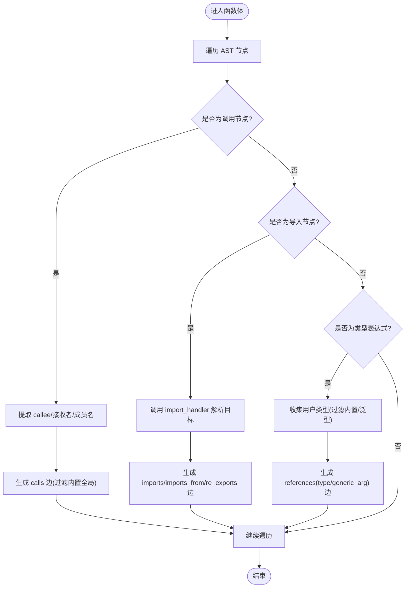

图表来源
- [graphify/extract.py:279-374](file://graphify/extract.py#L279-L374)
- [graphify/extract.py:376-412](file://graphify/extract.py#L376-L412)
- [graphify/extract.py:452-480](file://graphify/extract.py#L452-L480)
- [graphify/extract.py:483-516](file://graphify/extract.py#L483-L516)
- [graphify/extract.py:519-536](file://graphify/extract.py#L519-L536)
- [graphify/extract.py:539-557](file://graphify/extract.py#L539-L557)
- [graphify/extract.py:817-854](file://graphify/extract.py#L817-L854)
- [graphify/extractors/engine.py:68-116](file://graphify/extractors/engine.py#L68-L116)
- [graphify/extractors/engine.py:174-227](file://graphify/extractors/engine.py#L174-L227)
- [graphify/extractors/engine.py:333-384](file://graphify/extractors/engine.py#L333-L384)
- [graphify/extractors/engine.py:658-704](file://graphify/extractors/engine.py#L658-L704)
- [graphify/extractors/engine.py:791-800](file://graphify/extractors/engine.py#L791-L800)
- [graphify/extractors/engine.py:568-597](file://graphify/extractors/engine.py#L568-L597)
- [graphify/extractors/go.py:15-52](file://graphify/extractors/go.py#L15-L52)

章节来源
- [graphify/extract.py:279-557](file://graphify/extract.py#L279-L557)
- [graphify/extract.py:817-854](file://graphify/extract.py#L817-L854)
- [graphify/extractors/engine.py:68-116](file://graphify/extractors/engine.py#L68-L116)
- [graphify/extractors/engine.py:174-227](file://graphify/extractors/engine.py#L174-L227)
- [graphify/extractors/engine.py:333-384](file://graphify/extractors/engine.py#L333-L384)
- [graphify/extractors/engine.py:658-704](file://graphify/extractors/engine.py#L658-L704)
- [graphify/extractors/engine.py:791-800](file://graphify/extractors/engine.py#L791-L800)
- [graphify/extractors/engine.py:568-597](file://graphify/extractors/engine.py#L568-L597)
- [graphify/extractors/go.py:15-52](file://graphify/extractors/go.py#L15-L52)

### 跨语言依赖分析与类型解析
- JS/TS 导入解析：resolution.py 提供 _resolve_js_import_path/_resolve_js_import_target/_load_tsconfig_aliases/_match_tsconfig_alias 等，支持 .js/.ts/.tsx/.mts/.cts/.svelte 扩展补全、index 文件回退、tsconfig paths 别名与 extends 链解析。
- Python 导入解析：extract.py 中的 _import_python 处理相对/绝对导入，并生成 imports/imports_from 边。
- C/C++ include 解析：_import_c 尝试解析 #include 字符串到本地文件，生成 imports 边。
- C# using 解析：_import_csharp 解析 using 语句，记录 using_kind/alias/target_fqn 等元信息。
- Kotlin/Scala/PHP/Lua/Swift 导入：各自 import_handler 负责解析模块名并生成 imports 边。

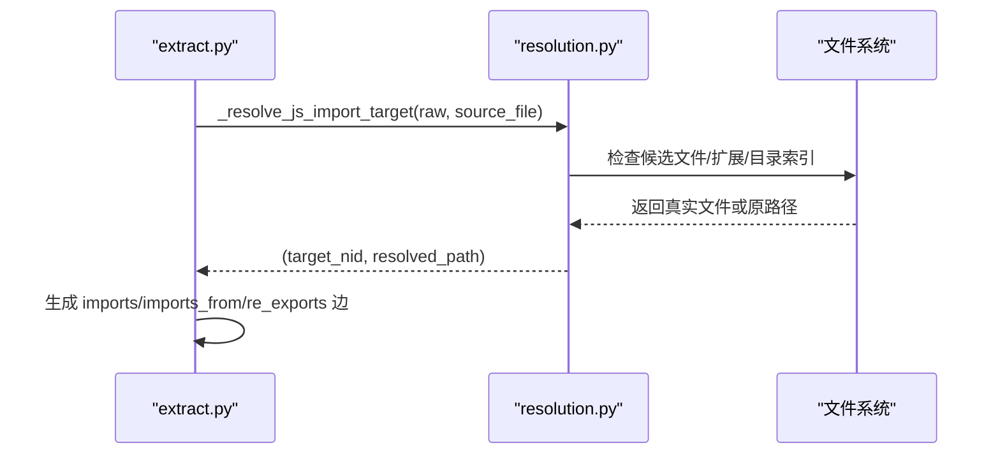

图表来源
- [graphify/extractors/resolution.py:28-58](file://graphify/extractors/resolution.py#L28-L58)
- [graphify/extractors/resolution.py:86-165](file://graphify/extractors/resolution.py#L86-L165)
- [graphify/extract.py:279-374](file://graphify/extract.py#L279-L374)
- [graphify/extract.py:415-449](file://graphify/extract.py#L415-L449)
- [graphify/extract.py:452-480](file://graphify/extract.py#L452-L480)

章节来源
- [graphify/extractors/resolution.py:28-58](file://graphify/extractors/resolution.py#L28-L58)
- [graphify/extractors/resolution.py:86-165](file://graphify/extractors/resolution.py#L86-L165)
- [graphify/extract.py:279-374](file://graphify/extract.py#L279-L374)
- [graphify/extract.py:415-449](file://graphify/extract.py#L415-L449)
- [graphify/extract.py:452-480](file://graphify/extract.py#L452-L480)

### JSON 配置文件提取
json_config.py 专门处理 package.json/tsconfig.json 等配置/清单文件，通过 AST 遍历键值对，提取 dependencies/devDependencies/extends/$ref 等语义，生成 contains/imports/extends/references 边，避免将数据 JSON 误当作配置。

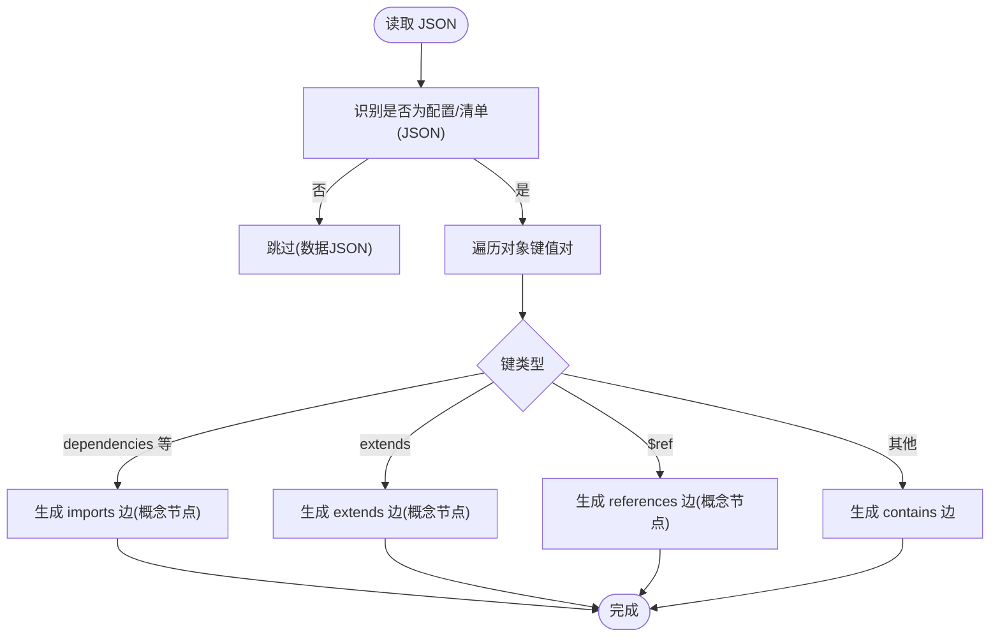

图表来源
- [graphify/extractors/json_config.py:24-49](file://graphify/extractors/json_config.py#L24-L49)
- [graphify/extractors/json_config.py:131-216](file://graphify/extractors/json_config.py#L131-L216)

章节来源
- [graphify/extractors/json_config.py:24-49](file://graphify/extractors/json_config.py#L24-L49)
- [graphify/extractors/json_config.py:131-216](file://graphify/extractors/json_config.py#L131-L216)

### Go 语言提取示例
Go 提取器演示了方法/类型/导入/类型引用的完整流程：
- 方法/函数：生成 contains/method 边，参数/返回值类型收集 references 边。
- 类型声明：struct/interface 字段/嵌入生成 references/embeds 边。
- 导入：生成 imports_from 边，并为标准库/第三方包生成 go/pkg 命名空间节点。
- 调用：在函数体内收集 call_expression，生成 calls 边。

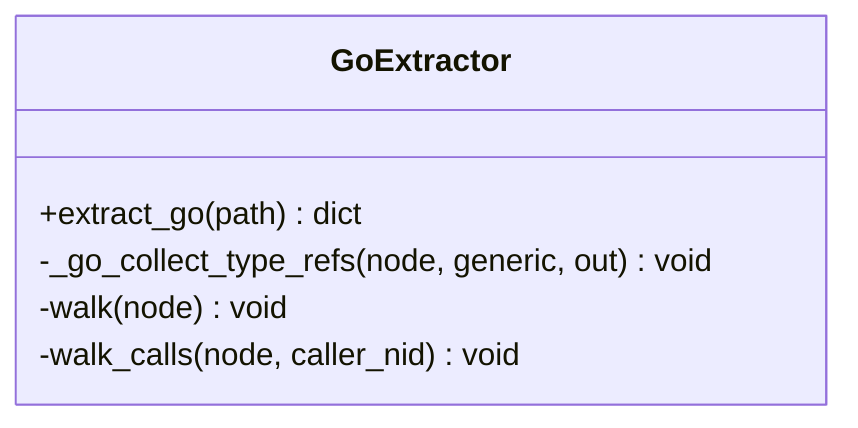

图表来源
- [graphify/extractors/go.py:53-397](file://graphify/extractors/go.py#L53-L397)

章节来源
- [graphify/extractors/go.py:53-397](file://graphify/extractors/go.py#L53-L397)

## 依赖关系分析
- 模块耦合：extract.py 作为中枢，依赖 models.py（配置）、base.py（工具）、resolution.py（解析）、engine.py（语言辅助）、各语言提取器模块（go/json_config 等）。
- 外部依赖：tree-sitter 各语言解析器（tree_sitter_python、tree_sitter_javascript、tree_sitter_typescript、tree_sitter_java、tree_sitter_c、tree_sitter_cpp、tree_sitter_c_sharp、tree_sitter_kotlin、tree_sitter_scala、tree_sitter_php、tree_sitter_lua、tree_sitter_swift、tree_sitter_go、tree_sitter_json 等）。
- 运行时依赖：缓存与增量（cache.py、detect.py、build.py）。

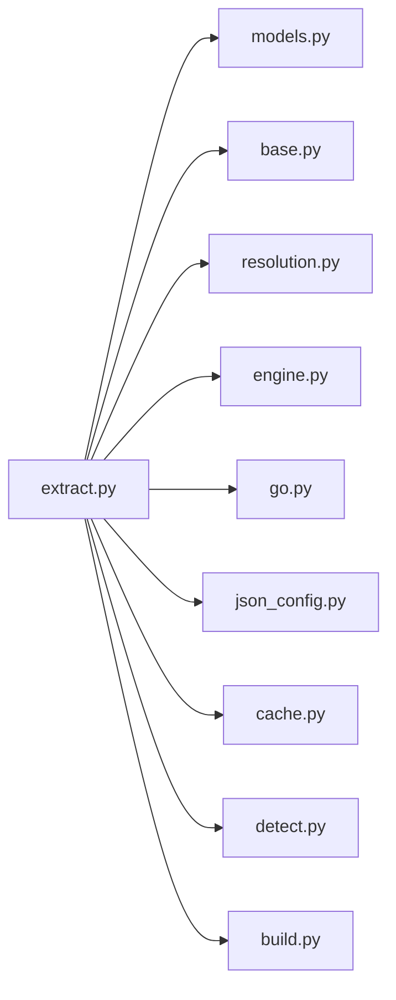

图表来源
- [graphify/extract.py:1-140](file://graphify/extract.py#L1-L140)
- [graphify/extractors/__init__.py:1-65](file://graphify/extractors/__init__.py#L1-L65)

章节来源
- [graphify/extract.py:1-140](file://graphify/extract.py#L1-L140)
- [graphify/extractors/__init__.py:1-65](file://graphify/extractors/__init__.py#L1-L65)

## 性能与并行处理
- 进程池并行：extract.py 提供 _extract_parallel/_extract_sequential，优先使用 ProcessPoolExecutor 并行处理未命中缓存的文件，失败时自动回退顺序执行。
- 工作线程数：默认取 CPU 核数与待处理文件数的较小值，可通过 GRAPHIFY_MAX_WORKERS 环境变量限制。
- 零节点保护：若某可提取文件产生空节点结果，不会写入缓存，以便下次重试自愈。
- 进度提示：大批量文件时打印 AST 提取进度。

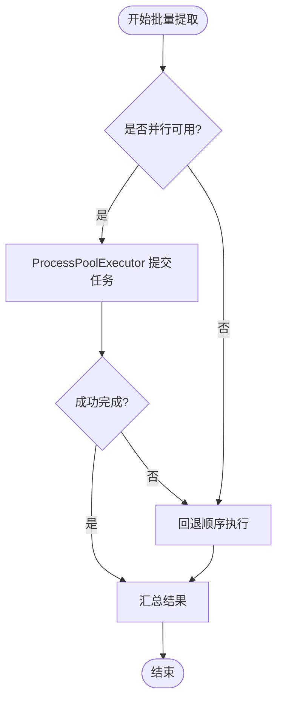

图表来源
- [graphify/extract.py:4147-4180](file://graphify/extract.py#L4147-L4180)
- [graphify/extract.py:4251-4284](file://graphify/extract.py#L4251-L4284)
- [tests/test_extract.py:1183-1211](file://tests/test_extract.py#L1183-L1211)

章节来源
- [graphify/extract.py:4147-4180](file://graphify/extract.py#L4147-L4180)
- [graphify/extract.py:4251-4284](file://graphify/extract.py#L4251-L4284)
- [tests/test_extract.py:1183-1211](file://tests/test_extract.py#L1183-L1211)

## 增量提取与缓存策略
- 内容哈希：cache.py 的 file_hash 使用 size+mtime_ns 快速路径，必要时计算 SHA256，并对 Markdown 仅对正文（去除 frontmatter）参与哈希。
- 缓存位置：AST 缓存按版本隔离（cache/ast/v{version}/），语义缓存不版本化（cache/semantic/），避免不同版本提取器导致的结果污染。
- 增量检测：detect_incremental 比较 ast_hash/semantic_hash 与当前 mtime，决定是否需要重新提取。
- 增量合并：build.py 在合并新块时，先删除旧文件中已变更的贡献，再合并新结果，确保“变更替换”语义。

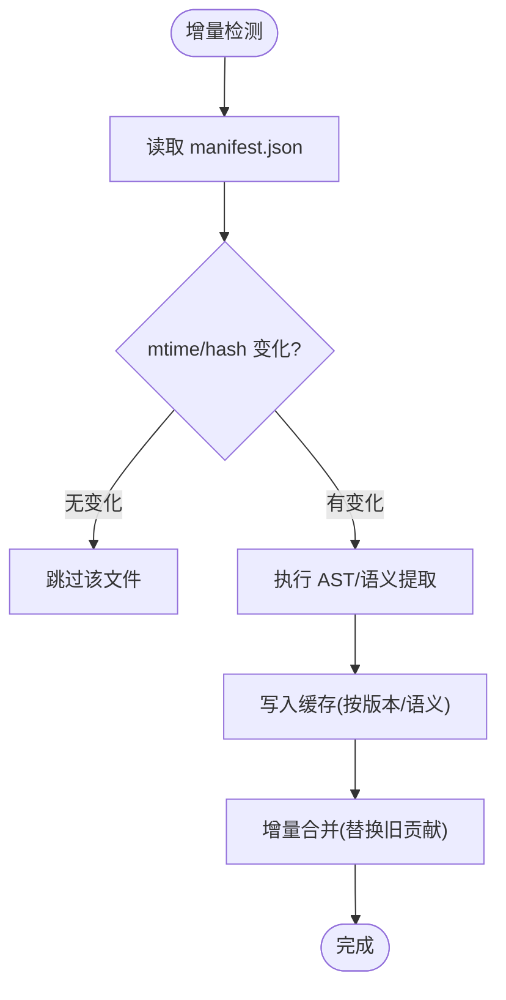

图表来源
- [graphify/cache.py:162-222](file://graphify/cache.py#L162-L222)
- [graphify/cache.py:340-400](file://graphify/cache.py#L340-L400)
- [graphify/detect.py:1544-1621](file://graphify/detect.py#L1544-L1621)
- [graphify/build.py:925-952](file://graphify/build.py#L925-L952)

章节来源
- [graphify/cache.py:162-222](file://graphify/cache.py#L162-L222)
- [graphify/cache.py:340-400](file://graphify/cache.py#L340-L400)
- [graphify/detect.py:1544-1621](file://graphify/detect.py#L1544-L1621)
- [graphify/build.py:925-952](file://graphify/build.py#L925-L952)

## 自定义语言提取器开发指南
- 步骤概览
  1) 新增语言模块：在 graphify/extractors/<lang>.py 中实现 extract_<lang>(path) -> dict，遵循 verbatim 迁移原则（见 MIGRATION.md）。
  2) 注册语言：在 __init__.py 的 LANGUAGE_EXTRACTORS 中添加映射。
  3) 保持 facade 兼容：在 extract.py 中保留 re-export，确保现有导入不变。
  4) 测试验证：运行 tests/test_extractors_registry.py 相关用例，确保行为一致。
- 设计要点
  - 使用 base.py 的工具函数（_make_id/_file_stem/_read_text）保证 ID 一致性。
  - 如需复杂导入/别名解析，参考 resolution.py 的模式（tsconfig 别名、工作区包、扩展补全）。
  - 对于类型引用，参考 engine.py 中各语言的 _collect_type_refs 模式，过滤内置/泛型占位符。
  - 对于特殊语法（如 Swift import module、Svelte 模板动态 import），在语言模块中追加后处理。
- 最佳实践
  - 谨慎处理“god-nodes”：使用 _LANGUAGE_BUILTIN_GLOBALS 过滤常见内置构造器/全局，避免噪声边。
  - 控制 JSON 文件大小与深度，避免大 fixture 拖慢解析。
  - 对异常与 RecursionError 做安全包裹，避免中断整个批次。

章节来源
- [graphify/extractors/MIGRATION.md:1-108](file://graphify/extractors/MIGRATION.md#L1-L108)
- [graphify/extractors/__init__.py:36-64](file://graphify/extractors/__init__.py#L36-L64)
- [graphify/extractors/base.py:13-32](file://graphify/extractors/base.py#L13-L32)
- [graphify/extractors/resolution.py:86-165](file://graphify/extractors/resolution.py#L86-L165)
- [graphify/extractors/engine.py:68-116](file://graphify/extractors/engine.py#L68-L116)

## 常见问题与排障
- 递归限制：遇到深层嵌套 AST 可能触发 RecursionError，extract.py 会提升递归上限并安全跳过受影响文件。
- 零节点结果：若某文件产生空节点，不会写入缓存，下次运行自愈；建议检查语言配置与 AST 节点匹配。
- Windows 进程池：spawn 模式下可能出现 BrokenProcessPool，系统会自动回退顺序执行。
- 缓存不一致：确保 cache_root 与 root 解耦，避免缓存落盘到只读源树；Markdown frontmatter 变更不应影响 AST 缓存。
- 导入解析失败：确认 tsconfig/工作区/扩展补全规则是否正确，必要时增加调试日志。

章节来源
- [graphify/extract.py:151-168](file://graphify/extract.py#L151-L168)
- [tests/test_zero_node_no_cache.py:1-54](file://tests/test_zero_node_no_cache.py#L1-L54)
- [tests/test_extract.py:1183-1211](file://tests/test_extract.py#L1183-L1211)
- [graphify/cache.py:340-400](file://graphify/cache.py#L340-L400)

## 结论
Graphify 的提取系统通过“配置驱动 + 插件化”的设计，将多语言 AST 解析、符号关系推断与跨语言依赖分析统一到一套可扩展的框架中。借助 tree-sitter、增量检测与分层缓存，系统在大规模混合语料上实现了高效、稳定且可演进的代码图谱构建能力。开发者可通过 LanguageConfig 与语言模块快速接入新语言，同时利用通用引擎提供的关系推断与解析工具，获得一致的图谱输出质量。