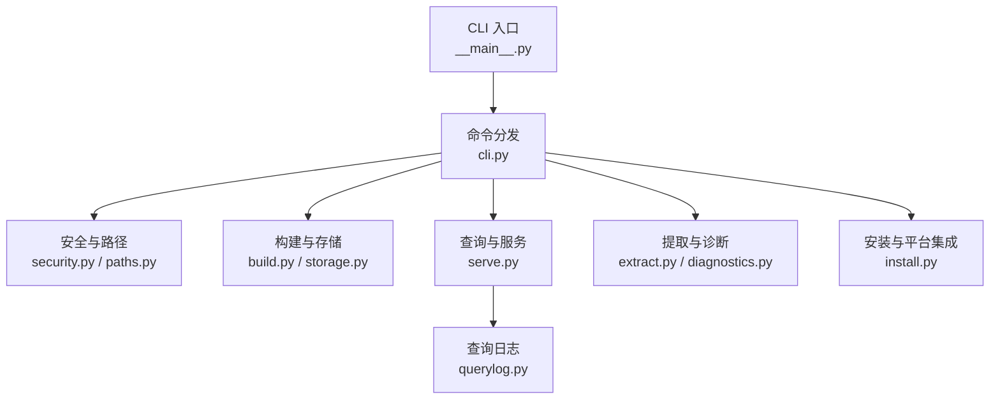
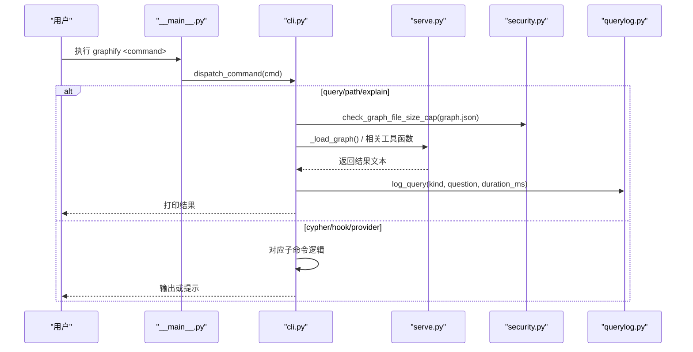
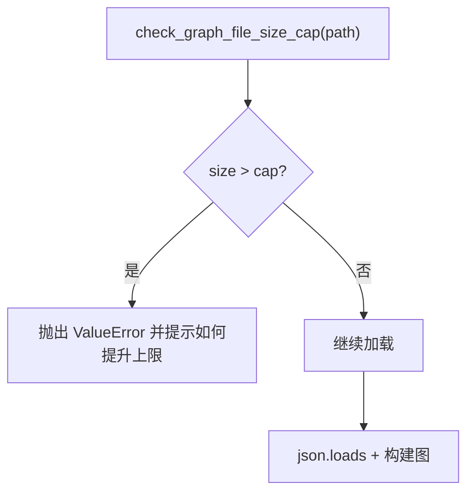
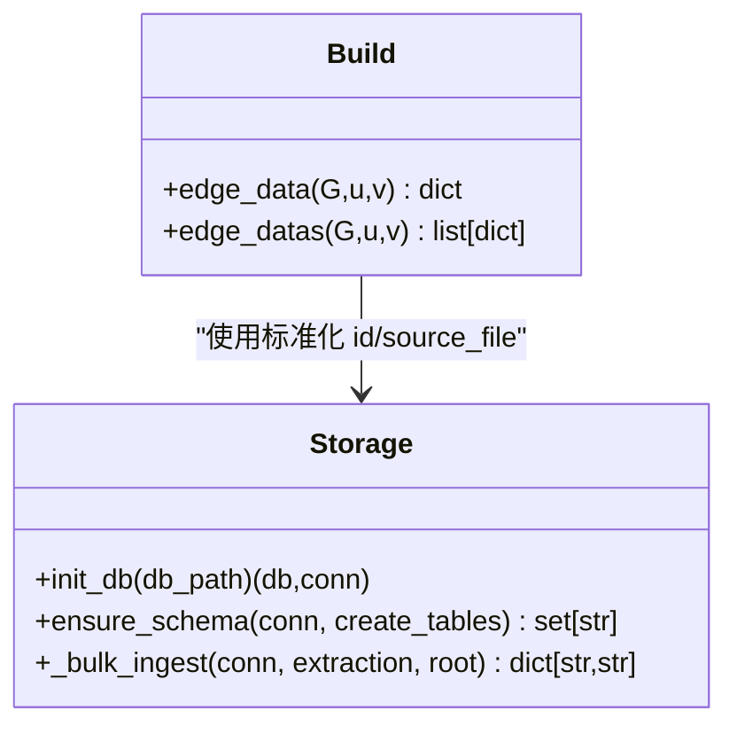
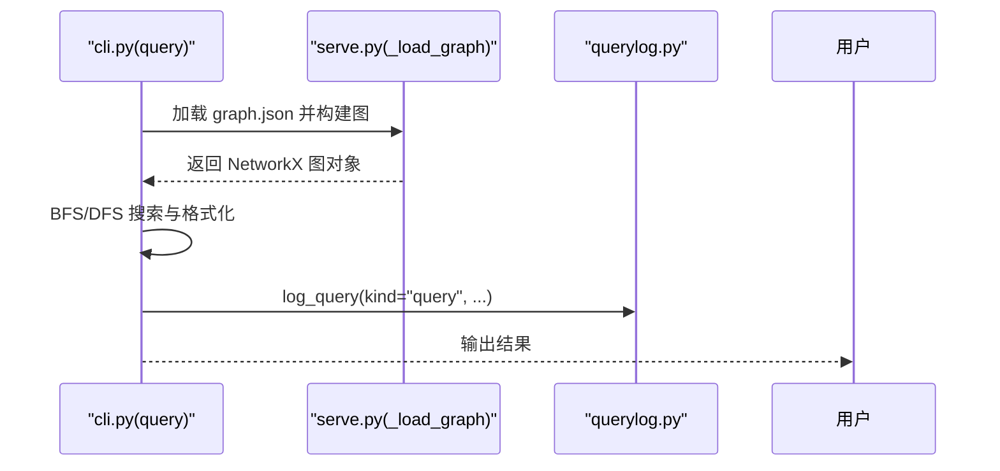
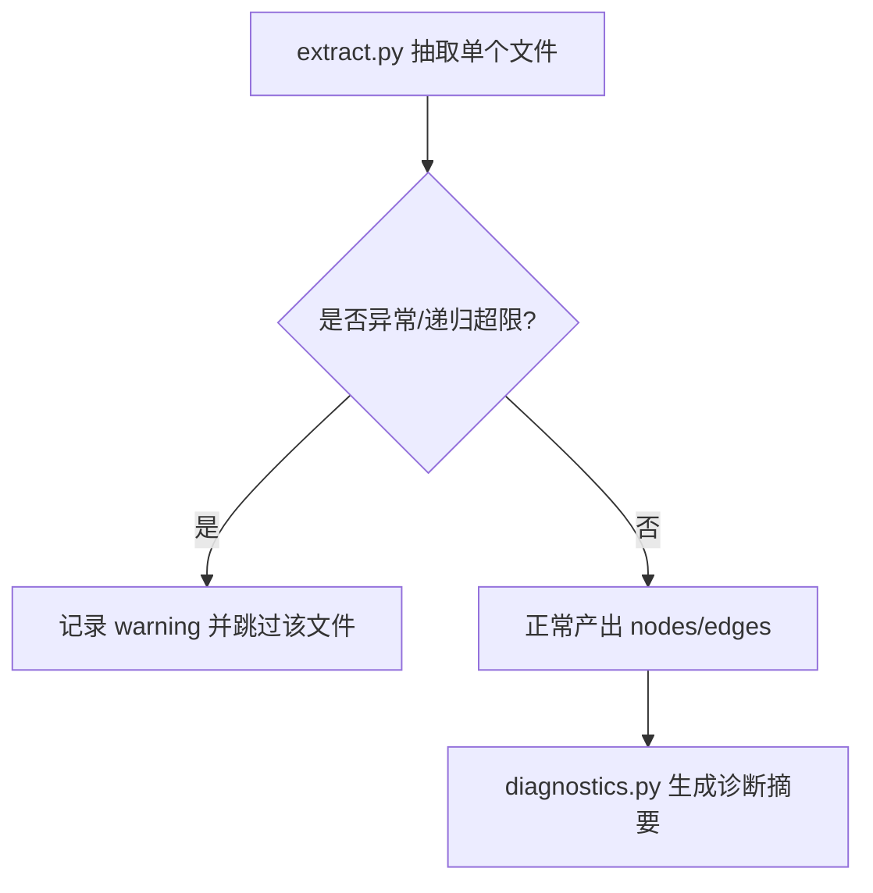
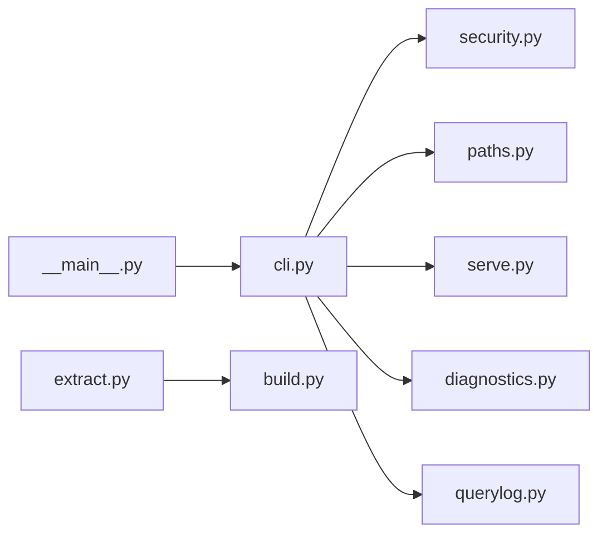

# 故障排除

<cite>
**本文引用的文件**   
- [README.md](file://README.md)
- [__main__.py](file://graphify/__main__.py)
- [cli.py](file://graphify/cli.py)
- [diagnostics.py](file://graphify/diagnostics.py)
- [querylog.py](file://graphify/querylog.py)
- [security.py](file://graphify/security.py)
- [paths.py](file://graphify/paths.py)
- [build.py](file://graphify/build.py)
- [storage.py](file://graphify/storage.py)
- [serve.py](file://graphify/serve.py)
- [extract.py](file://graphify/extract.py)
- [install.py](file://graphify/install.py)
</cite>

## 目录
1. [简介](#简介)
2. [项目结构](#项目结构)
3. [核心组件](#核心组件)
4. [架构总览](#架构总览)
5. [详细组件分析](#详细组件分析)
6. [依赖关系分析](#依赖关系分析)
7. [性能注意事项](#性能注意事项)
8. [故障排除指南](#故障排除指南)
9. [结论](#结论)
10. [附录](#附录)

## 简介
本指南聚焦于安装、配置、运行与诊断中的常见问题，提供可操作的排错步骤、日志分析方法、性能调优建议以及错误信息解读。内容基于仓库源码与文档整理，确保准确且可追溯。

## 项目结构
- CLI 入口与命令分发：负责版本检查、帮助输出、子命令路由与钩子守卫等。
- 安全与路径：统一输出目录名、图文件大小上限校验、URL/SSRF 防护、标签清洗。
- 构建与存储：将节点/边组装为图、可选的 NeuG 数据库批量导入。
- 查询与服务：MCP stdio/HTTP 服务、BFS/DFS 查询、最短路径、解释。
- 提取与诊断：AST/语义抽取、多向边折叠诊断、查询日志记录。
- 安装与平台集成：各 AI 助手技能与钩子安装/卸载。



图表来源
- [__main__.py:460-712](file://graphify/__main__.py#L460-L712)
- [cli.py:259-800](file://graphify/cli.py#L259-L800)
- [security.py:35-67](file://graphify/security.py#L35-L67)
- [paths.py:23-235](file://graphify/paths.py#L23-L235)
- [build.py:1-200](file://graphify/build.py#L1-L200)
- [storage.py:89-188](file://graphify/storage.py#L89-L188)
- [serve.py:21-63](file://graphify/serve.py#L21-L63)
- [extract.py:156-168](file://graphify/extract.py#L156-L168)
- [diagnostics.py:156-268](file://graphify/diagnostics.py#L156-L268)
- [querylog.py:15-81](file://graphify/querylog.py#L15-L81)
- [install.py:33-56](file://graphify/install.py#L33-L56)

章节来源
- [__main__.py:460-712](file://graphify/__main__.py#L460-L712)
- [cli.py:259-800](file://graphify/cli.py#L259-L800)
- [security.py:35-67](file://graphify/security.py#L35-L67)
- [paths.py:23-235](file://graphify/paths.py#L23-L235)
- [build.py:1-200](file://graphify/build.py#L1-L200)
- [storage.py:89-188](file://graphify/storage.py#L89-L188)
- [serve.py:21-63](file://graphify/serve.py#L21-L63)
- [extract.py:156-168](file://graphify/extract.py#L156-L168)
- [diagnostics.py:156-268](file://graphify/diagnostics.py#L156-L268)
- [querylog.py:15-81](file://graphify/querylog.py#L15-L81)
- [install.py:33-56](file://graphify/install.py#L33-L56)

## 核心组件
- CLI 入口与版本/帮助/管道保护：处理 BrokenPipe/OSError(EPIPE/EINVAL)，保证在下游提前关闭管道时不报错退出。
- 命令分发：实现 query/path/explain/affected/save-result/reflect/cypher/hook 等子命令；对 graph.json 进行大小限制与安全加载。
- 安全模块：统一图文件大小上限（默认 512MB，支持环境变量覆盖）、URL/SSRF 防护、路径白名单、标签清洗。
- 路径模块：集中定义输出目录名及默认 graph.json 路径，避免硬编码不一致。
- 构建与存储：节点去重、边属性访问兼容 MultiGraph/MultiDiGraph；NeuG 批量导入优化。
- 查询与服务：IDF 加权搜索、中文分词、社区重建、学习叠加层读取。
- 提取与诊断：AST/语义抽取异常捕获与跳过；同端点边折叠风险诊断。
- 安装与平台集成：跨平台技能与钩子写入、版本戳管理、渐进式 references 安装。

章节来源
- [__main__.py:448-481](file://graphify/__main__.py#L448-L481)
- [cli.py:123-139](file://graphify/cli.py#L123-L139)
- [security.py:35-67](file://graphify/security.py#L35-L67)
- [paths.py:218-235](file://graphify/paths.py#L218-L235)
- [build.py:177-196](file://graphify/build.py#L177-L196)
- [storage.py:119-188](file://graphify/storage.py#L119-L188)
- [serve.py:21-63](file://graphify/serve.py#L21-L63)
- [extract.py:156-168](file://graphify/extract.py#L156-L168)
- [diagnostics.py:156-268](file://graphify/diagnostics.py#L156-L268)
- [install.py:33-56](file://graphify/install.py#L33-L56)

## 架构总览
下图展示从 CLI 到查询/服务的调用链与关键安全/日志点。



图表来源
- [__main__.py:460-712](file://graphify/__main__.py#L460-L712)
- [cli.py:422-518](file://graphify/cli.py#L422-L518)
- [serve.py:21-63](file://graphify/serve.py#L21-L63)
- [security.py:357-384](file://graphify/security.py#L357-L384)
- [querylog.py:43-81](file://graphify/querylog.py#L43-L81)

## 详细组件分析

### CLI 入口与命令分发
- 管道保护：捕获 BrokenPipeError 与 OSError(EPIPE/EINVAL)，静默退出，避免 CI/Agent 误判失败。
- 帮助与参数解析：对 query/path/explain 等命令进行严格参数校验与错误提示。
- 图文件安全：统一通过 size cap 检查，防止内存炸弹。
- 查询日志：在 query/path 等命令完成后追加 JSONL 记录（需显式开启）。

```mermaid
flowchart TD
Start(["进入 main"]) --> TryRun["_run_cli()"]
TryRun --> Flush["刷新 stdout"]
Flush --> EndOK(["成功退出"])
TryRun --> |BrokenPipeError| Silence["静默退出(0)"]
TryRun --> |OSError(EPIPE/EINVAL)| Silence
TryRun --> |其他异常| Raise["抛出异常"]
```

图表来源
- [__main__.py:448-481](file://graphify/__main__.py#L448-L481)
- [__main__.py:460-712](file://graphify/__main__.py#L460-L712)

章节来源
- [__main__.py:448-481](file://graphify/__main__.py#L448-L481)
- [cli.py:422-518](file://graphify/cli.py#L422-L518)
- [cli.py:667-767](file://graphify/cli.py#L667-L767)
- [cli.py:769-800](file://graphify/cli.py#L769-L800)

### 安全与路径
- 图文件大小上限：默认 512MB，可通过环境变量调整；超过则拒绝加载并给出明确提示。
- URL/SSRF 防护：仅允许 http/https，阻止私有/保留/云元数据地址，连接前一次性 DNS 解析并校验 IP。
- 路径白名单：只允许访问 graphify-out 下的文件，防止越权读取。
- 标签清洗：去除控制字符、截断长度，保障 JSON/HTML 安全。



图表来源
- [security.py:357-384](file://graphify/security.py#L357-L384)
- [security.py:103-143](file://graphify/security.py#L103-L143)
- [security.py:315-354](file://graphify/security.py#L315-L354)
- [security.py:394-405](file://graphify/security.py#L394-L405)
- [paths.py:218-235](file://graphify/paths.py#L218-L235)

章节来源
- [security.py:35-67](file://graphify/security.py#L35-L67)
- [security.py:357-384](file://graphify/security.py#L357-L384)
- [security.py:103-143](file://graphify/security.py#L103-L143)
- [security.py:315-354](file://graphify/security.py#L315-L354)
- [security.py:394-405](file://graphify/security.py#L394-L405)
- [paths.py:218-235](file://graphify/paths.py#L218-L235)

### 构建与存储
- 边属性访问兼容 MultiGraph/MultiDiGraph，便于渲染器获取 relation/confidence。
- NeuG 批量导入：CSV 中转 + COPY FROM，显著加速大图入库。



图表来源
- [build.py:177-196](file://graphify/build.py#L177-L196)
- [storage.py:89-188](file://graphify/storage.py#L89-L188)

章节来源
- [build.py:177-196](file://graphify/build.py#L177-L196)
- [storage.py:89-188](file://graphify/storage.py#L89-L188)

### 查询与服务
- 图加载：强制 directed=True，兼容旧 edges/links 字段，附加学习叠加层。
- 查询流程：问题分词→IDF 权重→种子节点→BFS/DFS 扩展→结果格式化。
- 查询日志：按 kind/question/corpus/nodes_returned/duration_ms 记录。



图表来源
- [serve.py:21-63](file://graphify/serve.py#L21-L63)
- [cli.py:422-518](file://graphify/cli.py#L422-L518)
- [querylog.py:43-81](file://graphify/querylog.py#L43-L81)

章节来源
- [serve.py:21-63](file://graphify/serve.py#L21-L63)
- [cli.py:422-518](file://graphify/cli.py#L422-L518)
- [querylog.py:43-81](file://graphify/querylog.py#L43-L81)

### 提取与诊断
- 提取异常：递归超限或异常时跳过文件并记录警告，避免中断整体流程。
- 诊断报告：统计同端点边折叠、缺失端点、自环、重复边、变体分组等，辅助定位数据质量问题。



图表来源
- [extract.py:156-168](file://graphify/extract.py#L156-L168)
- [diagnostics.py:156-268](file://graphify/diagnostics.py#L156-L268)

章节来源
- [extract.py:156-168](file://graphify/extract.py#L156-L168)
- [diagnostics.py:156-268](file://graphify/diagnostics.py#L156-L268)

### 安装与平台集成
- 版本戳：安装后更新所有已知平台的 .graphify_version，避免“版本不匹配”告警。
- 渐进式 references：原子化安装 references/ 侧车，避免半写状态。
- 包完整性：若 always_on 块或 references 缺失，安装阶段即报错并提示重装。

章节来源
- [install.py:33-56](file://graphify/install.py#L33-L56)
- [install.py:56-67](file://graphify/install.py#L56-L67)
- [install.py:153-173](file://graphify/install.py#L153-L173)
- [install.py:174-200](file://graphify/install.py#L174-L200)

## 依赖关系分析
- CLI 强依赖 security/paths 做前置校验；query/path/explain 依赖 serve 的图加载与查询能力；部分功能依赖可选后端（如 neug）。
- extract 与 build 解耦：extract 产出 nodes/edges，build 负责图构建与兼容性处理。
- 诊断独立于主流程，用于离线分析 graph.json。



图表来源
- [__main__.py:460-712](file://graphify/__main__.py#L460-L712)
- [cli.py:259-800](file://graphify/cli.py#L259-L800)
- [serve.py:21-63](file://graphify/serve.py#L21-L63)
- [diagnostics.py:156-268](file://graphify/diagnostics.py#L156-L268)
- [extract.py:156-168](file://graphify/extract.py#L156-L168)
- [build.py:177-196](file://graphify/build.py#L177-L196)
- [querylog.py:43-81](file://graphify/querylog.py#L43-L81)

章节来源
- [__main__.py:460-712](file://graphify/__main__.py#L460-L712)
- [cli.py:259-800](file://graphify/cli.py#L259-L800)
- [serve.py:21-63](file://graphify/serve.py#L21-L63)
- [diagnostics.py:156-268](file://graphify/diagnostics.py#L156-L268)
- [extract.py:156-168](file://graphify/extract.py#L156-L168)
- [build.py:177-196](file://graphify/build.py#L177-L196)
- [querylog.py:43-81](file://graphify/querylog.py#L43-L81)

## 性能注意事项
- 大图的 HTML 可视化可能过大导致浏览器卡顿，可在 cluster-only 时禁用可视化。
- 本地推理（如 Ollama）受 VRAM/上下文窗口限制，可降低 KV-cache 窗口与 token budget。
- 并发与批大小：社区命名/标注可调节 max-concurrency 与 batch-size 以平衡吞吐与资源占用。
- 查询预算：通过 --budget 控制输出规模，避免过长响应。

章节来源
- [README.md:577-582](file://README.md#L577-L582)
- [README.md:563-575](file://README.md#L563-L575)
- [cli.py:548-555](file://graphify/cli.py#L548-L555)
- [cli.py:438-452](file://graphify/cli.py#L438-L452)

## 故障排除指南

### 安装与环境
- 找不到 graphify 命令
  - 现象：安装后终端无法识别 graphify。
  - 原因：bin 目录未加入 PATH。
  - 解决：根据安装方式执行相应命令刷新 PATH，或改用 python -m graphify。
  - 参考
    - [README.md:539-549](file://README.md#L539-L549)

- uvx/uv tool run 无法解析 graphify
  - 现象：提示无可用版本。
  - 原因：PyPI 包名为 graphifyy，graphify 仅为命令名。
  - 解决：显式指定包名或使用已安装的命令。
  - 参考
    - [README.md:545-546](file://README.md#L545-L546)

- PowerShell 中 /graphify . 报路径不被识别
  - 现象：Windows 下报错。
  - 原因：PowerShell 将前导斜杠视为路径分隔符。
  - 解决：使用 graphify .（无前导斜杠）。
  - 参考
    - [README.md:551-552](file://README.md#L551-L552)

- 安装不完整/always_on 块或 references 缺失
  - 现象：安装时报错提示缺少 always_on 块或 references。
  - 原因：打包不完整或安装中断。
  - 解决：重新安装 graphifyy。
  - 参考
    - [install.py:33-56](file://graphify/install.py#L33-L56)
    - [install.py:174-200](file://graphify/install.py#L174-L200)

### 配置与权限
- 图文件过大被拒绝加载
  - 现象：error: graph file ... exceeds cap。
  - 原因：graph.json 超过默认 512MB 上限。
  - 解决：设置 GRAPHIFY_MAX_GRAPH_BYTES 提高上限，或拆分/精简图。
  - 参考
    - [security.py:357-384](file://graphify/security.py#L357-L384)
    - [security.py:35-67](file://graphify/security.py#L35-L67)

- 访问了不允许的路径
  - 现象：Path escapes the allowed directory。
  - 原因：尝试访问 graphify-out 之外的文件。
  - 解决：仅在 graphify-out 内操作，或通过正确参数传入相对路径。
  - 参考
    - [security.py:315-354](file://graphify/security.py#L315-L354)

- URL/SSRF 被拦截
  - 现象：Blocked URL scheme / Blocked private/internal IP。
  - 原因：使用了非 http/https 或目标为私有/保留地址。
  - 解决：改为合法公网地址，或配置代理/网关并确保域名解析到公网 IP。
  - 参考
    - [security.py:103-143](file://graphify/security.py#L103-L143)

### 构建与图质量
- 重构后节点数减少
  - 现象：update 后图变小。
  - 原因：删除了源文件但旧节点残留。
  - 解决：使用 --force 覆盖重建。
  - 参考
    - [README.md:554-555](file://README.md#L554-L555)

- 幽灵重复节点
  - 现象：同一实体出现多次。
  - 原因：旧版图未合并 AST 与语义节点。
  - 解决：全量重建以清理。
  - 参考
    - [README.md:557-561](file://README.md#L557-L561)

- 同端点边折叠风险
  - 现象：多个不同关系的边被合并。
  - 解决：使用诊断命令查看示例与变体分组，必要时调整提取策略。
  - 参考
    - [diagnostics.py:156-268](file://graphify/diagnostics.py#L156-L268)

### 查询与服务
- 查询/路径/解释报错
  - 现象：error: graph file not found / error: could not load graph。
  - 原因：graph.json 不存在或损坏/过大。
  - 解决：确认路径、重建图、检查大小上限。
  - 参考
    - [cli.py:464-496](file://graphify/cli.py#L464-L496)
    - [serve.py:21-63](file://graphify/serve.py#L21-L63)

- 查询结果为空或过慢
  - 现象：nodes found=0 或耗时很长。
  - 原因：问题过于宽泛、停止词过多、预算不足。
  - 解决：细化问题、增加 --budget、使用 --dfs 或调整上下文过滤。
  - 参考
    - [cli.py:438-452](file://graphify/cli.py#L438-L452)
    - [serve.py:164-183](file://graphify/serve.py#L164-L183)

- MCP 服务启动失败
  - 现象：端口占用或鉴权失败。
  - 解决：更换端口、设置 API Key 或绑定主机。
  - 参考
    - [README.md:459-476](file://README.md#L459-L476)

### 本地推理（Ollama/本地模型）
- VRAM 不足/上下文窗口超限
  - 现象：进程崩溃或报错。
  - 解决：降低 KV-cache 窗口与 token budget，或切换到云端兼容后端。
  - 参考
    - [README.md:563-575](file://README.md#L563-L575)

- 输出 JSON 被截断
  - 现象：LLM returned invalid JSON / Unterminated string。
  - 解决：提高输出上限或减小 chunk 大小；优先使用 OpenAI 兼容后端。
  - 参考
    - [README.md:569-575](file://README.md#L569-L575)

### 日志与调试
- 启用查询日志
  - 方法：设置 GRAPHIFY_QUERY_LOG_ENABLE=1 或 GRAPHIFY_QUERY_LOG=<path>。
  - 位置：默认 ~/.cache/graphify-queries.log（JSONL）。
  - 参考
    - [querylog.py:15-31](file://graphify/querylog.py#L15-L31)
    - [querylog.py:43-81](file://graphify/querylog.py#L43-L81)

- 查看每阶段耗时
  - 方法：添加 --timing 标志，输出到 stderr。
  - 参考
    - [cli.py:99-123](file://graphify/cli.py#L99-L123)

- 调试提取异常
  - 方法：设置 GRAPHIFY_DEBUG 以打印完整堆栈。
  - 参考
    - [extract.py:163-167](file://graphify/extract.py#L163-L167)

- 理解诊断报告
  - 关注项：same_endpoint_group_count、relation_variant_groups、post_build_error 等。
  - 参考
    - [diagnostics.py:339-396](file://graphify/diagnostics.py#L339-L396)

### 常见错误信息速查
- “graph file ... exceeds cap”
  - 含义：图文件超过大小上限。
  - 解决：设置 GRAPHIFY_MAX_GRAPH_BYTES。
  - 参考
    - [security.py:357-384](file://graphify/security.py#L357-L384)

- “Path escapes the allowed directory”
  - 含义：访问了不受控路径。
  - 解决：限定在 graphify-out 内。
  - 参考
    - [security.py:315-354](file://graphify/security.py#L315-L354)

- “Blocked URL scheme / Blocked private/internal IP”
  - 含义：URL/SSRF 防护触发。
  - 解决：使用合法公网地址。
  - 参考
    - [security.py:103-143](file://graphify/security.py#L103-L143)

- “graph.json is corrupted”
  - 含义：JSON 损坏。
  - 解决：重建图。
  - 参考
    - [serve.py:60-62](file://graphify/serve.py#L60-L62)

- “No node matching ... found.”
  - 含义：未找到匹配节点。
  - 解决：使用更精确的标签或 ID。
  - 参考
    - [cli.py:699-706](file://graphify/cli.py#L699-L706)

- “Both resolved to the same node”
  - 含义：起止点命中同一节点。
  - 解决：提供更具体的标识。
  - 参考
    - [cli.py:712-718](file://graphify/cli.py#L712-L718)

### 社区支持与获取帮助
- 官方渠道
  - Discord、LinkedIn、Y Combinator 徽章等见 README 顶部。
  - 参考
    - [README.md:18-23](file://README.md#L18-L23)

- 贡献与开发
  - 参见 README 贡献与开发环境说明。
  - 参考
    - [README.md:789-800](file://README.md#L789-L800)

## 结论
本指南围绕安装、配置、运行与诊断的关键环节，提供了基于源码的可验证排错路径。建议优先通过安全与路径校验、图大小限制、查询日志与诊断报告快速定位问题；在本地推理场景下，结合 KV-cache 与 token budget 调优以获得稳定性能。

## 附录

### 常用命令速查（节选）
- 构建/更新/聚类
  - graphify extract ./docs --backend ollama
  - graphify cluster-only ./my-project --no-viz
  - graphify label ./my-project --backend=openai --model gpt-4o
  - 参考
    - [README.md:700-763](file://README.md#L700-L763)

- 查询/路径/解释
  - graphify query "..." --budget 2000
  - graphify path "A" "B"
  - graphify explain "X"
  - 参考
    - [cli.py:422-518](file://graphify/cli.py#L422-L518)
    - [cli.py:667-767](file://graphify/cli.py#L667-L767)
    - [cli.py:769-800](file://graphify/cli.py#L769-L800)

- 诊断与导出
  - graphify diagnose multigraph --graph graphify-out/graph.json --json
  - graphify export callflow-html
  - 参考
    - [diagnostics.py:289-318](file://graphify/diagnostics.py#L289-L318)
    - [README.md:726-729](file://README.md#L726-L729)