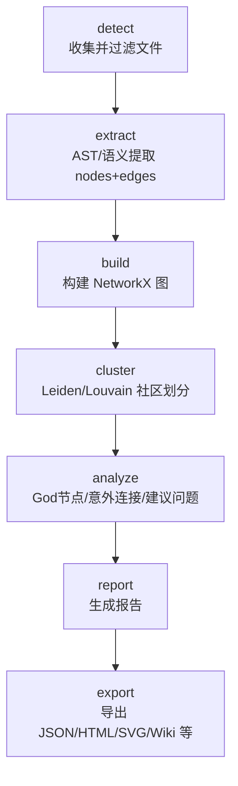
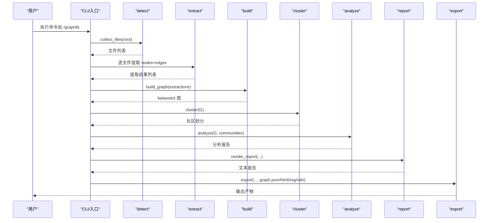
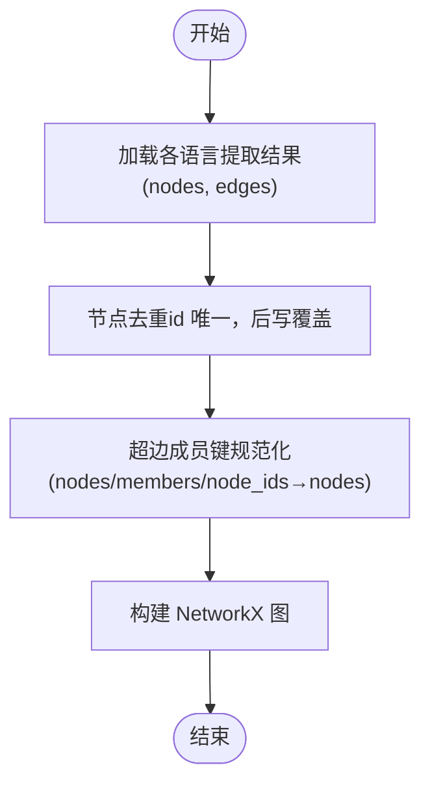
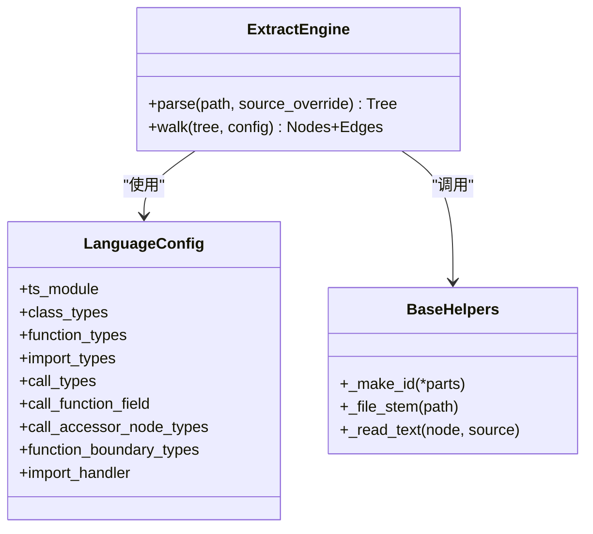
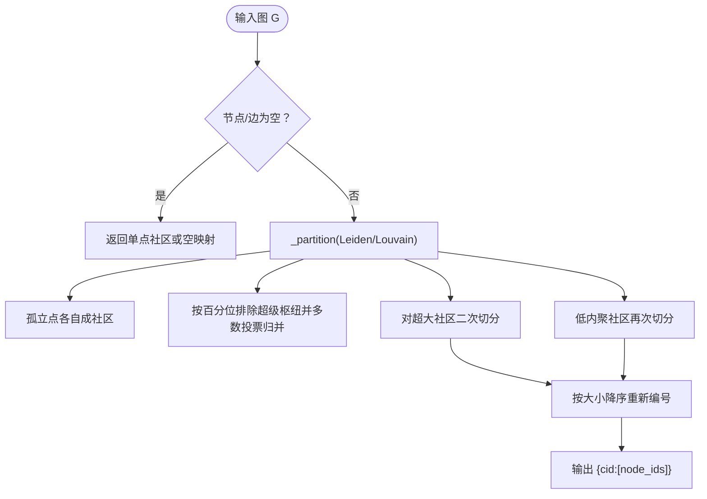
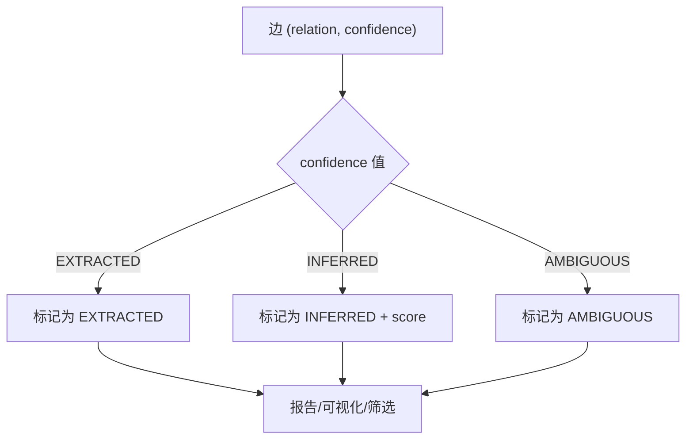
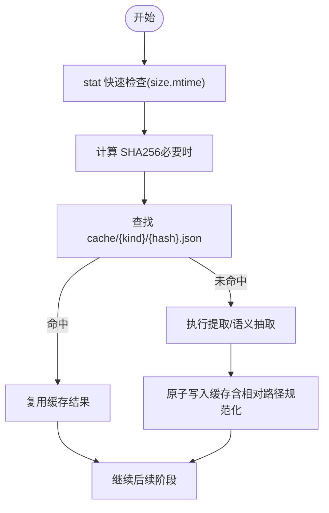
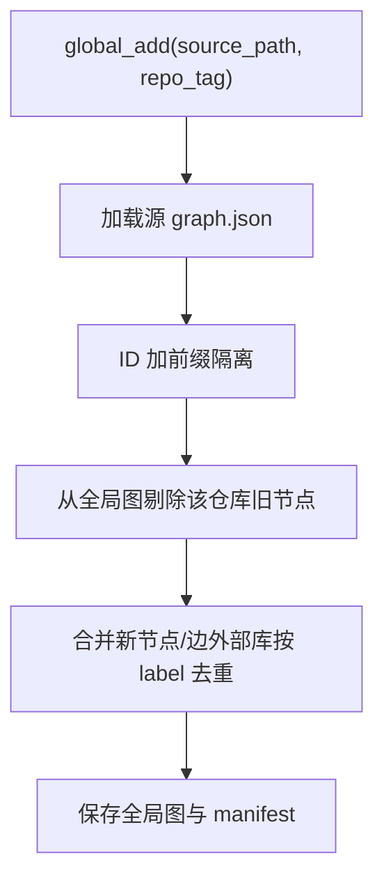
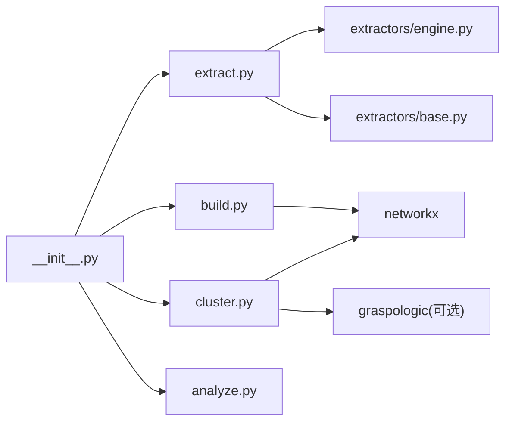

# 核心概念

<cite>
**本文引用的文件**   
- [README.md](file://README.md)
- [ARCHITECTURE.md](file://ARCHITECTURE.md)
- [how-it-works.md](file://docs/how-it-works.md)
- [__init__.py](file://graphify/__init__.py)
- [extract.py](file://graphify/extract.py)
- [build.py](file://graphify/build.py)
- [cluster.py](file://graphify/cluster.py)
- [analyze.py](file://graphify/analyze.py)
- [cache.py](file://graphify/cache.py)
- [global_graph.py](file://graphify/global_graph.py)
- [base.py](file://graphify/extractors/base.py)
- [engine.py](file://graphify/extractors/engine.py)
</cite>

## 目录
1. [引言](#引言)
2. [项目结构](#项目结构)
3. [核心组件](#核心组件)
4. [架构总览](#架构总览)
5. [详细组件分析](#详细组件分析)
6. [依赖关系分析](#依赖关系分析)
7. [性能考量](#性能考量)
8. [故障排查指南](#故障排查指南)
9. [结论](#结论)
10. [附录](#附录)

## 引言
本章节面向初学者与高级用户，系统阐述 Graphify 的核心概念与工作原理，覆盖知识图谱基础（节点、边、关系）、AST 抽象语法树在代码解析中的作用、社区检测算法（Leiden）的原理与应用、置信度标记体系（EXTRACTED/INFERRED/AMBIGUOUS），以及增量更新机制与缓存策略。文档同时提供可定位到源码的“代码片段路径”，帮助读者快速对照实现细节。

## 项目结构
Graphify 采用“流水线式”模块化设计：detect → extract → build → cluster → analyze → report → export。每个阶段由独立模块承担单一职责，通过 Python 字典与 NetworkX 图对象进行数据交换，避免共享状态与副作用。

图表来源
- [ARCHITECTURE.md:1-87](file://ARCHITECTURE.md#L1-L87)

章节来源
- [ARCHITECTURE.md:1-87](file://ARCHITECTURE.md#L1-L87)

## 核心组件
- 知识图谱三要素
  - 节点（Node）：代表代码实体或文档概念，具备稳定 id、可读 label、来源 source_file 等属性。
  - 边（Edge）：表示两个节点之间的关系，如 calls、imports、implements、references 等。
  - 关系（Relation）：边的类型标签，描述关系的语义（例如“调用”、“导入”、“继承”）。
- AST（抽象语法树）
  - 使用 tree-sitter 对源代码进行确定性解析，抽取类、函数、导入、调用图等结构化信息，无需 LLM，完全本地运行。
- 社区检测（Leiden）
  - 基于图密度将节点聚类为社区；支持 resolution 控制粒度，并对超大社区二次切分，保证社区规模合理。
- 置信度标记
  - EXTRACTED：直接从源码中显式发现（如 import、直接调用）。
  - INFERRED：通过解析与推理得出（如跨文件调用解析、语义相似性）。
  - AMBIGUOUS：存在歧义，需人工复核。
- 增量更新与缓存
  - AST 缓存按版本隔离，语义缓存不随版本失效；基于内容 SHA256 与 stat 快速路径，跳过未变更文件。

章节来源
- [README.md:25-30](file://README.md#L25-L30)
- [README.md:95-108](file://README.md#L95-L108)
- [README.md:317-324](file://README.md#L317-L324)
- [how-it-works.md:26-51](file://docs/how-it-works.md#L26-L51)
- [how-it-works.md:77-81](file://docs/how-it-works.md#L77-L81)

## 架构总览
下图展示从文件检测到导出的端到端流程，以及关键模块间的依赖关系。

图表来源
- [ARCHITECTURE.md:1-87](file://ARCHITECTURE.md#L1-L87)
- [__init__.py:1-31](file://graphify/__init__.py#L1-L31)

章节来源
- [ARCHITECTURE.md:1-87](file://ARCHITECTURE.md#L1-L87)
- [__init__.py:1-31](file://graphify/__init__.py#L1-L31)

## 详细组件分析

### 知识图谱建模与构建
- 节点与边的统一 schema
  - 节点包含 id、label、source_file、source_location 等字段。
  - 边包含 source、target、relation、confidence、source_file 等字段。
- 构建过程要点
  - 去重：同一 id 的节点多次添加时后写覆盖；跨文件合并时保持语义更丰富的节点优先。
  - 语言互操作族：根据扩展名分组，允许同族合法跨语言边（如 TS↔JS），抑制跨族噪声边。
  - 超边（hyperedge）成员键规范化：兼容 members/node_ids 别名，统一为 nodes。

图表来源
- [build.py:1-200](file://graphify/build.py#L1-L200)
- [ARCHITECTURE.md:34-49](file://ARCHITECTURE.md#L34-L49)

章节来源
- [build.py:1-200](file://graphify/build.py#L1-L200)
- [ARCHITECTURE.md:34-49](file://ARCHITECTURE.md#L34-L49)

### AST 解析与多语言提取
- 解析器
  - 使用 tree-sitter 动态加载语言模块，构造 Parser 并解析源文件字节流，得到 AST 根节点。
- 语言配置
  - 每种语言定义 LanguageConfig：类/函数/导入/调用节点类型、访问器字段、边界类型、导入处理函数等。
- 通用辅助
  - ID 生成与文件名前缀、读取节点文本、内置全局名过滤等。

图表来源
- [engine.py:2152-2186](file://graphify/extractors/engine.py#L2152-L2186)
- [extract.py:596-740](file://graphify/extract.py#L596-L740)
- [base.py:1-67](file://graphify/extractors/base.py#L1-L67)

章节来源
- [engine.py:2152-2186](file://graphify/extractors/engine.py#L2152-L2186)
- [extract.py:596-740](file://graphify/extract.py#L596-L740)
- [base.py:1-67](file://graphify/extractors/base.py#L1-L67)

### 社区检测（Leiden）与稳定性
- 算法选择
  - 优先 Leiden（graspologic），不可用时回退 Louvain（networkx）。
- 参数与行为
  - resolution 控制社区粒度；对孤立点单独处理；超大社区二次切分；低内聚社区再切分。
- 稳定性
  - 固定随机种子；社区按大小降序且以成员排序作为平局规则，确保跨运行稳定。
- 标签命名
  - 无后端默认按社区最高度节点（hub）的 label 命名，避免“Community N”。

图表来源
- [cluster.py:1-321](file://graphify/cluster.py#L1-L321)

章节来源
- [cluster.py:1-321](file://graphify/cluster.py#L1-L321)

### 置信度标记体系
- 标签含义
  - EXTRACTED：显式存在于源码（如 import、直接调用）。
  - INFERRED：推断得出，附带 confidence_score（离散档位）。
  - AMBIGUOUS：不确定，需要人工复核。
- 应用
  - 在报告中突出显示 AMBIGUOUS 边，并据此生成“待澄清关系”的建议问题。
  - 在查询与可视化中可按置信度筛选。

图表来源
- [how-it-works.md:34-51](file://docs/how-it-works.md#L34-L51)
- [analyze.py:433-446](file://graphify/analyze.py#L433-L446)

章节来源
- [how-it-works.md:34-51](file://docs/how-it-works.md#L34-L51)
- [analyze.py:433-446](file://graphify/analyze.py#L433-L446)

### 增量更新与缓存策略
- 缓存分层
  - AST 缓存：按 graphifyy 版本号隔离（v{version}），防止旧版提取器产出污染。
  - 语义缓存：不随版本失效，避免重复 LLM 调用成本。
- 命中判定
  - 基于文件内容 SHA256；Markdown 仅对正文哈希（忽略 frontmatter）。
  - 引入 stat 索引（size+mtime_ns）快速路径，减少全量读盘。
- 持久化与清理
  - 原子写入（tmp+replace）；进程退出时刷新 stat 索引；定期清理过期 AST 缓存与语义孤儿条目。
- 增量工作流
  - 只对新/改动的文件执行提取；语义缓存按 source_file 聚合保存，支持 merge_existing 增量合并。

图表来源
- [cache.py:162-223](file://graphify/cache.py#L162-L223)
- [cache.py:340-461](file://graphify/cache.py#L340-L461)
- [cache.py:531-641](file://graphify/cache.py#L531-L641)

章节来源
- [cache.py:162-223](file://graphify/cache.py#L162-L223)
- [cache.py:340-461](file://graphify/cache.py#L340-L461)
- [cache.py:531-641](file://graphify/cache.py#L531-L641)

### 全局图与跨仓库聚合
- 目标
  - 将多个项目的 graph.json 合并至 ~/.graphify/global-graph.json，便于跨仓库查询与路径追踪。
- 关键点
  - 按 repo_tag 前缀隔离节点 ID；外部库节点按 label 去重并复用；删除旧版本残留节点。
  - 维护 manifest 记录仓库元信息与源图哈希，避免重复合并。

图表来源
- [global_graph.py:77-156](file://graphify/global_graph.py#L77-L156)

章节来源
- [global_graph.py:77-156](file://graphify/global_graph.py#L77-L156)

## 依赖关系分析
- 模块耦合
  - __init__.py 提供延迟导入，按需加载 extract/build/cluster/analyze/report/export 等能力。
  - extract.py 集中语言配置与导入处理，依赖 extractors/* 中的具体语言实现与 engine 解析器。
  - build.py 负责图构建与跨语言家族边过滤。
  - cluster.py 依赖 networkx/graspologic 进行社区划分。
  - analyze.py 基于图结构与社区信息进行洞察分析。
  - cache.py 贯穿 extract 与语义阶段，提供增量加速。
- 外部依赖
  - tree-sitter 系列语言包、networkx、graspologic（可选）、markdownify（可选）等。

图表来源
- [__init__.py:1-31](file://graphify/__init__.py#L1-L31)
- [extract.py:1-135](file://graphify/extract.py#L1-L135)
- [build.py:1-54](file://graphify/build.py#L1-L54)
- [cluster.py:1-78](file://graphify/cluster.py#L1-L78)

章节来源
- [__init__.py:1-31](file://graphify/__init__.py#L1-L31)
- [extract.py:1-135](file://graphify/extract.py#L1-L135)
- [build.py:1-54](file://graphify/build.py#L1-L54)
- [cluster.py:1-78](file://graphify/cluster.py#L1-L78)

## 性能考量
- 并行与并发
  - 代码 AST 提取使用进程池并行；文档/图片/视频批处理并行调度。
- 缓存命中
  - stat 快速路径 + SHA256 内容指纹，显著降低重复 IO 与解析开销。
- 社区切分
  - 对超大/低内聚社区二次切分，避免单一巨型社区影响分析与可视化性能。
- 资源限制
  - 可通过 resolution、exclude_hubs_percentile 等参数调节社区质量与规模。

章节来源
- [how-it-works.md:71-81](file://docs/how-it-works.md#L71-L81)
- [cluster.py:134-236](file://graphify/cluster.py#L134-L236)

## 故障排查指南
- 常见症状与建议
  - 命令找不到：确认 PATH 与安装方式（uv/pipx/pip）。
  - 图节点变少：重构后旧节点残留，使用 --force 强制重建。
  - 幽灵重复节点：自动合并已修复，若仍出现则全量 re-extract。
  - Ollama 上下文溢出：降低 KV-cache 窗口或 token-budget。
  - LLM JSON 截断：提高输出上限或缩小 chunk。
  - HTML 过大：跳过可视化直接使用 JSON。
  - 多人并行提交冲突：启用 hook 设置 git merge driver。
- 相关参考
  - README 的“Troubleshooting”与“Full command reference”提供了大量实用命令与环境变量。

章节来源
- [README.md:537-607](file://README.md#L537-L607)
- [README.md:610-763](file://README.md#L610-L763)

## 结论
Graphify 以“确定性 AST 提取 + 轻量语义增强 + 高质量社区划分 + 透明置信度标注”为核心，构建了可查询、可解释、可扩展的代码与文档知识图谱。其增量缓存与跨仓库聚合能力，使其在大型工程与团队协作中具备良好性能与可用性。

## 附录
- 术语速查
  - 节点（Node）：图中的实体，如类、函数、文件、文档等。
  - 边（Edge）：连接两个节点的有向/无向关系。
  - 关系（Relation）：边的语义标签（calls、imports、implements 等）。
  - AST：抽象语法树，用于结构化解析源代码。
  - Leiden：一种社区发现算法，优化模块度并提升社区质量。
  - EXTRACTED/INFERRED/AMBIGUOUS：边的置信度等级。
- 示例与用法
  - 构建与查询：参见 README 的“Common commands”与“Using the graph directly”。
  - 社区命名与分辨率：参见 cluster-only 相关参数与 label 命令。
  - 增量更新：使用 --update 仅重提变更文件；查看 cache 目录了解命中情况。

章节来源
- [README.md:362-451](file://README.md#L362-L451)
- [README.md:764-766](file://README.md#L764-L766)