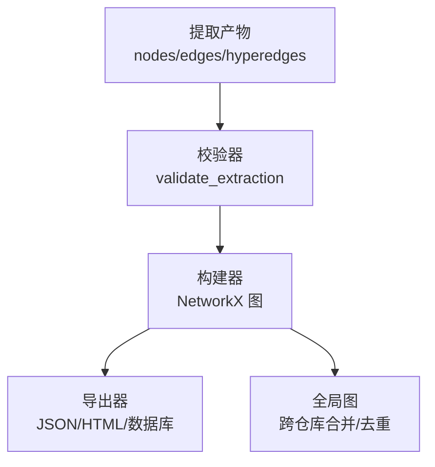
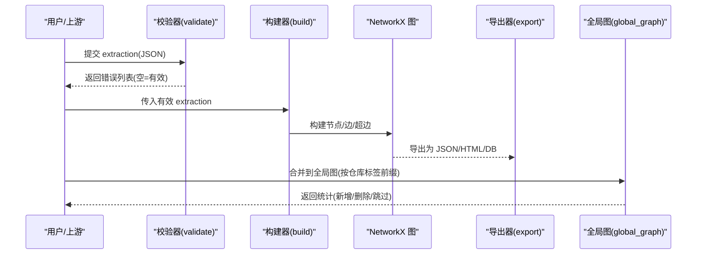
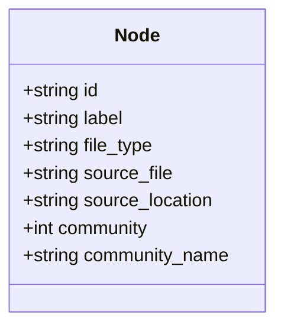
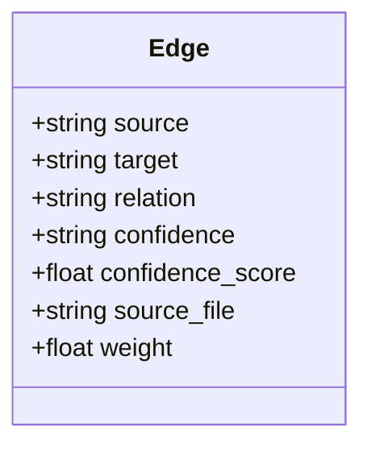
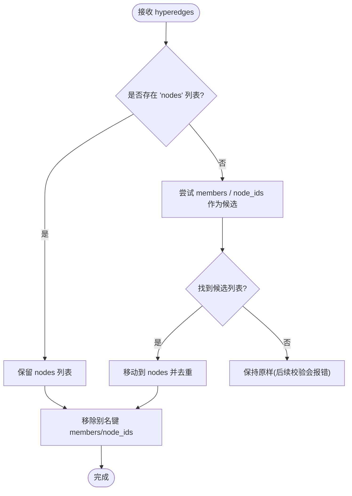
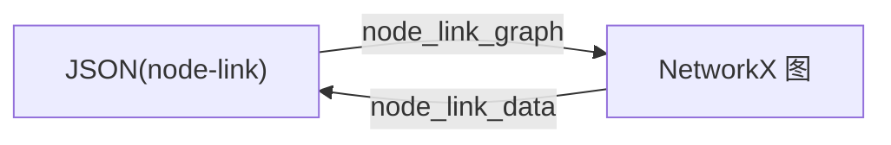
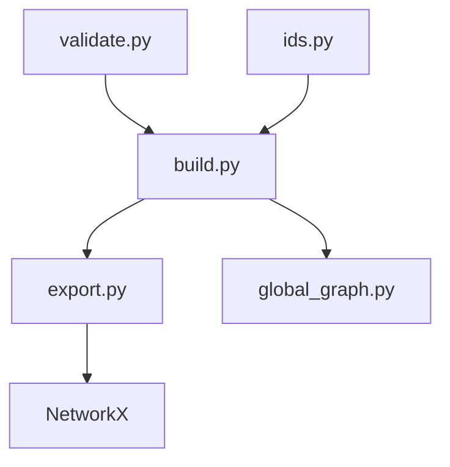

# 知识图谱基础

<cite>
**本文引用的文件**   
- [global_graph.py](file://graphify/global_graph.py)
- [storage.py](file://graphify/storage.py)
- [ids.py](file://graphify/ids.py)
- [build.py](file://graphify/build.py)
- [validate.py](file://graphify/validate.py)
- [export.py](file://graphify/export.py)
- [how-it-works.md](file://docs/how-it-works.md)
- [extraction.json](file://tests/fixtures/extraction.json)
- [graph.json](file://worked/httpx/graph.json)
</cite>

## 目录
1. [简介](#简介)
2. [项目结构](#项目结构)
3. [核心组件](#核心组件)
4. [架构总览](#架构总览)
5. [详细组件分析](#详细组件分析)
6. [依赖关系分析](#依赖关系分析)
7. [性能考量](#性能考量)
8. [故障排查指南](#故障排查指南)
9. [结论](#结论)
10. [附录](#附录) 

## 简介
本章节面向初学者，系统阐述 Graphify 中知识图谱的基本概念与数据结构：节点（Node）、边（Edge）、关系类型、超边（Hyperedges），以及图数据在网络 X（NetworkX）中的存储与访问方式。文档同时给出 JSON 示例路径，帮助读者将抽象概念与实际数据对应起来。

## 项目结构
Graphify 的知识图谱由“提取—校验—构建—导出/持久化”的流水线组成：
- 提取阶段产出节点与边的 JSON 描述
- 校验器确保字段完整与取值合法
- 构建器将其组装为 NetworkX 图对象
- 导出器输出 JSON、HTML 等，或写入外部数据库
- 全局图模块负责跨仓库合并与去重

图表来源
- [validate.py:10-87](file://graphify/validate.py#L10-L87)
- [build.py:177-200](file://graphify/build.py#L177-L200)
- [export.py:183-200](file://graphify/export.py#L183-L200)
- [global_graph.py:77-156](file://graphify/global_graph.py#L77-L156)

章节来源
- [validate.py:10-87](file://graphify/validate.py#L10-L87)
- [build.py:177-200](file://graphify/build.py#L177-L200)
- [export.py:183-200](file://graphify/export.py#L183-L200)
- [global_graph.py:77-156](file://graphify/global_graph.py#L77-L156)

## 核心组件
本节聚焦知识图谱的核心实体与属性规范。

- 节点（Node）
  - id：唯一标识符，需满足规范化规则（见 ids.py）。用于跨阶段稳定关联。
  - label：可读名称，常用于展示与检索。
  - file_type：内容类型，限定集合包括 code、document、paper、image、rationale、concept；未知值会被映射到最接近的语义或回退为 concept。
  - source_file：该节点对应的源文件路径（相对仓库根更友好）。
  - 可选：source_location（如 L1、§3.1）、community/community_name（聚类标签）等。

- 边（Edge）
  - source/target：两端节点的 id。
  - relation：关系动词短语，例如 calls、imports、implements、semantically_similar_to 等。
  - confidence：置信度枚举 EXTRACTED、INFERRED、AMBIGUOUS。
  - 可选：confidence_score（数值型，通常 INFERRED 时使用）、weight、source_file（关系来源位置）等。

- 超边（Hyperedge）
  - 表示连接三个及以上节点的“组关系”，存储在图的元数据中（G.graph["hyperedges"]）。
  - 成员列表键名统一为 nodes；兼容 members/node_ids 别名并在导入时归一化。

- 关系类型分类与语义
  - 调用/使用类：calls、uses、method
  - 依赖/包含类：imports、imports_from、contains、references
  - 实现/继承类：implements、inherits、mixes_in
  - 语义相似类：semantically_similar_to（多用于跨语言或跨文件的语义近似）
  - 其他：re_exports、embeds 等

- 网络 X 存储与访问
  - 内部以 NetworkX 图对象表示，支持普通图与多重图（MultiGraph/MultiDiGraph）。
  - 通过 node_link_data/node_link_graph 在 JSON 与图之间互转。
  - 提供 edge_data/edge_datas 安全读取边属性（兼容多重边）。

章节来源
- [validate.py:1-96](file://graphify/validate.py#L1-L96)
- [build.py:56-74](file://graphify/build.py#L56-L74)
- [build.py:76-124](file://graphify/build.py#L76-L124)
- [build.py:177-196](file://graphify/build.py#L177-L196)
- [export.py:162-171](file://graphify/export.py#L162-L171)
- [how-it-works.md:94-102](file://docs/how-it-works.md#L94-L102)

## 架构总览
下图展示了从 JSON 提取到 NetworkX 图再到导出的关键流程，并标注了与具体源码的对应关系。

图表来源
- [validate.py:10-87](file://graphify/validate.py#L10-L87)
- [build.py:177-200](file://graphify/build.py#L177-L200)
- [export.py:183-200](file://graphify/export.py#L183-L200)
- [global_graph.py:77-156](file://graphify/global_graph.py#L77-L156)

## 详细组件分析

### 节点（Node）定义与字段说明
- id：必须存在且可哈希；建议遵循 ids.py 的规范化策略，避免大小写、标点、Unicode 组合差异导致同一实体分裂成多个幽灵节点。
- label：人类可读的名称，便于可视化与检索。
- file_type：受 validate.py 约束，不在允许集合的值将被 build.py 的同义词映射修正，最终回退为 concept。
- source_file：建议相对仓库根的路径，便于增量更新与剪枝。
- source_location：定位信息（行号、章节等），辅助溯源。

图表来源
- [validate.py:1-96](file://graphify/validate.py#L1-L96)
- [build.py:56-74](file://graphify/build.py#L56-L74)
- [ids.py:32-51](file://graphify/ids.py#L32-L51)

章节来源
- [validate.py:1-96](file://graphify/validate.py#L1-L96)
- [build.py:56-74](file://graphify/build.py#L56-L74)
- [ids.py:32-51](file://graphify/ids.py#L32-L51)

### 边（Edge）定义与字段说明
- source/target：两端节点 id，必须存在于节点集合中。
- relation：关系动词短语，决定下游分析与可视化的行为。
- confidence：EXTRACTED/INFERRED/AMBIGUOUS，影响权重与提示。
- confidence_score：数值型，常与 INFERRED 配合使用。
- weight/source_file：可选，用于排序与溯源。

图表来源
- [validate.py:1-96](file://graphify/validate.py#L1-L96)
- [how-it-works.md:94-102](file://docs/how-it-works.md#L94-L102)

章节来源
- [validate.py:1-96](file://graphify/validate.py#L1-L96)
- [how-it-works.md:94-102](file://docs/how-it-works.md#L94-L102)

### 关系类型（relation）分类与语义
- 调用/使用：calls、uses、method
- 依赖/包含：imports、imports_from、contains、references
- 实现/继承：implements、inherits、mixes_in
- 语义相似：semantically_similar_to
- 其他：re_exports、embeds 等

这些关系在构建与分析中被差异化处理，例如某些关系在聚合视图或影响分析中会被过滤或降权。

章节来源
- [extract.py:180-181](file://graphify/extract.py#L180-L181)
- [analyze.py:218-223](file://graphify/analyze.py#L218-L223)
- [callflow_html.py:528-543](file://graphify/callflow_html.py#L528-L543)

### 超边（Hyperedges）：组关系的建模
- 用途：表达“三元及以上”的关系，如“某功能由多个组件共同实现”。
- 存储：保存在图的元数据 G.graph["hyperedges"] 中。
- 成员键名：统一为 nodes；若输入使用 members 或 node_ids，会在导入时被归一化为 nodes，并丢弃别名键。

图表来源
- [build.py:76-124](file://graphify/build.py#L76-L124)
- [export.py:162-171](file://graphify/export.py#L162-L171)

章节来源
- [build.py:76-124](file://graphify/build.py#L76-L124)
- [export.py:162-171](file://graphify/export.py#L162-L171)

### JSON 示例与网络 X 存储模式
- 提取 JSON 示例（含节点、边、token 统计）：[extraction.json](file://tests/fixtures/extraction.json)
- 实际 graph.json 片段（NetworkX node-link 格式）：[graph.json](file://worked/httpx/graph.json)
- 网络 X 读写：node_link_data/node_link_graph 用于序列化/反序列化；支持 multigraph 场景。
- 导出器 to_json 会进行安全保护（防止意外缩小现有图），并可附加社区标签与 git commit 信息。

图表来源
- [global_graph.py:48-68](file://graphify/global_graph.py#L48-L68)
- [export.py:183-200](file://graphify/export.py#L183-L200)
- [test_build.py:476-502](file://tests/test_build.py#L476-L502)

章节来源
- [extraction.json:1-17](file://tests/fixtures/extraction.json#L1-L17)
- [graph.json:1-200](file://worked/httpx/graph.json#L1-L200)
- [global_graph.py:48-68](file://graphify/global_graph.py#L48-L68)
- [export.py:183-200](file://graphify/export.py#L183-L200)
- [test_build.py:476-502](file://tests/test_build.py#L476-L502)

## 依赖关系分析
- 校验器 validate.py 对节点/边字段做强约束，是上游可靠性的第一道防线。
- 构建器 build.py 负责 ID 规范化、file_type 同义词映射、超边成员键归一化、边属性读取兼容等。
- 导出器 export.py 负责将 NetworkX 图序列化为 JSON/HTML 等，并附加元数据。
- 全局图 global_graph.py 负责跨仓库合并、ID 前缀隔离、外部库节点去重。
- ids.py 提供统一的 ID 规范化函数，保证 AST、LLM、构建器三端一致。

图表来源
- [validate.py:10-87](file://graphify/validate.py#L10-L87)
- [build.py:56-74](file://graphify/build.py#L56-L74)
- [build.py:76-124](file://graphify/build.py#L76-L124)
- [export.py:183-200](file://graphify/export.py#L183-L200)
- [global_graph.py:77-156](file://graphify/global_graph.py#L77-L156)
- [ids.py:32-51](file://graphify/ids.py#L32-L51)

章节来源
- [validate.py:10-87](file://graphify/validate.py#L10-L87)
- [build.py:56-74](file://graphify/build.py#L56-L74)
- [build.py:76-124](file://graphify/build.py#L76-L124)
- [export.py:183-200](file://graphify/export.py#L183-L200)
- [global_graph.py:77-156](file://graphify/global_graph.py#L77-L156)
- [ids.py:32-51](file://graphify/ids.py#L32-L51)

## 性能考量
- 批量入库：NeuG 适配器通过 CSV COPY FROM 批量写入节点与边，显著优于逐条 Cypher 插入。
- 增量更新：基于受影响 source_file 的 DELETE + COPY FROM，并保存跨文件入边后恢复，减少不必要重建。
- 图规模保护：导出与加载时对 graph.json 大小进行安全检查，避免恶意超大文件导致的 DoS。

章节来源
- [storage.py:119-188](file://graphify/storage.py#L119-L188)
- [storage.py:191-342](file://graphify/storage.py#L191-L342)
- [export.py:183-200](file://graphify/export.py#L183-L200)

## 故障排查指南
- 字段缺失或不合法
  - 现象：校验器返回错误列表，包含缺失必填字段、无效 file_type/confidence、非哈希 id 等。
  - 处理：根据错误提示修正 JSON 结构，确保 id 为字符串、file_type 在允许集合内、confidence 取指定枚举。
- 节点未匹配
  - 现象：边的 source/target 指向不存在的节点 id。
  - 处理：检查节点生成逻辑与 ID 规范化是否一致，必要时用 ids.py 的 make_id/normalize_id 对齐。
- 超边成员键不一致
  - 现象：members/node_ids 被自动归一化为 nodes，但下游仍读到旧键。
  - 处理：确保消费端只读 nodes 键；构建器已自动清理别名键。
- 图缩小风险
  - 现象：覆盖现有 graph.json 时因节点数减少被拒绝。
  - 处理：确认新图确实更小则使用 force 覆盖，或修复上游构建逻辑。

章节来源
- [validate.py:10-87](file://graphify/validate.py#L10-L87)
- [build.py:76-124](file://graphify/build.py#L76-L124)
- [export.py:183-200](file://graphify/export.py#L183-L200)

## 结论
Graphify 的知识图谱以“节点—边—超边”为核心模型，辅以严格的字段校验、稳定的 ID 规范化、灵活的 file_type 同义词映射与强大的导出/持久化能力。借助 NetworkX 的 node-link 格式，图数据可在 JSON 与内存图之间高效流转，并通过全局图机制实现跨仓库合并与外部库去重。理解上述概念与流程，有助于在生产环境中稳定地构建、维护与分析大型代码与文档知识图谱。

## 附录
- 参考示例
  - 提取 JSON 示例：[extraction.json](file://tests/fixtures/extraction.json)
  - 实际 graph.json 片段：[graph.json](file://worked/httpx/graph.json)
- 相关文档
  - 工作原理与边字段说明：[how-it-works.md](file://docs/how-it-works.md)