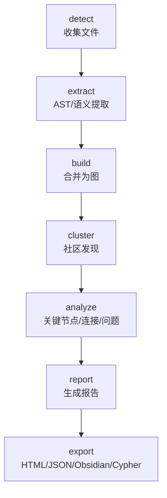
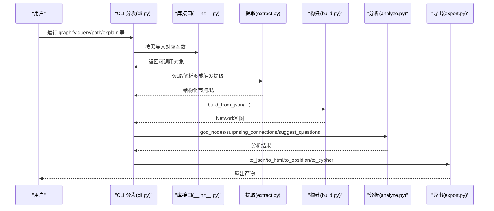
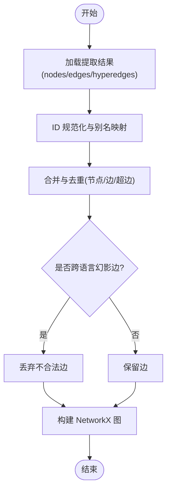
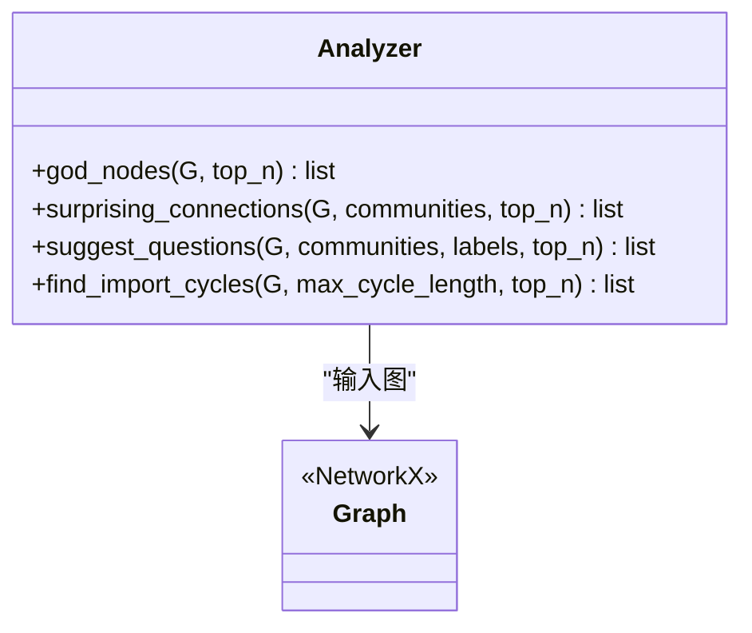
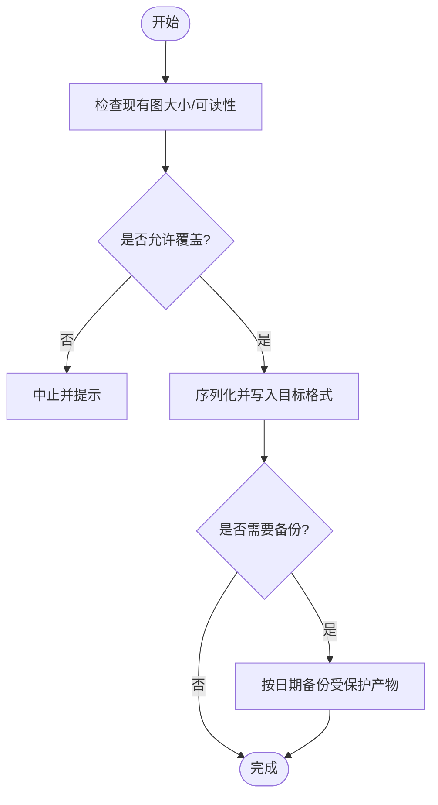
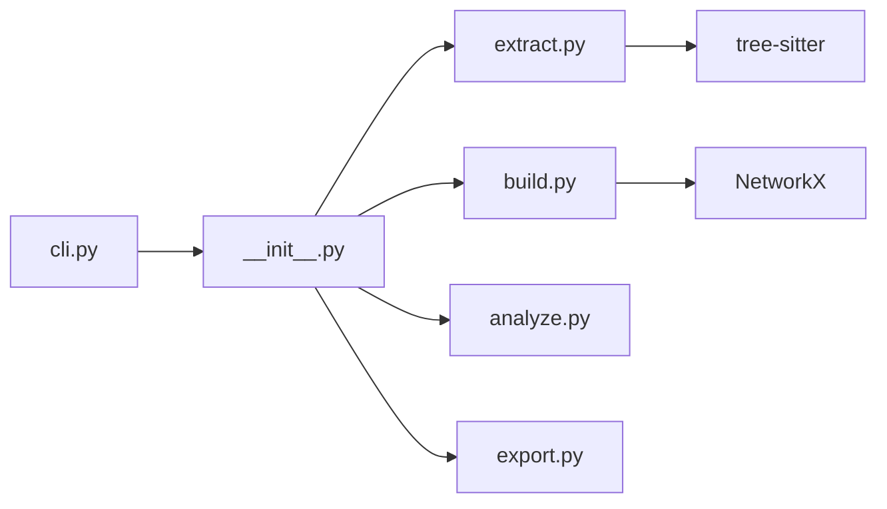

# 示例和教程

<cite>
**本文引用的文件**   
- [README.md](file://README.md)
- [ARCHITECTURE.md](file://ARCHITECTURE.md)
- [how-it-works.md](file://docs/how-it-works.md)
- [__init__.py](file://graphify/__init__.py)
- [cli.py](file://graphify/cli.py)
- [build.py](file://graphify/build.py)
- [extract.py](file://graphify/extract.py)
- [analyze.py](file://graphify/analyze.py)
- [export.py](file://graphify/export.py)
- [querylog.py](file://graphify/querylog.py)
</cite>

## 目录
1. [简介](#简介)
2. [项目结构](#项目结构)
3. [核心组件](#核心组件)
4. [架构总览](#架构总览)
5. [详细组件分析](#详细组件分析)
6. [依赖关系分析](#依赖关系分析)
7. [性能与优化建议](#性能与优化建议)
8. [故障排查指南](#故障排查指南)
9. [结论](#结论)
10. [附录：多语言与翻译](#附录多语言与翻译)

## 简介
本教程面向希望快速上手并深入掌握 Graphify 的用户，覆盖从首次构建、简单查询到高级工作流与企业级集成场景。你将学到：
- 如何安装与注册技能，完成第一次图构建
- 如何使用“查询/路径/解释”等命令进行基础分析
- 如何扩展自定义提取器、批量处理与自动化集成
- 如何在不同技术栈与规模项目中落地最佳实践（性能优化、团队协作、持续集成）
- 如何利用多语言文档与社区资源服务全球用户

## 项目结构
Graphify 采用“管道式”模块化设计：检测 → 提取 → 构建 → 聚类 → 分析 → 报告 → 导出。每个阶段由独立模块负责，通过字典与 NetworkX 图对象传递数据，避免共享状态与副作用。

图表来源
- [ARCHITECTURE.md:1-87](file://ARCHITECTURE.md#L1-L87)

章节来源
- [ARCHITECTURE.md:1-87](file://ARCHITECTURE.md#L1-L87)

## 核心组件
- 入口与懒加载：顶层包提供按需导入的 API 映射，避免重依赖在轻量命令时加载。
- CLI 分发：统一命令入口，支持 query/path/explain/hook/provider 等子命令。
- 构建器：将提取结果组装为 NetworkX 图，处理 ID 规范化、幽灵节点合并、跨语言幻影边过滤等。
- 提取器：基于 tree-sitter 的结构化解析，覆盖多种语言；同时支持文档/媒体语义抽取。
- 分析器：识别“上帝节点”、跨社区连接、建议问题、循环依赖等。
- 导出器：输出 HTML、JSON、Obsidian、Cypher 等格式，并提供备份与校验逻辑。
- 查询日志：可选记录每次查询/路径/解释的元数据与响应摘要。

章节来源
- [__init__.py:1-31](file://graphify/__init__.py#L1-L31)
- [cli.py:1-800](file://graphify/cli.py#L1-L800)
- [build.py:1-800](file://graphify/build.py#L1-L800)
- [extract.py:1-800](file://graphify/extract.py#L1-L800)
- [analyze.py:1-741](file://graphify/analyze.py#L1-L741)
- [export.py:1-800](file://graphify/export.py#L1-L800)
- [querylog.py:1-81](file://graphify/querylog.py#L1-L81)

## 架构总览
下图展示了从 CLI 到核心库的关键调用链，以及图构建与分析的主要流程。

图表来源
- [cli.py:1-800](file://graphify/cli.py#L1-L800)
- [__init__.py:1-31](file://graphify/__init__.py#L1-L31)
- [extract.py:1-800](file://graphify/extract.py#L1-L800)
- [build.py:1-800](file://graphify/build.py#L1-L800)
- [analyze.py:1-741](file://graphify/analyze.py#L1-L741)
- [export.py:1-800](file://graphify/export.py#L1-L800)

## 详细组件分析

### 入门：首次构建与简单查询
- 安装与注册
  - 使用 uv/pipx 安装官方包，并通过命令注册到你的 AI 助手平台。
  - 在仓库根目录执行一次构建，会产出三个核心文件：交互式 HTML、摘要报告、可重复查询的 JSON。
- 基本查询
  - 使用“查询/路径/解释”三类命令对知识图谱进行问答、最短路径追踪与概念说明。
- 忽略规则
  - 支持 .gitignore 与 .graphifyignore 合并策略，便于控制扫描范围。

章节来源
- [README.md:150-234](file://README.md#L150-L234)
- [README.md:362-411](file://README.md#L362-L411)
- [README.md:610-763](file://README.md#L610-L763)

### 进阶：构建与图操作
- 构建流程
  - 将多个提取片段合并为单一图，支持有向/无向模式，自动去重与规范化。
- 节点与边规范
  - 节点 ID 规范化、幽灵节点合并、跨语言幻影边过滤、超边成员键归一化。
- 增量与幂等
  - 通过哈希缓存与幂等写入，保证多次构建一致性。

图表来源
- [build.py:383-762](file://graphify/build.py#L383-L762)

章节来源
- [build.py:1-800](file://graphify/build.py#L1-L800)

### 分析：关键洞察与建议
- 上帝节点：按度排序，排除文件级枢纽与噪声标签，聚焦真实抽象。
- 意外连接：综合置信度、跨文件类型、跨仓库、跨社区、外围→枢纽等因素打分。
- 建议问题：围绕 AMBIGUOUS 边、桥接节点、INFERRED 关系、孤立节点与低凝聚社区生成。
- 循环依赖：在文件级别检测 imports_from/re_exports 环，限制长度并去重。

图表来源
- [analyze.py:100-741](file://graphify/analyze.py#L100-L741)

章节来源
- [analyze.py:1-741](file://graphify/analyze.py#L1-L741)

### 导出：多格式输出与协作
- 输出目标
  - JSON（供后续工具消费）、HTML（可视化）、Obsidian Vault（笔记+社区概览）、Neo4j/FalkorDB Cypher 脚本。
- 安全与保护
  - 写前备份受保护的产物（含人工标注/语义标记），拒绝静默缩小现有图。
- 文件名与冲突
  - 对 Obsidian 输出进行安全命名与去重，避免大小写敏感文件系统覆盖。

图表来源
- [export.py:183-271](file://graphify/export.py#L183-L271)
- [export.py:35-98](file://graphify/export.py#L35-L98)

章节来源
- [export.py:1-800](file://graphify/export.py#L1-L800)

### 自定义提取器与批量处理
- 新增语言提取器
  - 遵循“解析 AST → 收集 nodes/edges → 二次推断 calls 边”的模式，并在分发处注册后缀。
- 批量与并行
  - 代码文件通过进程池并行提取；文档/媒体以子代理批次并发处理。
- 增量更新
  - 基于内容 SHA256 的缓存，仅重新处理变更文件。

章节来源
- [ARCHITECTURE.md:59-66](file://ARCHITECTURE.md#L59-L66)
- [docs/how-it-works.md:71-80](file://docs/how-it-works.md#L71-L80)
- [extract.py:1-800](file://graphify/extract.py#L1-L800)

### 企业级工作流：自动化集成与团队协同
- 钩子与 Always-on
  - 安装 Git hooks 与平台指令，使助手优先使用图查询而非逐文件 grep。
- 团队共享
  - 提交 graphify-out 快照，配合 merge driver 避免 graph.json 冲突。
- 持续集成
  - 在 CI 中执行 headless 提取（配置后端与模型），输出 JSON 供下游消费。
- 共享 HTTP 服务
  - 以 MCP Streamable HTTP 暴露图能力，供全团队 IDE 指向同一实例。

章节来源
- [README.md:269-314](file://README.md#L269-L314)
- [README.md:434-482](file://README.md#L434-L482)
- [README.md:414-431](file://README.md#L414-L431)
- [cli.py:377-421](file://graphify/cli.py#L377-L421)

### 实际项目集成案例
- 小型 Python 库
  - 快速构建、查看 HTML 与报告，使用 query/path/explain 定位关键类与方法。
- 多语言仓库
  - 利用跨语言家族判定与幻影边过滤，获得更准确的跨模块依赖视图。
- 文档/论文/多媒体
  - 启用语义抽取，结合社区发现与“建议问题”，辅助知识梳理与审查。

章节来源
- [docs/how-it-works.md:1-66](file://docs/how-it-works.md#L1-L66)
- [build.py:43-53](file://graphify/build.py#L43-L53)

## 依赖关系分析
- 模块耦合
  - CLI 作为调度层，按需导入库接口；构建与分析/导出之间通过图对象解耦。
- 外部依赖
  - NetworkX 用于图计算；tree-sitter 用于结构化解析；可选后端（OpenAI/Gemini/Claude/Ollama 等）用于语义抽取。
- 潜在循环
  - extract 与 build 存在相互引用风险，已通过延迟导入与职责边界规避。

图表来源
- [cli.py:1-800](file://graphify/cli.py#L1-L800)
- [__init__.py:1-31](file://graphify/__init__.py#L1-L31)
- [extract.py:1-800](file://graphify/extract.py#L1-L800)
- [build.py:1-800](file://graphify/build.py#L1-L800)
- [analyze.py:1-741](file://graphify/analyze.py#L1-L741)
- [export.py:1-800](file://graphify/export.py#L1-L800)

章节来源
- [ARCHITECTURE.md:1-87](file://ARCHITECTURE.md#L1-L87)

## 性能与优化建议
- 并行与批处理
  - 调整最大工作线程数与并发度，平衡本地推理与吞吐。
- 输出上限与分块
  - 针对大文档/密集语料提高输出 token 上限或减小分块预算，降低 LLM 截断风险。
- 缓存与增量
  - 充分利用 SHA256 缓存与增量更新，减少重复开销。
- 可视化体积
  - 超大图跳过 HTML 渲染，直接消费 JSON 或使用 CLI 查询。

章节来源
- [docs/how-it-works.md:71-80](file://docs/how-it-works.md#L71-L80)
- [README.md:569-582](file://README.md#L569-L582)

## 故障排查指南
- 常见错误
  - 命令未找到：检查 PATH 与安装方式（uv/pipx/pip）。
  - PowerShell 路径前缀：Windows 下使用不带斜杠的路径。
  - 图节点变少：重构后需强制重建以避免静默缩小。
  - 幽灵重复：全量重建以清理历史残留。
  - Ollama 显存不足：降低 KV 窗口或分块预算。
  - JSON 被截断：提升输出上限或减小分块。
  - 浏览器打不开大 HTML：改用 JSON 直查。
  - graph.json 冲突：安装 hook 并使用内置合并驱动。
- 查询日志
  - 可通过环境变量开启/关闭与指定路径，默认关闭以保护隐私。

章节来源
- [README.md:537-607](file://README.md#L537-L607)
- [querylog.py:1-81](file://graphify/querylog.py#L1-L81)

## 结论
Graphify 以“结构化优先、语义增强”的方式将代码与文档统一为可查询的知识图。通过清晰的管道设计与丰富的导出/集成能力，既能满足个人开发者的高效探索，也能支撑团队与企业级的规模化应用。建议在生产环境中结合钩子、CI 与共享服务，形成“构建即资产、查询即效率”的工程闭环。

## 附录：多语言与翻译
- 多语言 README
  - 仓库提供数十种语言的 README 翻译，便于全球用户快速了解与上手。
- 使用建议
  - 选择与你团队最匹配的语言版本阅读，并结合英文原版获取最新特性与命令参考。

章节来源
- [README.md:10-15](file://README.md#L10-L15)