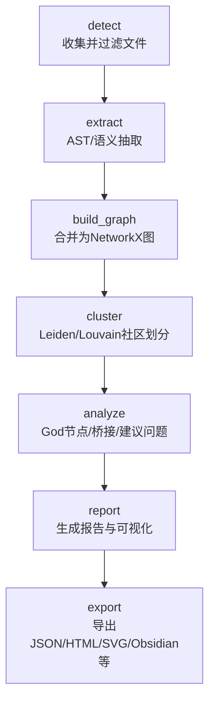
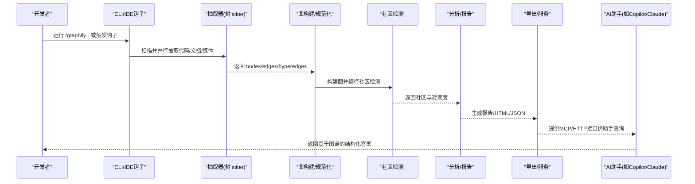
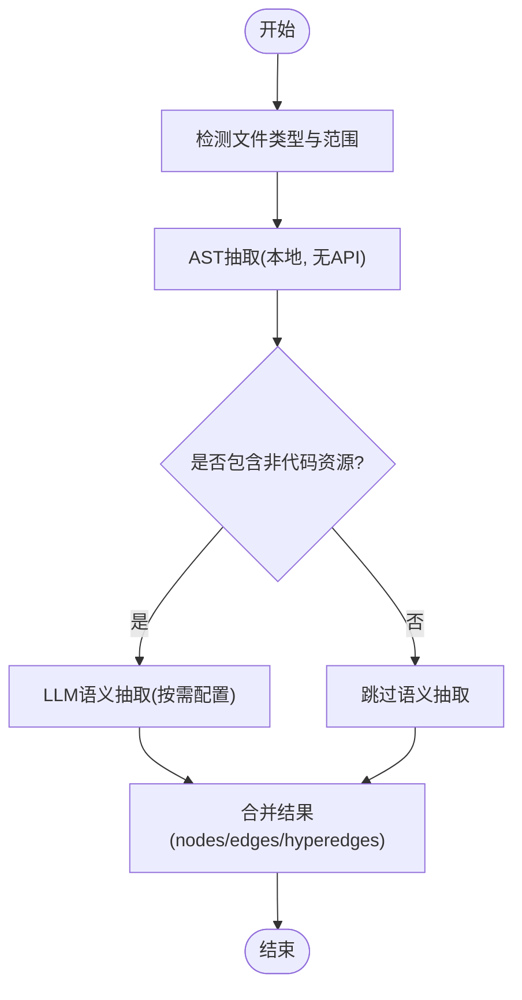
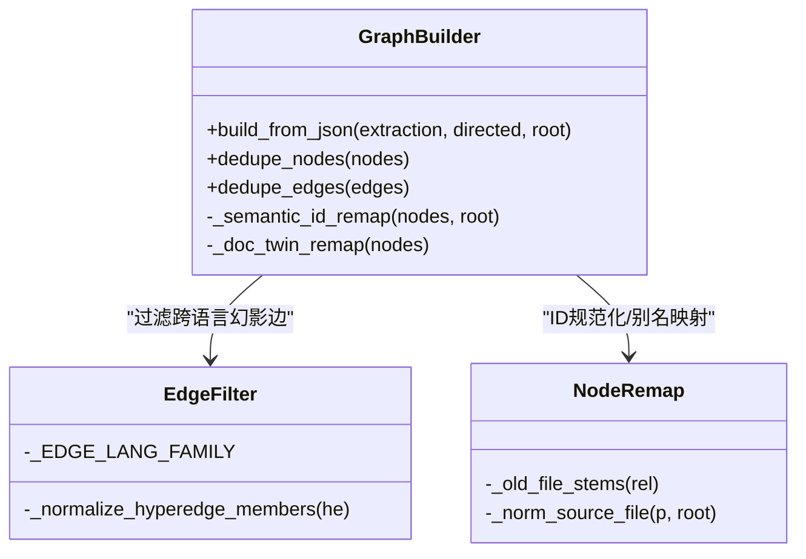
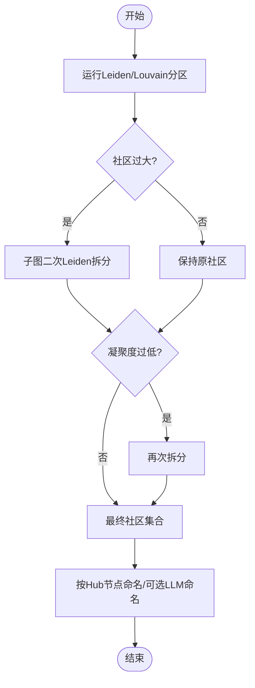
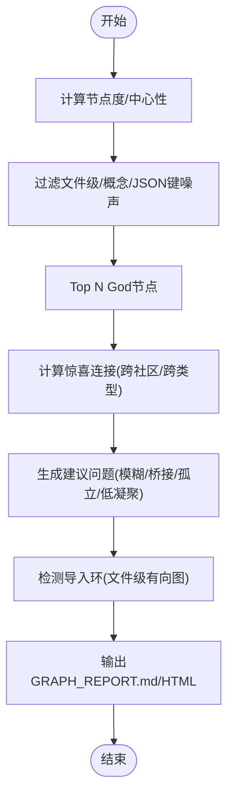
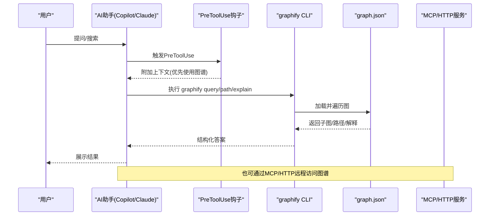
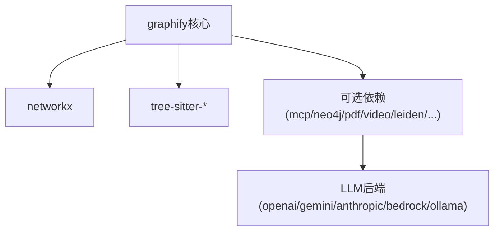

# 项目介绍

<cite>
**本文引用的文件**   
- [README.md](file://README.md)
- [ARCHITECTURE.md](file://ARCHITECTURE.md)
- [graphify/__init__.py](file://graphify/__init__.py)
- [graphify/cli.py](file://graphify/cli.py)
- [graphify/extract.py](file://graphify/extract.py)
- [graphify/build.py](file://graphify/build.py)
- [graphify/cluster.py](file://graphify/cluster.py)
- [graphify/analyze.py](file://graphify/analyze.py)
- [docs/how-it-works.md](file://docs/how-it-works.md)
- [pyproject.toml](file://pyproject.toml)
</cite>

## 目录
1. [引言](#引言)
2. [项目结构](#项目结构)
3. [核心组件](#核心组件)
4. [架构总览](#架构总览)
5. [详细组件分析](#详细组件分析)
6. [依赖分析](#依赖分析)
7. [性能考量](#性能考量)
8. [故障排查指南](#故障排查指南)
9. [结论](#结论)
10. [附录](#附录)

## 引言
Graphify 是一个面向代码与多模态文档的知识图谱构建工具。它将代码、文档、PDF、图片、视频等素材统一转换为可查询的知识图谱，使开发者能够以“图遍历”的方式理解系统，而不是在海量文件中 grep 文本。其核心价值在于：
- 本地 AST 解析确保隐私安全：代码抽取完全在本地完成，无需上传到云端。
- 置信度标记系统提供透明度：每条边都标注 EXTRACTED/INFERRED/AMBIGUOUS，便于判断来源与可靠性。
- 社区检测算法自动识别模块结构：基于 Leiden/Louvain 的聚类，帮助快速把握子系统边界。
- 广泛的兼容性：支持 36 种编程语言（tree-sitter）以及多种非代码资源类型。
- 与 20+ AI 编程助手平台深度集成：Claude Code、Cursor、GitHub Copilot、Gemini CLI、Aider、Devin、Kiro、Trae、OpenCode、Codex 等均可通过技能或钩子机制优先使用知识图谱进行问答与导航。

与传统代码搜索工具的本质区别在于：Graphify 不是对原始文件做全文匹配，而是先构建结构化知识图谱，再在图上执行 query/path/explain 等操作，从而获得更精准、更具上下文的答案。

对于初学者，Graphify 将“节点=概念/实体”、“边=关系/依赖”的图模型直观呈现；对于有经验的开发者，它提供了高性能的本地 AST 抽取、确定性 ID 与去重策略、跨语言调用解析、社区命名与可视化、MCP/HTTP 服务化能力等亮点。

**章节来源**
- [README.md:25-108](file://README.md#L25-L108)
- [docs/how-it-works.md:1-102](file://docs/how-it-works.md#L1-L102)

## 项目结构
Graphify 采用“流水线式”模块化设计：detect → extract → build_graph → cluster → analyze → report → export。每个阶段由独立函数实现，模块间通过 Python 字典和 NetworkX 图对象通信，避免共享状态与副作用。

**图表来源**
- [ARCHITECTURE.md:5-33](file://ARCHITECTURE.md#L5-L33)

**章节来源**
- [ARCHITECTURE.md:5-33](file://ARCHITECTURE.md#L5-L33)

## 核心组件
- 命令分发与交互层：CLI 提供 /graphify、query、path、explain、hook、mcp 等服务入口，并在 IDE 中通过 PreToolUse 钩子引导优先使用图谱。
- 抽取器与语言支持：基于 tree-sitter 的 AST 抽取器覆盖 36 种语言，同时支持 SQL、Terraform、Pascal/Delphi、DM 等扩展语法。
- 图构建与规范化：负责节点/边去重、ID 规范化、幽灵节点合并、跨语言幻影边过滤、方向性保留等。
- 社区检测与标签：Leiden（graspologic）优先，回退 Louvain；按最大连通度节点命名社区，可选 LLM 命名增强。
- 分析与报告：计算 God 节点、跨社区连接、建议问题、导入环检测等，输出 GRAPH_REPORT.md 与交互式 graph.html。
- 导出与服务：支持 JSON/HTML/SVG/Obsidian 导出，并提供 MCP stdio/HTTP 服务，供团队共享访问。

**章节来源**
- [graphify/cli.py:1-120](file://graphify/cli.py#L1-L120)
- [graphify/extract.py:1-120](file://graphify/extract.py#L1-L120)
- [graphify/build.py:1-120](file://graphify/build.py#L1-L120)
- [graphify/cluster.py:1-120](file://graphify/cluster.py#L1-L120)
- [graphify/analyze.py:1-120](file://graphify/analyze.py#L1-L120)
- [README.md:327-344](file://README.md#L327-L344)

## 架构总览
下图展示了从源码到知识图谱的关键路径，包括本地 AST 抽取、社区检测、分析与导出，以及与 AI 助手的集成点。

**图表来源**
- [ARCHITECTURE.md:5-33](file://ARCHITECTURE.md#L5-L33)
- [docs/how-it-works.md:1-24](file://docs/how-it-works.md#L1-L24)
- [README.md:269-304](file://README.md#L269-L304)

## 详细组件分析

### 抽取器与语言支持（AST + 语义）
- 本地 AST 抽取：Tree-sitter 解析代码，提取类、函数、导入、调用图与内联注释；SQL 特殊处理表、视图、外键与 JOIN 关系。
- 语义抽取：针对文档、PDF、图片、音视频，使用配置的 LLM 后端进行语义抽取，产出节点、边与超边。
- 置信度标签：EXTRACTED（源中明确）、INFERRED（合理推断）、AMBIGUOUS（不确定）。

**图表来源**
- [docs/how-it-works.md:1-24](file://docs/how-it-works.md#L1-L24)
- [docs/how-it-works.md:34-51](file://docs/how-it-works.md#L34-L51)

**章节来源**
- [docs/how-it-works.md:1-24](file://docs/how-it-works.md#L1-L24)
- [docs/how-it-works.md:34-51](file://docs/how-it-works.md#L34-L51)
- [graphify/extract.py:1-120](file://graphify/extract.py#L1-L120)

### 图构建与规范化（去重、ID映射、幻影边过滤）
- 三层去重：文件内 AST 去重、跨文件构建时 NetworkX 幂等写入、语义缓存合并。
- ID 规范化与别名映射：兼容旧版 ID 格式，防止幽灵节点分裂。
- 跨语言幻影边过滤：同一短名在不同语言家族之间不建立 calls/imports/references 边。
- 方向性保留：在无向图中通过 _src/_tgt 保存原始方向，保证渲染与查询正确。

**图表来源**
- [graphify/build.py:1-120](file://graphify/build.py#L1-L120)
- [graphify/build.py:176-238](file://graphify/build.py#L176-L238)
- [graphify/build.py:257-381](file://graphify/build.py#L257-L381)
- [graphify/build.py:383-762](file://graphify/build.py#L383-L762)

**章节来源**
- [graphify/build.py:1-120](file://graphify/build.py#L1-L120)
- [graphify/build.py:176-238](file://graphify/build.py#L176-L238)
- [graphify/build.py:257-381](file://graphify/build.py#L257-L381)
- [graphify/build.py:383-762](file://graphify/build.py#L383-L762)

### 社区检测与标签（Leiden/Louvain）
- 首选 Leiden（graspologic），回退 Louvain（networkx）。
- 支持 resolution 参数控制社区粒度；超大社区二次拆分；低凝聚度社区再次拆分。
- 默认按最高度节点命名社区（无需 LLM），也可启用 LLM 命名增强。

**图表来源**
- [graphify/cluster.py:22-77](file://graphify/cluster.py#L22-L77)
- [graphify/cluster.py:134-236](file://graphify/cluster.py#L134-L236)
- [graphify/cluster.py:86-110](file://graphify/cluster.py#L86-L110)

**章节来源**
- [graphify/cluster.py:22-77](file://graphify/cluster.py#L22-L77)
- [graphify/cluster.py:134-236](file://graphify/cluster.py#L134-L236)
- [graphify/cluster.py:86-110](file://graphify/cluster.py#L86-L110)

### 分析与报告（God节点/桥接/建议问题/导入环）
- God 节点：排除文件级枢纽与内置噪声，选出真正核心抽象。
- 惊喜连接：跨文件/跨社区/跨类型/跨仓库的连接，结合置信度与中心性评分。
- 建议问题：基于 AMBIGUOUS 边、桥接节点、孤立节点、低凝聚度社区生成探索性问题。
- 导入环检测：在文件级别构建有向图，查找简单环，限制长度以避免组合爆炸。

**图表来源**
- [graphify/analyze.py:100-121](file://graphify/analyze.py#L100-L121)
- [graphify/analyze.py:124-154](file://graphify/analyze.py#L124-L154)
- [graphify/analyze.py:419-544](file://graphify/analyze.py#L419-L544)
- [graphify/analyze.py:631-741](file://graphify/analyze.py#L631-L741)

**章节来源**
- [graphify/analyze.py:100-121](file://graphify/analyze.py#L100-L121)
- [graphify/analyze.py:124-154](file://graphify/analyze.py#L124-L154)
- [graphify/analyze.py:419-544](file://graphify/analyze.py#L419-L544)
- [graphify/analyze.py:631-741](file://graphify/analyze.py#L631-L741)

### CLI 与 AI 助手集成（PreToolUse 钩子/MCP/HTTP）
- CLI 提供 query/path/explain/affected/save-result/reflect 等命令，直接读取 graph.json 进行图遍历。
- 在 Claude Code/Gemini CLI 等平台安装 PreToolUse 钩子，在搜索/读文件前提示优先使用图谱。
- 提供 MCP stdio/HTTP 服务，暴露 query_graph/get_node/get_neighbors/shortest_path 等工具，供团队共享。

**图表来源**
- [graphify/cli.py:1-120](file://graphify/cli.py#L1-L120)
- [README.md:269-304](file://README.md#L269-L304)
- [README.md:434-476](file://README.md#L434-L476)

**章节来源**
- [graphify/cli.py:1-120](file://graphify/cli.py#L1-L120)
- [README.md:269-304](file://README.md#L269-L304)
- [README.md:434-476](file://README.md#L434-L476)

### 包管理与扩展（pyproject）
- 包名 graphifyy，脚本 graphify/graphify-mcp。
- 可选依赖涵盖 mcp、neo4j、falkordb、pdf、office、video、leiden、openai/gemini/anthropic/bedrock、sql、neug、pascal/dm/terraform 等。
- 开发工具链与测试配置完善，支持 uv/pipx/pip 安装。

**章节来源**
- [pyproject.toml:1-149](file://pyproject.toml#L1-L149)

## 依赖分析
Graphify 的核心依赖集中在网络图与 AST 解析：
- networkx：图结构与算法基础。
- tree-sitter 系列：各语言语法树解析。
- graspologic（可选）：Leiden 社区检测。
- 可选后端：openai/gemini/anthropic/bedrock/ollama 等用于语义抽取。

**图表来源**
- [pyproject.toml:13-84](file://pyproject.toml#L13-L84)

**章节来源**
- [pyproject.toml:13-84](file://pyproject.toml#L13-L84)

## 性能考量
- 本地 AST 抽取完全离线，零 API 成本；仅对非代码资源进行语义抽取。
- 并行处理：代码文件通过进程池并行抽取；文档/媒体批次作为并行子代理调度。
- SHA256 缓存：内容指纹驱动增量更新，未变更文件跳过抽取。
- 社区检测优化：大社区二次拆分、低凝聚度再拆分，提升可读性与稳定性。
- 查询效率：首次构建后，后续问答直接读取 compact 的 graph.json，显著降低 token 消耗。

[本节为通用指导，不直接分析具体文件]

## 故障排查指南
- 常见安装与 PATH 问题：uv tool install/pipx/pip 安装后需更新 shell PATH。
- PowerShell 路径前缀斜杠问题：Windows 下使用 graphify . 而非 /graphify .。
- 图谱节点减少：重构删除文件后旧节点残留，使用 --force 强制重建。
- 幽灵重复节点：v0.8.33 起自动合并，旧图需全量重建。
- Ollama VRAM/上下文超限：调整 KV-cache 窗口与 token-budget。
- LLM JSON 截断：提高输出上限或缩小 chunk 大小。
- HTML 过大：跳过可视化直接使用 JSON。
- 并发提交冲突：安装 hook 设置 merge driver 自动合并 graph.json。

**章节来源**
- [README.md:537-607](file://README.md#L537-L607)

## 结论
Graphify 通过本地 AST 抽取、置信度标记、社区检测与广泛的语言/资源支持，将代码与多模态资料转化为可查询的知识图谱。相比传统 grep 式搜索，它以图遍历为核心，提供更强的上下文理解与导航能力。借助与 20+ AI 平台的深度集成，Graphify 能在日常开发中持续提供高质量的结构化洞察，显著提升大型项目的可维护性与协作效率。

[本节为总结，不直接分析具体文件]

## 附录
- 入门三步：安装 CLI → 注册技能 → 在项目根目录运行 /graphify .
- 常用命令：query/path/explain/affected/save-result/reflect/export/cypher/prs 等。
- 忽略规则：.graphifyignore 与 .gitignore 合并，支持 ! 否定与子目录作用域。
- 团队工作流：提交 graphify-out/ 到 git，配合 hook 自动重建与合并。

**章节来源**
- [README.md:38-58](file://README.md#L38-L58)
- [README.md:362-390](file://README.md#L362-L390)
- [README.md:394-411](file://README.md#L394-L411)
- [README.md:414-431](file://README.md#L414-L431)