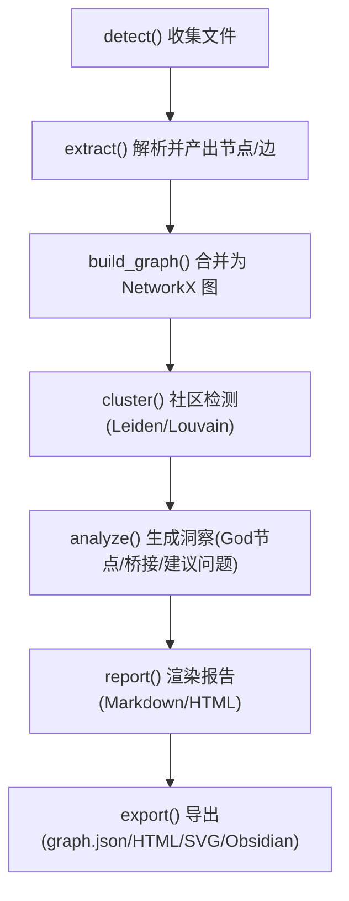
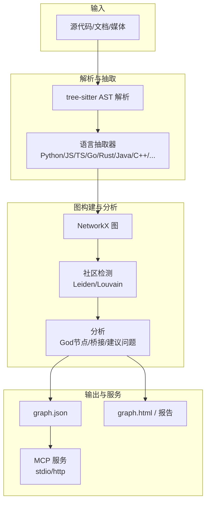
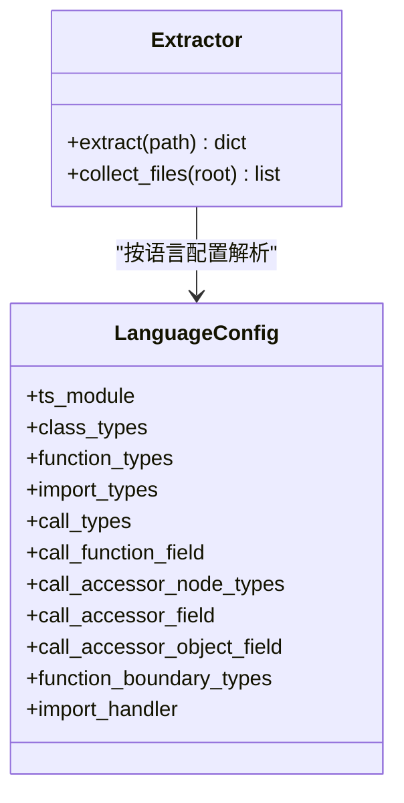
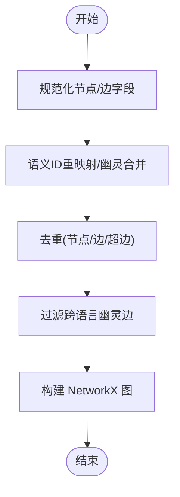
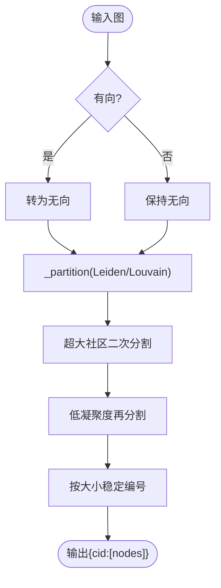
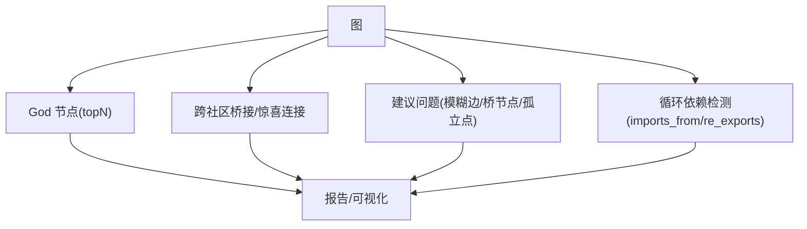
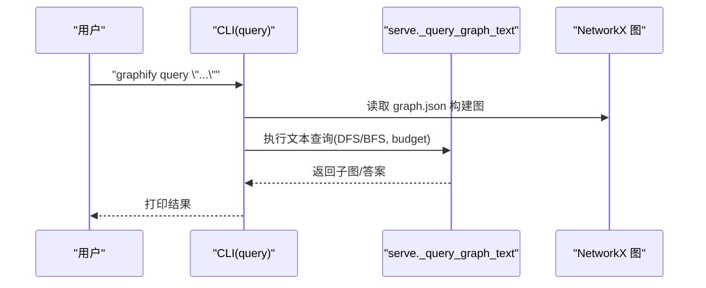
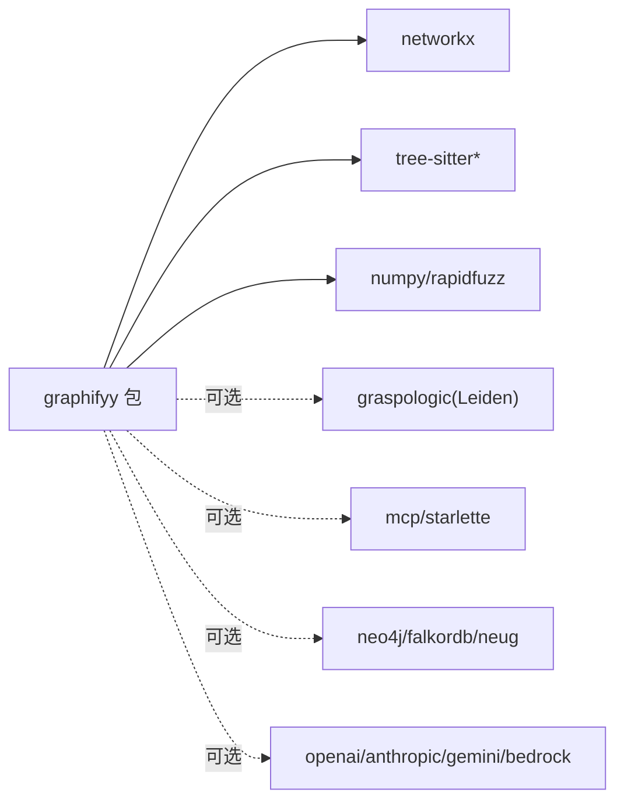

# 项目概述

<cite>
**本文引用的文件**   
- [README.md](file://README.md)
- [ARCHITECTURE.md](file://ARCHITECTURE.md)
- [pyproject.toml](file://pyproject.toml)
- [graphify/__init__.py](file://graphify/__init__.py)
- [graphify/cli.py](file://graphify/cli.py)
- [graphify/extract.py](file://graphify/extract.py)
- [graphify/build.py](file://graphify/build.py)
- [graphify/cluster.py](file://graphify/cluster.py)
- [graphify/analyze.py](file://graphify/analyze.py)
- [docs/how-it-works.md](file://docs/how-it-works.md)
</cite>

## 目录
1. [简介](#简介)
2. [项目结构](#项目结构)
3. [核心组件](#核心组件)
4. [架构总览](#架构总览)
5. [详细组件分析](#详细组件分析)
6. [依赖关系分析](#依赖关系分析)
7. [性能与可扩展性](#性能与可扩展性)
8. [故障排查指南](#故障排查指南)
9. [结论](#结论)
10. [附录：快速开始与常用命令](#附录快速开始与常用命令)

## 简介
Graphify 是一个将代码、文档、PDF、图片、视频等素材转换为可查询知识图谱的工具。它通过本地 AST 解析（tree-sitter）构建确定性的结构化图，辅以社区检测（Leiden/Louvain）、置信度标记系统（EXTRACTED/INFERRED/AMBIGUOUS），以及可选的语义抽取（由 AI 后端驱动），最终输出可直接查询的 graph.json、可视化 HTML 和报告。同时提供 MCP 协议服务，便于与 20+ AI 编程助手平台集成，实现“用图代替 grep”的代码理解体验。

核心价值
- 本地优先：代码解析完全在本地完成，无需 API 调用；仅对文档/媒体进行语义抽取时才使用配置的模型。
- 可解释连接：每条边带有置信度标签，明确来源是显式提取还是推断得出。
- 非向量索引：基于真实图遍历，支持路径查询、概念解释、子图检索。
- 多语言与多模态：覆盖数十种编程语言与多种文档/媒体格式。
- 生态集成：为 Claude Code、Cursor、Codex、Gemini CLI、Copilot 等 20+ 平台提供一键安装与“始终在线”提示策略。

章节来源
- [README.md:25-108](file://README.md#L25-L108)
- [docs/how-it-works.md:1-32](file://docs/how-it-works.md#L1-L32)

## 项目结构
Graphify 采用“流水线 + 模块职责清晰”的设计：每个阶段对应一个函数/模块，数据以 Python 字典与 NetworkX 图对象传递，避免共享状态与副作用。

图表来源
- [ARCHITECTURE.md:5-24](file://ARCHITECTURE.md#L5-L24)

章节来源
- [ARCHITECTURE.md:5-33](file://ARCHITECTURE.md#L5-L33)

## 核心组件
- 入口与分发
  - 包级懒加载接口：对外暴露 extract、build_from_json、cluster、god_nodes、generate、to_json 等能力，按需导入以降低冷启动成本。
  - CLI 分发：统一处理 query/path/explain/prs/hook/provider 等子命令，并在内部复用 serve 与 build 等核心逻辑。
- 抽取器与语言支持
  - 基于 tree-sitter 的确定性 AST 抽取，按语言配置（LanguageConfig）定义类/函数/导入/调用等节点类型与解析规则，支持跨语言引用与二次推断。
- 图构建与去重
  - 三层去重：文件内 AST 去重、跨文件 ID 幂等、语义结果合并；兼容旧 schema 与别名字段；过滤跨语言“幽灵边”。
- 社区检测
  - 首选 Leiden（graspologic），回退 Louvain（networkx）；支持分辨率参数、超枢纽排除、低凝聚度再分割。
- 分析与报告
  - God 节点、跨社区桥接、建议问题、循环依赖检测；报告包含“为什么”与置信度说明。
- 存储与服务
  - 支持 NeuG 图数据库写入；MCP stdio/HTTP 服务暴露 query_graph、shortest_path 等工具。

章节来源
- [graphify/__init__.py:4-30](file://graphify/__init__.py#L4-L30)
- [graphify/cli.py:259-800](file://graphify/cli.py#L259-L800)
- [graphify/extract.py:1-120](file://graphify/extract.py#L1-L120)
- [graphify/build.py:383-762](file://graphify/build.py#L383-L762)
- [graphify/cluster.py:1-120](file://graphify/cluster.py#L1-L120)
- [graphify/analyze.py:100-122](file://graphify/analyze.py#L100-L122)

## 架构总览
下图展示了从输入到输出的端到端流程，以及关键外部依赖（tree-sitter、NetworkX、可选 graspologic、MCP）。

图表来源
- [ARCHITECTURE.md:5-24](file://ARCHITECTURE.md#L5-L24)
- [docs/how-it-works.md:1-32](file://docs/how-it-works.md#L1-L32)
- [pyproject.toml:13-43](file://pyproject.toml#L13-L43)

## 详细组件分析

### 抽取器与语言支持（AST 层）
- 设计要点
  - 每种语言通过 LanguageConfig 声明树节点类型、导入/调用模式、边界节点等，统一进入通用遍历与边生成流程。
  - 支持跨语言解析与二次推断（如 JS/TS 模块解析、C/C++ include、Java/Kotlin 包名等）。
  - 安全与健壮性：递归深度保护、异常捕获、调试开关。
- 复杂度与优化
  - 时间复杂度近似 O(E+V)，其中 E/V 为 AST 边/节点数；并行化通过进程池提升吞吐。
  - 缓存机制基于内容 SHA256，增量更新跳过未变更文件。

图表来源
- [graphify/extract.py:596-760](file://graphify/extract.py#L596-L760)

章节来源
- [graphify/extract.py:1-120](file://graphify/extract.py#L1-L120)
- [graphify/extract.py:596-760](file://graphify/extract.py#L596-L760)
- [docs/how-it-works.md:7-16](file://docs/how-it-works.md#L7-L16)

### 图构建与去重（Build 层）
- 设计要点
  - 兼容旧 schema（links→edges、from/to→source/target、members→nodes）。
  - 语义 ID 重映射与幽灵节点合并，确保 AST 与语义结果一致对齐。
  - 跨语言“幽灵边”过滤，防止同名符号在不同语言间误连。
- 数据结构与复杂度
  - 使用 NetworkX DiGraph/Graph；节点/边去重均摊 O(N)。
  - 方向保留通过 _src/_tgt 属性在无向图中恢复。

图表来源
- [graphify/build.py:383-762](file://graphify/build.py#L383-L762)

章节来源
- [graphify/build.py:383-762](file://graphify/build.py#L383-L762)

### 社区检测（Cluster 层）
- 算法选择
  - 首选 Leiden（graspologic），失败回退 Louvain（networkx）。
  - 支持 resolution 控制粒度；超枢纽排除；低凝聚度再分割。
- 稳定性与可复现
  - 固定随机种子；社区 ID 按大小降序与成员排序稳定分配。

图表来源
- [graphify/cluster.py:22-77](file://graphify/cluster.py#L22-L77)
- [graphify/cluster.py:134-236](file://graphify/cluster.py#L134-L236)

章节来源
- [graphify/cluster.py:1-120](file://graphify/cluster.py#L1-L120)
- [graphify/cluster.py:134-236](file://graphify/cluster.py#L134-L236)

### 分析与报告（Analyze 层）
- 功能
  - God 节点（高连通实体）、跨社区桥接、建议问题、循环依赖检测。
  - 置信度加权与噪声过滤（内置类型/JSON 键/方法桩等）。
- 输出
  - 用于 GRAPH_REPORT.md 的结构化洞察与“为什么”说明。

图表来源
- [graphify/analyze.py:100-122](file://graphify/analyze.py#L100-L122)
- [graphify/analyze.py:124-154](file://graphify/analyze.py#L124-L154)
- [graphify/analyze.py:419-544](file://graphify/analyze.py#L419-L544)
- [graphify/analyze.py:631-741](file://graphify/analyze.py#L631-L741)

章节来源
- [graphify/analyze.py:100-122](file://graphify/analyze.py#L100-L122)
- [graphify/analyze.py:124-154](file://graphify/analyze.py#L124-L154)
- [graphify/analyze.py:419-544](file://graphify/analyze.py#L419-L544)
- [graphify/analyze.py:631-741](file://graphify/analyze.py#L631-L741)

### CLI 与 MCP 服务
- CLI 子命令
  - query/path/explain：基于 graph.json 的子图检索与最短路径。
  - prs：PR 看板、冲突社区、AI 分诊。
  - hook/install：钩子注入，引导助手优先使用图查询。
  - provider：自定义 OpenAI 兼容后端注册。
- MCP 服务
  - stdio/http 两种传输；暴露 query_graph、get_node、shortest_path 等工具。

图表来源
- [graphify/cli.py:422-518](file://graphify/cli.py#L422-L518)

章节来源
- [graphify/cli.py:259-800](file://graphify/cli.py#L259-L800)

## 依赖关系分析
- 核心依赖
  - networkx：图结构与算法。
  - tree-sitter 系列：多语言 AST 解析。
  - numpy/rapidfuzz：相似度计算与数值运算。
- 可选依赖
  - graspologic（Leiden，Python < 3.13）、mcp/starlette（MCP 服务）、neo4j/falkordb/neug（图数据库）、pypdf/markdownify（PDF/Markdown）、faster-whisper/yt-dlp（音视频）、openai/anthropic/gemini/bedrock（LLM 后端）等。

图表来源
- [pyproject.toml:13-84](file://pyproject.toml#L13-L84)

章节来源
- [pyproject.toml:13-84](file://pyproject.toml#L13-L84)

## 性能与可扩展性
- 并行与缓存
  - AST 抽取使用进程池并行；文档/媒体批处理并发调度；SHA256 缓存跳过未变更文件。
- 社区检测调优
  - resolution 控制粒度；exclude_hubs_percentile 抑制超级枢纽影响；低凝聚度再分割提升模块化质量。
- 扩展新语言
  - 新增 LanguageConfig 与 import/call 处理器，注册后缀与 watch 列表，补充测试用例即可。

章节来源
- [docs/how-it-works.md:71-80](file://docs/how-it-works.md#L71-L80)
- [graphify/cluster.py:134-236](file://graphify/cluster.py#L134-L236)
- [ARCHITECTURE.md:59-66](file://ARCHITECTURE.md#L59-L66)

## 故障排查指南
- 常见安装与 PATH 问题
  - uv/pipx/pip 安装后找不到 graphify 命令：更新 shell PATH 或使用 python -m graphify。
- 运行期问题
  - graph.json 过大：设置 GRAPHIFY_MAX_GRAPH_BYTES 或 --no-viz 跳过 HTML。
  - 节点重复（幽灵重复）：使用 --force 重建或升级后全量重建。
  - 本地推理显存不足：调整 Ollama KV 窗口与 token-budget。
- 钩子与平台集成
  - 预工具调用钩子（PreToolUse/BeforeTool）引导优先使用 graphify query。
  - 各平台安装/卸载命令与项目级安装（--project）支持。

章节来源
- [README.md:539-607](file://README.md#L539-L607)
- [graphify/cli.py:140-194](file://graphify/cli.py#L140-L194)

## 结论
Graphify 以“本地 AST + 图算法 + 可选语义抽取”的组合，提供了低成本、可解释、可查询的知识图谱基础设施。其清晰的流水线设计、强大的多语言支持与丰富的生态集成，使其成为团队级代码理解与协作的高效抓手。

## 附录：快速开始与常用命令
- 快速开始
  - 安装 CLI 并注册技能到你的 AI 助手，随后在助手内输入 /graphify . 即可在当前目录构建知识图谱。
- 常用命令
  - 构建/更新：/graphify .、/graphify ./docs --update、/graphify . --cluster-only
  - 查询/路径/解释：/graphify query "..."、/graphify path "A" "B"、/graphify explain "X"
  - 导出/可视化：graphify export callflow-html、--wiki、--obsidian、--svg、--graphml
  - 服务：python -m graphify.serve graphify-out/graph.json（stdio/http）
  - PR 看板：graphify prs、graphify prs --triage、graphify prs --conflicts

章节来源
- [README.md:38-58](file://README.md#L38-L58)
- [README.md:362-388](file://README.md#L362-L388)
- [README.md:434-476](file://README.md#L434-L476)
- [README.md:610-763](file://README.md#L610-L763)