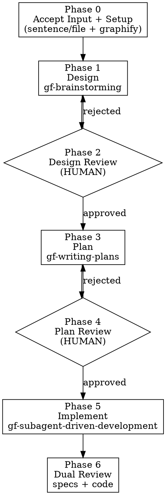

# Code Pipeline

Orchestrate the full feature lifecycle: from a one-sentence requirement or a requirement file, through design, planning, implementation, and dual-track review. Two human review gates enforce quality between phases.

<HARD-GATE>
Do NOT skip any phase. Do NOT advance past a human review gate without an explicit, documented decision from the user. The review gates are not ceremonial — they are the load-bearing quality controls of this pipeline.
</HARD-GATE>

<HARD-GATE id="structured-decision">
The review gates REQUIRE the structured decision format — `PASS/FAIL` on each axis plus an explicit `APPROVED` or `CHANGES_REQUESTED` decision. Verbal "yes", "looks good", "go ahead", a recorded "user said X on YYYY-MM-DD", or any "lighter confirmation" do NOT satisfy a gate. **There is no middle ground** between the structured format and a gate bypass — inventing one (e.g. "I'll record their words and ask 'confirm?' to be safe") is itself the bypass.
</HARD-GATE>


## Anti-Pattern: "This Requirement Is Too Simple To Need The Full Pipeline"

Every requirement that spans multiple modules meaningfully goes through every phase. A single-line typo fix, a config tweak scoped to one file, a clear bug with a known root cause — those don't need this skill. Invoke `gf-brainstorming`, `gf-writing-plans`, or `gf-systematic-debugging` directly for those.

"Simple" multi-module features are where unexamined assumptions cause the most wasted work. If you are tempted to skip a gate because the requirement "looks small", that is exactly when the gate matters most.

## When To Use

Use when:

- The user has provided a feature requirement — one sentence OR a path to a  file
- The expected change touches more than one module meaningfully
- The user wants the structured pipeline with explicit human review gates

Do NOT use when:

- The change is a single-file typo, formatting fix, or config-value tweak — i.e. literally one file with one concern, no new behavior, no new module boundary crossed
- The task is a bug fix with a known root cause (use `gf-systematic-debugging` directly)
- The user only wants to brainstorm a design (use `gf-brainstorming` directly)
- The user only wants an implementation plan for an already-approved design (use `gf-writing-plans` directly)
- The user wants raw code generation with no design or plan (use `gf-subagent-driven-development` directly, with their own plan)

**File count is NOT the criterion.** A new feature that touches 3 files across 3 different modules (e.g. CLI entry + formatter + tests) is multi-module work that requires the full pipeline. "Single-file" means literally one file with one concern — a typo, a config value, or a one-line cosmetic change. If in doubt, the pipeline applies; the user can always abort a phase if they realize it was unnecessary.

## Bundled Sub-Skills (Invoked By This Pipeline)

- `graphify` — generates the code knowledge graph
- `gf-brainstorming` — design exploration and spec writing
- `gf-writing-plans` — implementation plan generation
- `gf-subagent-driven-development` — task execution with isolated subagent contexts
- `gf-requesting-code-review` — code review orchestration

Each of these is invoked explicitly by name from this skill. They are not hidden.

## Process Flow



## Checklist

You MUST create a task for each of these items and complete them in order. Do not collapse or skip any item.

1. **Accept input** — capture the requirement (sentence or file path) and derive a `feature-name` slug
2. **Setup** — verify `graphify-out/` exists; invoke `graphify` if missing or stale
3. **Design** — invoke `gf-brainstorming` with the requirement, the graph, and relevant sources
4. **Design review gate** — STOP and wait for explicit user decision
5. **Plan** — invoke `gf-writing-plans` with the approved design
6. **Plan review gate** — STOP and wait for explicit user decision
7. **Implement** — invoke `gf-subagent-driven-development` with the approved plan
8. **Dual-track review** — dispatch two independent review subagents IN PARALLEL

## Phase Details

### Phase 0: Accept Input and Setup

The user provides one of:

- **A sentence**: typed directly in chat
- **A file path**: a path to a file. Read the file first and pass its content as the requirement.

If the user has not provided a requirement at all, STOP. Ask for one before proceeding.

Check whether `graphify-out/` exists in the current project root.

- If it exists and the codebase has not materially changed since it was generated: skip the Setup step and proceed to Phase 1.
- If it does not exist OR the codebase has materially changed: invoke `graphify` to (re)generate it.

Do NOT proceed to Phase 1 without a current `graphify-out/`. The gf-brainstorming skill depends on it for project context.

### Phase 1: Design

Invoke `gf-brainstorming` with:

- The user's requirement (sentence or file content)
- The `graphify-out/` knowledge graph as project context
- Pointers to relevant existing source files

`gf-brainstorming` owns the design document — its location, format, and content structure. The pipeline does not dictate.

### Phase 2: Design Review Gate

STOP. Do not advance to Phase 3 without an explicit, structured user decision.

The user must review the design against:

1. Requirement understood correctly?
2. Impact scope bounded and acceptable?
3. Any DB schema changes necessary and justified?
4. Anything missing, contradictory, or out of scope?

Capture the decision in this format:

```
**Design Review** — <feature-name>
- Requirement understanding: PASS/FAIL [notes]
- Impact scope:              PASS/FAIL [notes]
- DB changes:                PASS/FAIL [notes]
- Completeness:              PASS/FAIL [notes]
- Decision: APPROVED / CHANGES_REQUESTED [specifics]
```

If `CHANGES_REQUESTED`, return to Phase 1 with the user's notes attached.

No "rubber stamp". A vague "looks good" is not approval. Require the structured decision.

### Phase 3: Plan

Invoke `gf-writing-plans` with:

- The approved design document (output of Phase 1/2)
- The `graphify-out/` knowledge graph (so the plan reflects existing architecture)
- The `feature-name` slug

`gf-writing-plans` owns the implementation plan — its location, format, and content structure. The pipeline requires only that every implementation task lists its tests BEFORE its code, in execution order (TDD).

### Phase 4: Plan Review Gate

STOP. Do not advance to Phase 5 without an explicit, structured user decision.

The user must review the plan against:

1. Task granularity reasonable (not too coarse, not too fine)?
2. Dependency relationships accurate?
3. TDD-compliant (tests precede implementation in every task)?

Capture the decision:

```
**Plan Review** — <feature-name>
- Task granularity: PASS/FAIL [notes]
- Dependencies:     PASS/FAIL [notes]
- TDD compliance:   PASS/FAIL [notes]
- Decision: APPROVED / CHANGES_REQUESTED [specifics]
```

If `CHANGES_REQUESTED`, return to Phase 3.

### Phase 5: Implement

Invoke `gf-subagent-driven-development` with:

- The approved implementation plan (output of Phase 3/4)
- Pointer to `graphify-out/` for cross-task context

Each task runs in an isolated subagent context. Each task follows TDD: tests first, then implementation, then verification. No task may be marked complete without passing tests.

### Phase 6: Dual-Track Review

Dispatch TWO independent subagents IN PARALLEL. Do NOT merge them into one review — they have different goals.

1. **Specs Review**: verifies the implementation matches the approved design document section by section.
2. **Code Review**: checks for performance, security, readability, reuse, and simplification opportunities.

Output: one review report per task, per track.

## Key Principles

- **Hard gates, not soft suggestions** — the two review gates are non-negotiable; this skill cannot proceed past them without a documented user decision.
- **Two reviewers, not one** — specs and code quality are distinct lenses; combining them dilutes both.
- **TDD everywhere** — every implementation task lists tests before code, full stop.
- **Source of truth is the user's words** — the original requirement is quoted verbatim in the design doc; traceability is built in from day one.
- **Bundled, but not hidden** — this skill invokes its bundled siblings explicitly. If a user only wants one phase (e.g. brainstorming alone), they should invoke that skill directly.

## Rationalization Table

| Excuse | Reality |
|--------|---------|
| "Requirement is too simple, skip the gates" | Simple requirements often miss edge cases. Gates have no exception. |
| "graphify ran last week, skip it" | Only skip if the codebase has not materially changed. Otherwise re-run. |
| "Senior said go ahead" | Verbal approval is not a structured decision. Require the documented format. |
| "Two reviews is overkill, merge them" | Specs and code quality are different lenses. Merging dilutes both. |
| "User said 'yeah go ahead', I'll take that as approval" | "Yeah go ahead" is not the structured decision format. Require it explicitly. |
| "I'll just call gf-brainstorming and call it Phase 1" | Brainstorming alone has no plan, no implementation, no dual review. The pipeline is more than its parts. |
| "The user is in a hurry, I'll skip a gate" | Skipping a gate is the same as not having the gate. There is no fast path through quality control. |
| "Only 3 files, doesn't need a full pipeline" | File count ≠ scope. A new feature spanning 3 modules requires the full pipeline. "Single-file" means literally one file with one concern — typo fix, config value, or one-line cosmetic change. |
| "User said 'this is small, skip the design phase'" | User pressure does not override the skill. The pipeline is enforced regardless of perceived simplicity. The user can always abort a phase they realize was unnecessary. |
| "C is a middle ground between strict A and bad B" | There is no middle ground for a review gate. Either the structured format is satisfied, or the gate is bypassed. Inventing a "lighter confirmation" is the bypass, not the compromise. |
| "Recording what they said + asking 'confirm?' is enough" | The structured format (`PASS/FAIL` on each axis + `APPROVED`/`CHANGES_REQUESTED`) is the gate. Anything softer is a bypass. A recorded "user said X" plus a one-word "confirm?" does not equal `APPROVED`. |
| "C is less bad than B, so C is acceptable" | Choosing between two non-A options is choosing between two violations. The skill does not grade on a curve. The only acceptable answer is the one that fully satisfies the gate. |
| "5-line chat sketch is faster than a full design doc" | A 5-line sketch is not a design doc. If Phase 1 cannot produce a full design doc, Phase 1 is not done. Abort and report; do not proceed to Phase 2 with a stub artifact. |
| "User said 'don't be heavyweight', so use a lighter process" | User pressure to "go faster" does not change the skill's requirements. The user can always abort a phase they realize was unnecessary, but they cannot downgrade a phase to a stub. |

## Red Flags — STOP and Restart

- Design generated without `graphify-out/` being consulted
- Plan generated from an unapproved design (skipped Phase 2)
- Code executed from an unapproved plan (skipped Phase 4)
- Single reviewer doing both specs review and code review
- Any review gate skipped, defaulted to "approved", or treated as ceremony
- "I manually reviewed this" used to bypass the structured decision format
- Treating `gf-brainstorming` invoked standalone as equivalent to running Phase 1 of this skill (they're not — the full pipeline adds plan, implementation, and dual review under unified review gates)
- Skipping TDD verification in the plan because "this task is too small for tests"
- Treating a multi-file change as "single-file obvious scope" just because the file count feels small (file count ≠ scope; a 3-module CLI change is multi-module work)
- Inventing a softer "middle ground" confirmation (recording user's words + asking "confirm?") instead of requiring the structured decision format
- Treating any non-structured approval as a gate — verbal "yes", casual "looks good", one-word "go ahead", or any other "lighter" confirmation are gate bypasses, not gate satisfaction
- Choosing a "lighter" or "abbreviated" version of a phase because of time pressure or user preference (5-line sketch instead of design doc, TODO list instead of plan, single combined review instead of dual) — each phase produces its full artifact or the phase is not done
- Picking the "less bad" option in a multiple-choice ("C is less bad than B") — both non-A options are violations; the only acceptable answer is the one that fully satisfies the gate

## Common Mistakes

- Treating review gates as ceremony — the gates are the load-bearing quality controls; treat them accordingly
- Letting review gates become implicit ("the user didn't object, so approved") — require explicit structured decisions every time
- Running specs review and code review in the same agent — conflated goals, lower-quality feedback
- Skipping TDD verification in the plan — plans without test-first ordering will produce untested code
- Forward-porting a casual "yeah go ahead" as approval — that is not a structured decision
- Letting the design doc grow so large it loses the original requirement verbatim quote — traceability breaks
- Generating one giant "design + plan" document instead of two separate artifacts — they have different audiences and review gates